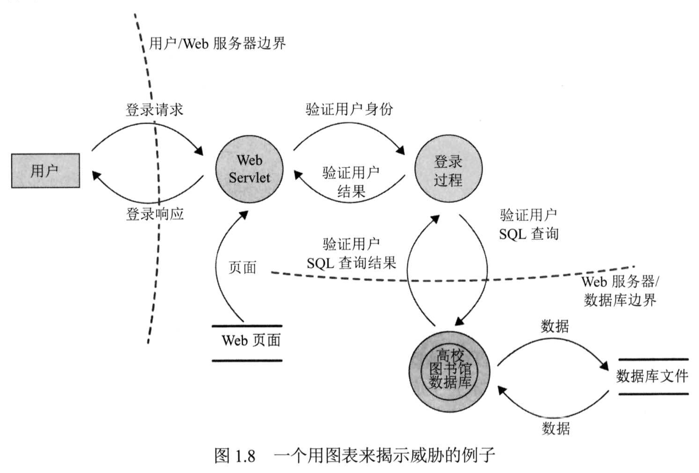
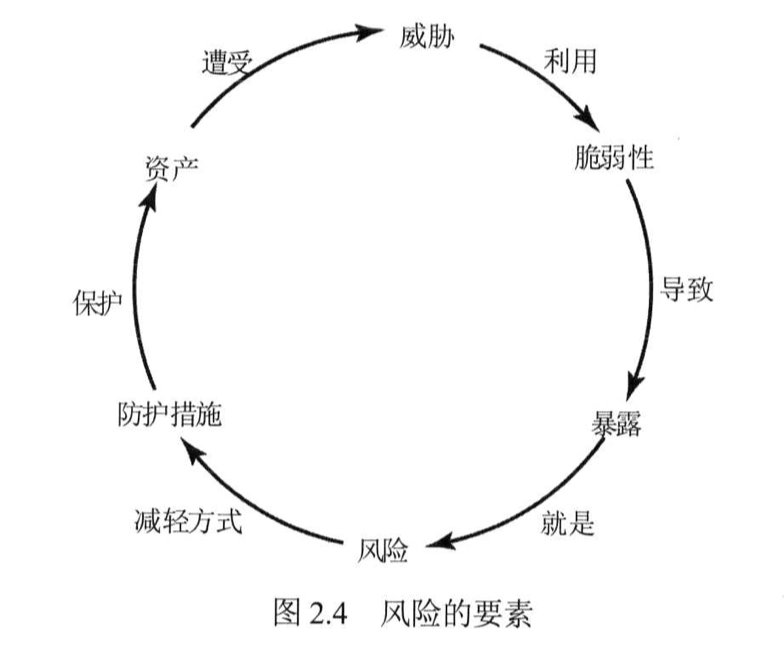
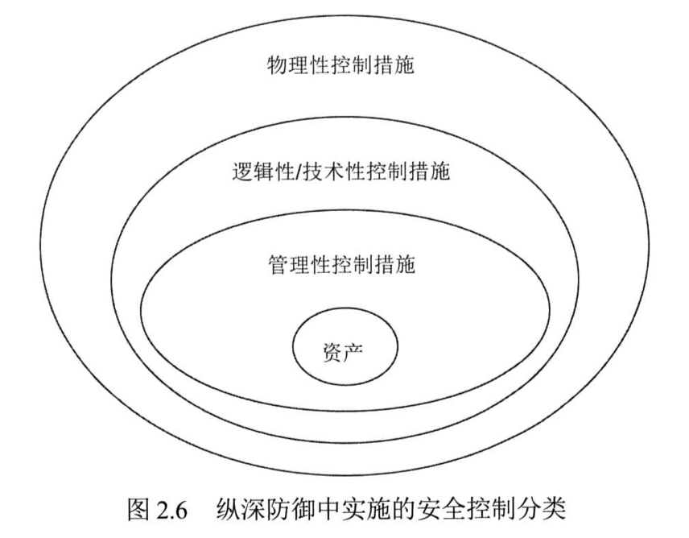
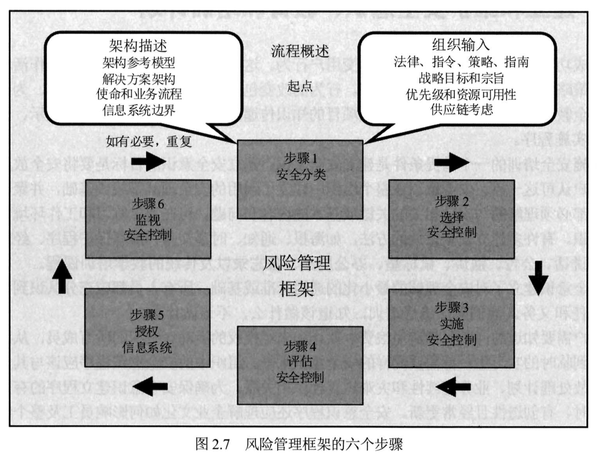

# 域1：安全与风险管理

- [域1：安全与风险管理](#域1安全与风险管理)
  - [D1-1：通过原则和策略进行安全治理](#d1-1通过原则和策略进行安全治理)
    - [一、理解和应用安全概念](#一理解和应用安全概念)
    - [二、评估和应用安全治理原则](#二评估和应用安全治理原则)
    - [三、管理安全功能](#三管理安全功能)
    - [四、安全制度类型](#四安全制度类型)
    - [五、威胁建模](#五威胁建模)
    - [六、供应链风险管理](#六供应链风险管理)
  - [D1-2：人员安全和风险管理](#d1-2人员安全和风险管理)
    - [一、人员安全策略和程序](#一人员安全策略和程序)
    - [二、理解和应用风险管理](#二理解和应用风险管理)
    - [三、社会工程](#三社会工程)
    - [四、安全意识、培训和教育](#四安全意识培训和教育)
  - [D1-3：业务连续性计划](#d1-3业务连续性计划)
    - [一、项目范围和计划](#一项目范围和计划)
    - [二、业务影响分析](#二业务影响分析)
    - [三、连续性规划](#三连续性规划)
    - [四、计划批准和实施](#四计划批准和实施)
  - [D1-4：法律、法规和合规性](#d1-4法律法规和合规性)
    - [一、法律类型](#一法律类型)
    - [二、计算机犯罪](#二计算机犯罪)
    - [三、知识产权](#三知识产权)
    - [四、许可](#四许可)
    - [五、进出口](#五进出口)
    - [六、隐私](#六隐私)
    - [七、合规](#七合规)

## D1-1：通过原则和策略进行安全治理

### 一、理解和应用安全概念

1. CIA

CIA是最基础、也是最重要的安全原则，所有的安全解决方案都应考虑这三个原则，但会应组织自身的独特情况不同，优先级会有所不同。

- 机密性（Confidentiality）：确保数据、对象或资源的不被非授权用户访问。
- 完整性（Integrity）：确保数据、对象或资源的不被非授权用户更改。
- 可用性（Availability）：确保数据、对象或资源的在任何时间都可被授权用户访问。

2. DAD

DAD代表CIA安全保护的失败。

- 泄漏（Disclosure）：未经授权的实体访问敏感或机密材料。
- 改变（Alteration）：数据被恶意或意外更改。
- 销毁（Destruction）：资源被破坏或授权用户无法访问。

3. 过度保护（Overprotection）

- 过度保护机密性会导致可用性受到限制。
- 过度保护完整性可能会导致可用性受到限制。
- 过度提供可用性可能会导致机密性和完整性的损失。

4. 真实性（Authenticity）

数据是真实的且来源于其声称的来源，即完整性和不可否性。

5. 不可否认性（Nonrepudiation）

确保活动的主体或事件的肇事者不能否认事件的发生。

6. AAA服务

- 标识（Identification）：声明自己是谁的过程。
- 身份认证（Authentication）：提交身份验证信息用于验证其身份真实性。
- 授权（Authorization）：分配用户对资源访问的权限。
- 审计（Auditing）：记录用户登录后的行为。
- 可问责性（Accounting）：事后审查追责用户。

7. 保护机制

- 纵深防御（defense in depth）：也被称为分层，是指连续使用多个控制。典型场景如边界防火墙、数据中心防火墙组合使用（细节），以及管理、技术、物理控制措施组合使用（宏观）。
- 抽象（abstraction）：高效率处理方式，将具有属性相同的元素放在一起统一进行安全管理。典型场景如基于角色的访问控制（RBAC）。
- 数据隐藏（data hiding）：将数据存放到需要授权才能访问或看到的地方，即知道数据的存在但无权限无法访问。
- 隐式安全（security through obscurity）是指不向主体告知存在的对象，从而希望主体不会发现该对象。
- 加密（encryption）：通过加密算法使其拿到数据也无法读取实际内容。

8. 安全边界（security boundary）

具有不同安全要求或需求的任意两个区域、子网或环境之间的交叉线，存在于物理环境和逻辑环境，通常在安全边界设置安全策略用于保护边界两侧的安全。

### 二、评估和应用安全治理原则

1. 安全治理（security governance）

安全治理是与支持、评估、定义和指导组织的安全工作相关的实践的集合，将外部最佳实践与组织内安全流程和基础设施进行比较，用于提高或改进组织的管理。安全治理是安全解决方案和管理方法紧密结合的实现，直接监督并参与所有级别的安全，而不仅仅是IT安全。

2. 第三方治理（third-party governance）

一方面是指外部监管机构依据法律、法规、行业标准、合同义务或许可要求，对组织开展第三方治理，派遣审计人员到组织内部进行。另一方面是指组织对自身供应商的治理，也就是供应链安全管理。

第三方治理侧重于验证是否符合声明的安全目标、要求、法规和合同义务。现场评估（on-site assessment）可以提供对某一地点使用的安全机制的第一手资料，文件交换和审查（document exchange and review）帮助与预期目标进行对比，也有助于现场评估的有效开展。

3. 文档审查（documentation review）

未能提供足够的文件以满足第三方（特别是政府或军工）的要求可能会导致运营授权（authorization to operate，ATO）或临时运营授权（TATO）丢失或无效。

### 三、管理安全功能

1. 安全功能应与组织目标一致

安全管理计划将安全功能与组织的战略、目标、使命和目标相一致。使安全管理计划的最有效方法之一是使用自上而下的方法，没有高级管理层支持啥工作都不好开展。

信息安全（InfoSec）团队应由指定的首席信息安全官（CISO）领导，直接向高级管理层报告，如首席信息官（CIO）、首席执行官（CEO）或董事会。将CISO和CISO团队的自主权置于组织中典型的层级结构之外，可以改进整个组织的安全管理，有助于避免跨部门和内部政治问题。CISO相关职位：

- 首席安全官（CSO）：有时被用作CISO的替代词，但更多时候是指负责人身安全的。
- 信息安全官（ISO）：专注于确保信息安全。
- 首席信息官（CIO）：专注于确保信息有效地用于实现业务目标。
- 首席技术官（CTO）：专注于确保设备和软件正常工作，以支持业务功能。

2. 安全管理计划类型

- 战略计划（strategic plan）：长期计划，一般为5年，典型战略计划有风险评估，制定的大方向计划，不涉及具体内容。
- 战术计划（tactical plan）：中期计划，一般为1年，典型战术计划有项目计划、收购计划、招聘计划等，相应战略计划的内容细化。
- 运营计划（operational plan）：短期计划，一般为季度或月，典型操作计划有培训计划、系统部署计划和产品设计计划等，涉及具体计划的细节实现。

安全是一个持续的过程，因此安全管理计划需要定期更新，越做越细节，渐进明细、不断调整。

3. 组织流程
- 收购：组织发展中会进行收购活动，收购其他公司的资产，那么组织环境一定会变化（增加风险），进而影响原来的环境安全性，需考虑安全治理。
- 剥离：组织发展中会进行剥离活动，如变卖资产、员工离职等，组织环境也会变化（增加风险），进而影响原来的环境安全性，需考虑安全治理。
- 治理委员会：负责组织安全治理的执行和监督，通常由高级管理层负责。
- 变更管理：组织的安全治理做的很好的情况下，如果组织环境发生变化（如上面两个过程发生），则安全风险一定增加，因此需要在变化时进行变更管理，保障变化不会引入新风险。
- 数据分类：由于组织的资源是有限的，因此钱都需要用在刀刃上，不同安全级别的数据用相同的安全策略进行保护，不符合成本效益，因此需要对组织内的数据进行分类分级。

当评估第三方安全集成时，需考虑以下过程：

- 现场评估：访问第三方现场，采访人员并观察其操作习惯。
- 文件交换和审查：调查数据集和文件交换的方式以及进行评估和审查的正式流程。
- 流程/政策审查：要求提供其安全政策、流程/程序以及事件和响应文件的副本以供审查。
- 第三方审计：根据第三方出具的服务组织控制（SOC）报告进行审计。

需考虑与第三方签订的协议

- 服务水平协议（SLA）：对供应商产品或服务的规定要求，涉及赔偿内容。
- 服务水平需求（SLR）：对供应商产品或服务的期望的陈述。

4. 组织角色和职责

- 高级管理层：为组织的信息安全负最终责任，负责审核和批准安全策略的发布实施，高级管理者不支持的安全策略一定无法有效实施。
- 安全专家：高级管理者负责定安全策略的大方向，但他们不会负责具体实施（因为不会），所有必须有安全专业人员负责具体安全策略的实施，比如安全专家或顾问。
- 资产所有者：通常是最终负责资产保护的高级经理，将实际数据管理任务的责任委托给托管人，如部门领导。
- 托管员：真正执行安全保障任务的人员，如安全运维工程师。
- 用户：使用系统和数据的人，比如员工。
- 审计员：负责对安全策略的实现情况进行审查的人，可以是内部或外部审计人员。

5. 安全控制框架

最广泛使用的安全控制框架是信息和相关技术控制目标（COBIT），也被用于维持业务和安全的平衡。其他可参考安全标准：

- 信息系统和组织的安全和隐私控制（NIST 800-53 Rev.5）
- 互联网安全中心（CIS）的安全基线指南
- 风险管理框架（NIST RMF）
- 网络安全框架（NIST CSF）
- ISO/IEC 27000系列
- ITIL框架

6. 应尽关心和应尽职责

- 应尽关心（due care）：指的是一个理性的人的遵守和最大努力，通常指的是所有人。
- 应尽职责（due diligence）：指的是做出明智的决定，通常指的是高级管理层。

OSG第九版内容为准确描述。

### 四、安全制度类型

1. 安全策略

最高层级的强制性文件，内容涉及为什么安全很重要、安全需求范围、最终的安全目标等，泛泛而谈的安全制度，有点类似喊口号，如我们要保障组织的内的业务系统不受攻击，但不涉及具体怎么干。

- 特定问题的安全策略（issue-specific security policy）：侧重于特定的网络服务、部门、职能或与整个组织不同的其他方面。
- 特定系统的安全策略（system-specific security policy）：侧重于单个系统或系统类型，并预先描述批准的硬件和软件，概述锁定系统的方法，甚至强制防火墙或其他特定的安全控制。
- 可接受使用策略（AUP）：定义了可接受性能的级别以及行为和活动的预期，不遵守该策略可能导致工作活动警告、处罚或终止。
- 监管性策略：遵循法律或行业标准要求，也就是满足合规；
- 建议性策略：定义可允许的行为和违规的处罚，管理类的黑白名单；
- 信息性策略：定义组织的信息或知识，如公司目标、任务声明或组织如何与合作伙伴和客户交流。

2. 安全标准

对硬件、软件、技术和安全控制方法的一致性定义了强制性要求，如硬件防火墙的规格、OA软件的规格、文件传输必须使用SFTP等。

3. 安全基线

定义了整个组织中每个系统必须满足的最低安全级别，如centos系统上线前检查一下配置基线，不满足基线则不能上线。

4. 安全指南

提供了关于如何实现标准和基线的建议，并作为安全专业人员和用户的操作指南，建议性、非强制，即可以遵从、也可以不遵从。

5. 安全程序

标准操作程序(Standard Operating Procedure, SOP)是详细的分步实施文档，描述了实现特定安全机制、控制或解决方案所需的具体操作，如OA系统上线前需要编写的上线操作手册，内容详细记录了上线时需执行的命令和回退机制等。

### 五、威胁建模

威胁建模是识别、分类和分析潜在威胁的安全过程，可以在设计和开发期间作为主动措施执行，也可以在部署产品后作为响应措施执行。威胁建模越早执行成本效益越高，且应该贯彻系统整个生命周期。

Microsoft使用的安全开发生命周期（SDL），其口号是设计安全、默认安全、部署和通信安全（SD3+C），具有两个主要目标：

- 降低与安全相关设计和编码的缺陷数量，即减少漏洞降低风险。
- 降低剩余缺陷的严重程度，即无法避免的情况下就试图降低漏洞造成的影响。

1. 识别威胁

识别威胁的三种方法

- 关注资产：对所需关心的资产进行风险评估，识别资产的威胁有哪些。
- 关注攻击者：对比较活跃的攻击者进行分析，动机、目标或战术、技术和程序（TTP）识别他们所代表的威胁。
- 关注软件：其实软件也是资产的的一种，只不过更偏向于组织自己研发的软件应用。

Microsoft的STRIDE威胁分类方案

- 欺骗(Spoofing)：伪造身份获取系统权限的攻击行为，如ARP欺骗、窃取cookie等；
- 篡改(Tampering)：破坏数据的完整性或可用性，如修改数据库某一条目；
- 否认(Repudiation)：否认执行过某些动作的能力，如多人共用服务器的administrator账号，无法审计具体某人做了什么操作；
- 信息泄露(Information Disclosure)：破坏数据机密性，如图纸、薪酬表、PII、PHI等泄密；
- 拒绝服务(DoS)：破坏系统可用性，无法为正常用户提供服务，现如今典型代表有DDoS；
- 特权提升(Elevation of Privilege)：利用普通账号获取超级管理员权限，渗透测试典型步骤。

攻击模拟和威胁分析过程（PASTA）是一种以风险为中心的方法，旨在选择或制定与待保护资产价值相关的对策。

- 阶段1: 为风险分析定义目标（DO）
- 阶段2: 定义技术范围(Definition of the Technical Scope，DTS)
- 阶段3: 分解和分析应用程序(Application Decomposition and Analysis，ADA) 
- 阶段4: 威胁分析(Threat Analysis，TA)
- 阶段5: 弱点和脆弱性分析(Weakness and Vulnerability Analysis, WVA) 
- 阶段6: 攻击建模与仿真(Attack Modeling & Simulation，AMS) 
- 阶段7: 风险分析和管理(Risk Analysis & Management, RAM)

VAST是基于敏捷项目的威胁建模方法。

2. 确定和绘制潜在攻击

该过程确定可能实现的潜在攻击，通常通过创建事务中涉及的元素的图表以及数据流和权限边界的指示来实现。
 

3. 执行简化分析

简化分析（reduction analysis）也称为分解应用程序、系统或环境，通过专注单个软件或系统进行深度分析，更好地理解产品的逻辑、内部组件以及与外部元素的交互，也就能更好的识别威胁。分解过程中需要关注的五个要素：

- 信任边界：信任和安全发生变化的任何位置。
- 数据流路径：数据在位置之间的移动。
- 输入点：接收外部输入的位置。
- 特权操作：需要执行特权操作的活动。
- 安全声明和方法的细节：安全策略、安全基础和安全假设的声明。

4. 优先级和响应

该阶段对威胁进行排名，可以使用以下技术：

- 可能性×潜在损害排名：可能性和潜在损害分配1～10分，然后乘积计算总值。
- 高中低排名：可能性和破潜在损害分配高中低级别，然后组合表示级别。
- DREAD：基于潜在损害、再现性、可利用性、影响范围、可发现性综合衡量。

### 六、供应链风险管理

供应链风险管理（SCRM）是确保供应链中的所有供应商或环节都是可靠、值得信赖、信誉良好的组织，向其业务合作伙伴（尽管不一定向公众）披露其做法和安全要求的手段。

PS：可参考第三方治理。

## D1-2：人员安全和风险管理

### 一、人员安全策略和程序

人类通常被认为是任何安全解决方案中最薄弱的因素。

1. 工作描述和职责

招聘之前要对雇佣什么样的人达成共识，因此设置工作描述和工作职责，用以确定人员需要做什么工作、应该分配什么样的权限、要达到什么样的预期要求等等。

2. 候选人筛选和招聘

招聘过程对人的筛选，主要包括以下内容：工作履历、教育背景、访谈同事、犯罪记录、药物测试、性格评估、社交媒体，老外不关注身体健康（体检）！

3. 入职：雇佣协议和策略

入职后首先签署雇佣协议，根据岗位不同可能会涉及签署保密协议（NDA）和竞业协议（NCA）。其次，需要对员工进行培训，包括组织文化、策略、流程、技能等；根据员工岗位分配系统访问权限。

4. 员工监督

在员工的整个雇佣期内，经理应定期审查或审核每位员工的工作描述、工作任务、特权和责任，确定其是否仍能满足岗位要求。

- 特权蠕变（privilege creep）：随着员工工作涉及的内容越来越多，可能获得了超过其岗位规定的权限。
- 强制休假（mandatory vacations）：要求员工离开岗位1～2周，由其他员工顶替前者工作，用于发现滥用、欺诈或疏忽。
- 合谋（collusion）：采用职责分离、强制休假、工作轮换和交叉培训等原则，因被发现的风险较高，可降低员工愿意合作实施非法或滥用计划的可能性。
- 用户和实体行为分析（UEBA）：通过对用户和实体的分析，有助于改进人员管理计划。

5. 离职、转岗、终止过程

员工离职时，需要注意以下内容：

- 在员工收到终止通知的同时或之前禁用员工的用户帐户，不直接删除为了审计目的。
- 离职面谈强调NDA和NCA的责任。
- 确保员工归还公司资产，包括但不限于钥匙、门禁卡、手机、电脑等。
- 安排安保人员陪同员工在工作区回收个人物品。
- 通知所有人员该员工已离职。

6. 供应商、顾问和承包商协议和控制

当多个实体或组织参与一个项目时，就会存在多方风险（multiparty risk）。可通过服务水平协议（SLA）确保供应商的产品或服务水平达到预期，如果达不到会涉及赔偿，从而确保服务质量。供应商、顾问和承包商有时被描述为外包（outsourcing）。组织还可以通过供应商管理系统（VMS）提高外包管理的效率。

7. 合规策略要求

人员安全管理也需要满足法律法规的要求，如PCI DSS。

8. 隐私策略要求

人员安全管理也需要满足隐私策略的要求，如GDPR。

### 二、理解和应用风险管理

风险管理是指识别可能损坏或披露资产的因素，根据资产价值和对策成本评估这些因素，并实施降低或减少风险的成本效益解决方案的详细过程。风险管理主要目标是将风险降至可接受的水平（风险无法被完全消除），主要涉及两个元素风险评估（分析风险）和风险响应（制定措施）。

1. 风险要素

2. 资产评估

识别组织内所有资产，评估资产的有形（如服务器采购价格）和无形价值（如服务器上的业务数据），为风险分析的全面性提供保障，并为成本效益分析提供支持。

3. 识别威胁和脆弱性

识别资产可能面临的所有可识别威胁，团队成员涵盖组织的部门越多，识别的威胁就越全面。参考威胁建模过程。

4. 风险评估

风险评估的目标是识别风险，并按关键程度对其进行排序。

- 定性风险分析

很多情况下价值无法被量化，如组织的声誉、数据的价值，所以只能拍脑袋决定，资产价值、风险级别等内容使用级别来标识，如高中低、0~10、百分制等。定性风险分析的技术有：
头脑风暴、故事板、焦点小组、调查、问卷调查、面谈、场景化、Delphi技术。

- 定量风险分析

定量风险分析的主要过程：

- 盘点资产、分配价值（AV）
- 将资产与威胁进行配对
- 计算每个资产威胁配对的暴露因子（EF），即特定威胁一次破坏资产遭受损失的百分比
- 计算每个资产威胁配对的单一损失期望（SLE），即特定威胁一次破坏资产损失的钱（SLE=AV*EF）
- 计算每个威胁的年化发生率（ARO）。即资产一年内面临的特定威胁发生的概率
- 计算每个资产威胁配对的年化损失期望（ALE），即特定威胁一年内破坏资产损失的钱（ALE=SLE*ARO）
- 为每个资产威胁配对制定可能的对策，并计算年化防护成本（ACS）、ARO、EF和ALE的变化
- 对每种对策进行成本效益评估（cost/benefit evaluation），选择对每种威胁最合适的响应措施，即ALE_per-ALE_post-ACS，结果为正则防护措施有价值，结果为负责防护措施无价值。

5. 风险响应

- 影响风险响应的因素
  - 风险偏好（risk appetite）是一个组织在所有资产中愿意承担的总风险。
  - 风险能力（risk capacity）是一个组织能够承担的风险水平。
  - 风险目标（risk target）是特定资产威胁配对的首选风险水平。
  - 风险容忍度（risk tolerance）是指一个组织能够接受的每个资产威胁配对的风险量或风险水平。
  - 风险限额（risk limit）是指在采取进一步的风险管理措施之前，可容忍的高于风险目标的最大风险水平。
- 风险应对措施
  - 风险缓解（Risk Mitigation）：组织部署了一个OA系统在互联网上供员工使用，那么就会面临来自互联网攻击的风险。为了降低被攻击的风险，部署一个防火墙用以防护OA，这是风险缓解。
  - 风险转移（Risk Assignment）：考虑到OA被攻击后恢复的成本，选择购买商业保险，损失将由保险公司承担，这是风险转移。
  - 风险接受（Risk Acceptance）：老板觉得防护OA被攻击成本投入太大，没有超过OA给组织带来的价值，不采取防护措施，这是风险接受。
  - 风险拒绝（Risk Rejection）：老板觉得自己运气爆表，不会被黑客盯上，因此不觉得OA有任何风险，这是风险拒绝。
  - 风险威慑（Risk Deterrence）：老板不给钱做安全，管理员为了威慑黑客，给OA配置一个访问页告警“我们的OA已经部署各类防护措施，并与网安系统联网，请不要进行网络非法活动！”，这是风险威慑。
  - 风险规避（(Risk Avoidance）：老板觉得OA既然会被攻击，那么我们就不用了，于是OA系统下线，黑客没目标可以攻击，这是风险规避。
- 风险的变化
  - 固有风险（inherent risk）：在风险管理工作开前存在的风险。
  - 剩余风险（residual risk）：实施控制措施后仍存在的风险，包括不可识别和可接受风险。
  - 总风险（total risk）：如果没有实施保障措施，组织将面临的风险量。
  - 控制间隙（controls gap）：总风险和剩余风险之间的差异。

6. 对策的选择和实施

安全控制、对策和保障措施可以通过管理、技术或物理方式实施，这三类机制应以纵深防御方式实施，以提供最大效益。

- 管理：测量、程序、雇佣实践、背景调查、数据分类和标签、安全意识和培训工作、报告和审查、工作监督、人员控制和测试。
- 技术：身份验证方法、加密、受限接口、访问控制列表、协议、防火墙、路由器、入侵检测系统和剪裁级别。
- 物理：警卫、围栏、运动探测器、带锁的门、密封的窗户、照明、电缆保护、笔记本电脑锁、徽章、刷卡、警犬、摄像机、门禁前厅和报警器。

7. 控制类型

- 预防：预判了黑客怎么干坏事提前预防让他干不了，如IPS。
- 威慑：通过恐吓让黑客不敢干坏事，如登录告警。
- 检测：发现或检测不期望或未经授权的活动，如IDS。
- 补偿：增强现有措施能力的控制，如E-DLP、N-DLP配合使用。
- 纠正：修改环境使系统在发生不期望或未经授权的活动后恢复正常，如杀毒。
- 恢复：纠正措施的扩展，通常涉及整体还原，如数据库恢复。
- 指令：涉及管理类措施，如横幅标语。

8. 安全控制评估

安全控制评估SCA（Security Control Assessment）是根据基线或可靠性预期对安全基础架构的各个机制进行的正式评估。通常来说，SCA是NIST 800-53 Rev. 5 (信息系统和组织的安全和隐私控制)实施的过程。

9. 监控和测量

安全控制应该被持续监控和量化，用于衡量安全控制的效益，并提供改进建议。

10. 风险报告和文档

风险报告是风险分析结束执行时的任务，包括编写风险报告和相关方汇报。风险登记簿（risk register）或风险日志（risk log）是对组织或系统或单个项目内的所有已识别风险进行编目的文件，通常包括：

- 识别风险
- 评估这些风险的严重性并确定其优先级
- 制定应对措施以减少或消除风险
- 跟踪风险缓解的进度

11. 持续提升

由于风险评估是时间点的度量，而威胁和脆弱性不断变化，因此需要进行定期风险评估，以支持持续改进。企业风险管理（ERM）计划可以使用风险成熟度模型（RMM）进行评估。RMM评估成熟、可持续和可重复的风险管理过程的关键指标和活动，通常有五个级别：

- 临时（Ad hoc）：瞎鸡儿管。
- 起步（Preliminary）：不严格地尝试遵循风险管理流程，但每个部门可能单独进行风险评估。
- 定义（Defined）：在整个组织范围内采用通用或标准化的风险框架。
- 集成（Integrated）：风险管理操作集成到业务流程中，指标用于收集有效性数据，风险被视为业务战略决策中的一个要素。
- 优化（Optimized）：风险管理的重点是实现目标，而不仅仅是应对外部威胁；增加战略规划是为了业务成功，而不仅仅是避免事故；吸取的经验教训将重新纳入风险管理过程。

12. 风险框架

NIST 800-37 Rev.2中风险管理框架RMF的6个阶段：
1. 分类（Categorize）：根据损失影响分析，对系统和系统处理、存储和传输的信息进行分类。
2. 选择（Select）：为系统选择一套初始控制措施，并根据需要调整控制措施，以根据风险评估将风险降低到可接受的水平。
3. 实施（Implement）：实施控制并描述如何在系统及其运行环境中使用控制。
4. 评估（Assess）：评估控制措施以确定控制措施是否正确实施，是否按满足安全和隐私要求的预期运行。
5. 授权（Authorize）：在确定组织运营和资产、个人、其他组织和国家的风险可接受的基础上，授权系统或通用控制。
6. 监控（Monitor）：持续监控系统和相关控制，包括评估控制有效性、记录系统和运行环境的变化、进行风险评估和影响分析，以及报告系统的安全和隐私状况。

### 三、社会工程

社会工程是指利用对他人的基本信任、提供帮助的愿望或炫耀的倾向，来达到说服某人执行未经授权的操作或说服某人泄露机密信息的目的。针对社会工程攻击的最重要防御措施是用户教育和意识培训。

1. 社会工程原则
- 权威（authority）：由于大多数人都会顺从权威，因此冒充具有有效内部或外部权限的人容易使目标相信，如伪装CEO打电话。
- 恐吓（intimidation）：权威原则的衍生，利用权威、自信、甚至伤害威胁激发某人服从命令或指示，如伪装CEO打电话说：“你赶紧给我重置一下系统密码，不然我就开掉你”。
- 共识（consensus）：利用一个人的自然倾向模仿他人正在做或被认为在过去做过的事情的行为，如打电话说：“张三（目标的同事）说要帮我重置密码，但他正巧没有空，说找您可以帮忙重置“。
- 稀缺性（scarcity）：与紧迫性相关，基于目标所需的对象的稀缺性来说服某人，如钓鱼邮件里描述有白嫖星巴克的劵还有5张，赶紧点击链接领取。
- 熟悉感（familiarity）：利用一个人对熟悉事物的天生信任，如打电话说：“张三（目标的同事）说要帮我重置密码，但他正巧没有空，说找您可以帮忙重置“。
- 信任（trust）：攻击者与受害者建立关系，可能需要几秒钟或几个月，但最终攻击者会试图利用关系的信任说服受害者泄露信息或执行违反公司安全的行为。
- 紧迫性（urgency）：与稀缺性相关，利用紧急状况使目标不能仔细思考而做出决策，如伪装CEO打电话说：“你赶紧给我重置一下系统密码，我有个1亿的单子要走审批，5分钟不审批付款，客户那边就断绝合作了”。

2. 套取信息

套取信息（eliciting Information）是从系统或人员获取或收集信息的活动。在社会工程的背景下，它被用作一种研究方法，以便设计一个更有效的借口让对方相信自己，并获取自己想要的信息，用于支持物理或技术攻击。可参考电信诈骗话术或PUA。

3. 预附加

预附加（prepending）是在某些其他通信的开头或标题中添加术语、表达式或短语，目的是增强借口的可信度，如钓鱼邮件添加Re：或者Fw：标签；还可以尝试绕过过滤器，如钓鱼邮件添加X-Spam-Condition:SAFE。

4. 网络钓鱼

网络钓鱼（phishing）是指通过多种方式，如邮件、即时通讯软件、电话、短信、甚至面对面交流，从目标处获取信息或植入恶意软件。网络钓鱼模拟（phishing simulation）是一种工具，用于评估员工抵制网络钓鱼活动的能力。

5. 鱼叉式网络钓鱼

鱼叉式网络钓鱼（Spear phishing）是一种更具针对性的网络钓鱼形式，其信息是专门针对一组或个人制作的。当鱼叉式网络钓鱼伪装成高级管理层时，被称为商业电子邮件诈骗（business email compromise，BEC）。

6. 鲸钓

鲸钓（whaling）是鱼叉式网络钓鱼的一种形式，目标是特定的高价值个人，如高级管理层。

7. 钓鱼短信

钓鱼短信（smishing）是指利用短消息服务（SMS）发起的网络钓鱼攻击。

8. 钓鱼语音

钓鱼语音（vishing）是指通过任何电话或语音通信系统进行的网络钓鱼。就像防电信诈骗一样，要做到不信、不听、不转账。

9. 垃圾邮件

垃圾邮件（spam）是任何类型的不受欢迎或未经请求的电子邮件，除了浪费邮箱资源外，还是恶意软件的载体。防御手段包括垃圾邮件过滤器、反垃圾邮件软件（Antispam）、发件人策略框架（SPF）、域密钥标识邮件（DKIM）和域消息身份验证报告和一致性（DMARC）。

10. 肩窥

肩窥（shoulder surfing）是指某人能够观看用户的键盘或查看其显示，限制屏幕可视性可以有效防御肩窥，如贴上防窥膜。

11. 发票诈骗

发票诈骗（invoice scams）是指试图通过出示虚假发票从组织或个人处窃取资金，通常与BEC结合发动攻击。

12. 骗局

骗局（hoax）是指尝试说服目标执行会导致问题或降低其IT安全性的操作，如宣称爆发了一个恶意病毒，得下载一个专杀工具才能查杀，实际专杀工具才是恶意病毒。

13. 假冒和伪装

假冒（impersonation）是指以他人身份进行的行为，也可以被称为伪装（masquerading）、欺骗（spoofing）、身份欺诈（identity fraud）。

14. 尾随和捎带

尾随（tailgating）是指未经授权的实体在有效员工的授权下、但在员工不知情的情况下进入设施，如前面人刷卡进入后，趁门没关赶紧溜进去。捎带（piggybacking）是指未经授权的实体通过诱骗受害者获得同意，在有效工人的授权下进入设施，如对前面的人说：“兄弟，我忘记带卡了，给我刷一下吧”。

15. 垃圾搜索

垃圾搜索（dumpster diving）是指通过挖掘垃圾、废弃设备或废弃地点，获取目标组织或个人信息的行为。

16. 身份欺诈

身份盗窃（Identity theft）和身份欺诈（identity fraud）是指所有类型的犯罪，其中有人以某种方式非法获取和使用他人的个人数据，通常是为了经济利益。

17. 误植占用（typo squatting）

通常注册与合法域名类似的域名来实现攻击，如googel.com、gooogle.com、googles.com、googe.edu等。

18. 影响力运动

影响力运动（influence campaigns）是试图引导、调整或改变公众舆论的社会工程攻击，如“公知”。

- 恶意散播他人信息（doxing）是指收集有关个人或组织的信息，然后公开披露收集的数据（可能涉及伪造），以影响对目标的看法，如女子取快递被造谣出轨诽谤案。
- 混合战争（Hybrid Warfare）是指将传统军事战略与现代能力相结合发动战争，包括社会工程、数字影响力运动、心理战、政治战术和网络战能力。
- 社交媒体（social media）已经成为国家对目标发动混合战争的武器，也称为了泄漏个人隐私信息的主要渠道。

### 四、安全意识、培训和教育

安全策略制定的非常完美也不能够保障组织的安全性，因为策略的执行必须依靠人这个关键资产，人如果对信息安全一点都不上心，那么再好的安全制度也无法贯彻实施，就像老板开大会讲的贼high，员工都在下面打瞌睡。

1. 意识（Awareness）

让员工首先意识到信息安全的重要性，才能让其后续工作中有所作为。常规做法就是搞意识培训，请老师讲讲最近发生的安全事件以及危害，以及通过环境进行营销，如在墙上张贴一些安全提示语等。

2. 培训（training）

有了安全意识后，员工还需要进行安全培训，赋予员工解决安全风险的能力，比如怎么杀毒、怎么配置防火墙。

3. 教育（education）

员工有能力完成职责所要求的的工作内容外，还想不断提高自己技术能力，那么参与的就是教育，如大家现在考的CISSP。

4. 提高意识和培训的最佳实践

- 改变培训目标焦点
- 改变话题顺序或重点
- 使用多种演示方法
- 角色扮演
- 培养和鼓励安全倡导者（security champions）
- 游戏化（gamification）

安全倡导者通常是非安全员工，他们承担鼓励他人支持和采用更多的安全实践和行为的责任。游戏化是一种通过将游戏中的常见元素整合到其他活动中来鼓励合规性和参与性的方法，通常包括奖惩行为。

5. 有效性评估

培训和意识计划有效性评估应持续或持续进行，包括但不限于培训材料审查、培训记录审查、安全策略违规率监控等。

## D1-3：业务连续性计划

业务连续性计划（Business Continuity Plan, BCP）涉及评估组织流程的风险，并创建策略、计划和程序，以最大限度地降低这些风险发生时对组织产生的不良影响，即该计划尽最大可能保障组织业务持续开展，一旦失败则转入灾难恢复计划（Disaster Recovery, DRP）。

### 一、项目范围和计划

1. 组织审查

识别组织架构的所有部门和人员，这些信息与组织业务息息相关，为后续过程的顺利开展打下基础。既然叫业务连续性计划，那么就先识别出组织里有哪些业务流程，由哪些部门和人员负责，方便后续组建BCP团队。

2. BCP团队选择

计划的制定和实施离不开人员的支持，因此组建一个多元化的BCP团队至关重要，团队成员应来自不同的部门以弥补团队的知识欠缺（术业有专攻），并有高级管层（他们拥有资源和权利）的加入和支持，以保障BCP计划的顺利制定和实施。

3. 资源需求

不管干什么事，都需要组织投入资源，如人力、财力、硬件、软件等，因此就需要对BCP的制定和实施所需要的资源进行评估，并向高级管理层说明BCP的必要性，以争取更多的资源，根据资源的多少，决定BCP的覆盖范围（有多少钱，干多少事）。

4. 法律法规要求

制定的BCP应满足合规性要求（法律法规是底线，必须遵循），并在法律法规和行业标准发生变化后及时更新（安全总是是临时性的）。

### 二、业务影响分析

业务影响分析（BIA）对组织的业务进行评估，确定业务可能面临的风险，以及风险发生的可能性和影响，使用定量影响评估和定性影响评估（与风险评估过程基本一致），对业务连续性资源的投入进行优先级排序。

1. 确定优先级

根据业务重要性进行优先级确定，度量指标包括资产价值（AV）、最大允许中断时间（Maximum Tolerable Downtime, MTD或Maximum Tolerable Outage, MTO）和恢复时间目标（Recovery Time Objective, RTO），BCP的目标就是确保RTO小于MTD，即业务系统如OA允许中断服务3天，3天以后就开始造成组织经济损失，那么OA的恢复时间必须是3天以内，才能保障组织不受损失。恢复点目标（recovery point objective，RPO）定义了事件发生前的时间点，在该时间点上，组织应该能够从关键业务流程中恢复数据

2. 风险识别

识别组织面临的风险，自然风险和人为风险两大类。

3. 可能性评估

对识别到的每种风险发生的可能性进行评估，得到ARO，像一个倒霉蛋一年被雷劈1次，那么雷劈这个风险的可能性就是100%。

4. 影响评估

在定量评估中，计算EF、SLE和ALE；在定性评估中，关注组织信誉、员工流失、社会责任等。要综合定量和定性评估的结果，这样计算的风险对组织的影响更加精准。

5. 资源优先级排序

根据评估结果对资源投入进行优先级排序，紧着重要业务投入资源，资源没有了其他业务就先不纳入BCP。

### 三、连续性规划

这个阶段就是把前期做的各种分析和结果，落地形成可展示的文档。其中，设计缓解方案的具体机制，需保护的三类资产分别是：

- 人员：业务流程肯定有人参与，在所有资产中人员安全优先级最高，人命关天。
- 建筑物和设施：业务流程必须依赖的物理设施，如数据中心、厂房、仓库等，需要关注加固预备措施（风险发生前的措施，如刮大风前要加固屋顶）和替代站点（风险发生后的措施，主设施可能会彻底损坏，要提前考虑备用设施）。
- 基础设施：业务流程依赖的基础实施，如通信线路、信息系统等，需要关注物理性加固系统（如灭火措施）和替代系统（双机热备），与建筑物和设施一样。

### 四、计划批准和实施

1. 计划批准

高级管理者的批准说明BCP得到认可，使计划在其他相关方处能够得到重视，保障计划的顺利实施。大多数情况下，组织颁布的制度如果不是特别的重要、未及时对制度进行宣传，组织内的员工其实并不会重视，想想大家对自己公司制度的遵守程度。

2. 计划实施

得到批准就按部就班干就完了，完成计划实施后，BCP团队应持续监控计划执行情况、并不断优化。安全是临时的、计划也是临时的，因此需要定期更新和完善。

3. 培训和教育

全员接受BCP的整体培训，以保证员工重视BCP，对BCP中担任职责的员工接受专项培训，以保证风险发生时能够完成BCP任务。计划都是由员工执行的，那么适当的培训是必须的，不然计划内的要求可能员工的能力无法覆盖。

4. BCP文档化

BCP文档化非常的重要,也是甩锅神器，试想一下：分析出一个重大风险，老板因为投入资源过大而选择接受风险，但未使其文档化并签字确认，那么风险一旦真正发生，你必然要背锅，为什么当时你没有好好劝我？巴拉巴拉~虽然文档化并不能彻底解决老板BB你的必然，但可以从一定程度上让你的老板背一点锅。BCP应该包含以下部分：

- 连续性计划的目标：制定的计划得说明目标是啥，最简单的目标就是保障业务不间断运行。
- 重要性声明：用以说明BCP的重要性，让所有人对该计划上心。
- 优先级声明：哪些业务系统重要、哪些不重要，用1~10分或A-Z进行说明。
- 组织职责声明：说明组织在BCP中的责任，让所有人都支持该计划。
- 紧急程度和时限声明：说明BCP的紧急程度，以及BPC实施的时间安排。
- 风险评估：业务影响评估BIA的决策过程。
- 风险处置：说明每种风险的处置方式。
- 重要记录计划：重要记录（涉及业务的相关信息）需识别、查找、存储。
- 应急响应指南：如何响应紧急事件的步骤，应包含响应程序（怎么干）、通知名单（叫人）。
- 维护：环境变化需及时更新BCP，涉及版本控制。
- 测试和演练：BCP再好，还得真刀真枪试一试才能发现计划的缺点。

## D1-4：法律、法规和合规性

### 一、法律类型

1. 刑法

打击计算机犯罪保护社会安全，道德的最低底线。

2. 民法

维护社会秩序，主要解决个人和组织间的问题。

3. 行政法

行政部门拥有执法权，那么执法权是需要进行监管和限制的。

### 二、计算机犯罪

1. 计算机欺诈和滥用法案（CFAA）

美国第一部针对网络犯罪的主要立法，涵盖了跨州的联邦计算机犯罪。

2. CFAA修正案

扩大了保护范围，但已被抵制。

3. 国家信息基础设施保护法案（NIIPA）

CFAA另一套修正案，扩大了保护范围。

4. 联邦量刑指南（Federal Sentencing Guidelines）

该指南中正式确定审慎者规则（prudent man rule），要求高级管理人员为应尽关心（due care）而承担个人责任。

5. 联邦信息安全管理法案（FISMA）

该法案对联邦机构和政府承包商提出了安全要求。

6. 联邦信息系统现代化法案（FISMA）

与联邦信息安全管理法案缩写一样，该法案将联邦网络安全责任集中到美国国土安全部。

7. 网络安全增强法案（Cybersecurity Enhancement Act）

该法案指定美国国家标准与技术研究院（NIST）负责协调全国范围内的网络安全标准。

### 三、知识产权

1. 版权（Copyright）

保护创造者所产生的如文学、音乐、戏剧、舞蹈、图画、电影、源代码等内容，防止作品遭受未经授权的复制。需注意的是，被雇佣时发生的创作归雇主所有。版权的保护时间为创造者离世后的70年。

数字千年版权法（DMCA）用于保护数字版权，其中规定了互联网服务提供商（ISP）违反版权法的豁免条件：

- 传输必须由提供商以外的人员发起。
- 传输、路由、提供连接或复制必须通过自动化技术流程进行，不需要服务商提供材料。
- 服务提供商不得确定材料的收件人。
- 除预期接收人外，任何人通常不得访问任何中间副本，且不得保留超过合理需要的时间。
- 传输材料时不得修改其内容。

DMCA还豁免了豁免服务提供商与系统缓存、搜索引擎和个人用户在网络上存储信息相关的活动，因为这些活动不受服务提供商控制，但需在收到侵权通知后立即采取行动，删除受保护内容。

2. 商标（Trademarks）

保护明显代表公司及产品或服务的文字、口号和标志，如“恒源祥”、“恒源祥，羊羊羊”等。保护时间为无限期，但需每10年申请延续。

在美国申请商标需要满足两个要求：

- 该商标不得与另一商标混淆相似
- 商标不应描述将提供的商品和服务

3. 专利（Patents）

保护知识产权，如一种防御某类攻击的安全机制。保护时间为20年。

申请专利的三个要求：

- 这项发明必须是新的
- 这项发明必须有用
- 这项发明不能是显而易见的

4. 商业秘密（Trade Secrets）

维持公司核心竞争力的知识产权，可申请版权或专利，但因为需要公开细节且有时限，可能存在滥用的情况。因此可以自行保护，涉及签署保密协议（NDA）。

### 四、许可

许可协议有四种常见类型：

1. 合同许可协议

使用软件供应商和客户之间的书面合同概述各自的责任。

2. 开封生效许可协议

该合同条款写在软件包的外部，通常软件外包装一经撕开即代表同意协议条款。

3. 点击生效许可协议

软件安全过程中提示的用户确认合同条款。

4. 云服务许可协议

网站注册时勾选“我同意…”挑√的内容。

### 五、进出口

美丽国为了实现技术封锁，出口高性能计算机（现已放开）和加密软件非常困难。

### 六、隐私

1. 美国隐私法

- 第四修正案（Fourth Amendment）：隐私权的基础，搜查令的出处。
- 隐私法案（Privacy Act）：限制联邦政府处理公民个人隐私信息。
- 电子通信隐私法案（ECPA）：将侵犯个人的电子隐私定为犯罪，规定监控移动电话通话是非法的。
- 通信执法协助法案（CALEA）：在法庭命令下，运营商需配合政府执法人员进行通信监听。
- 经济间谍隐私法案（EEA）：定义窃取商业秘密为犯罪行为。
- 健康保险携带和责任法案（HIPAA）：要求处理或存储PHI的组织采取严格的安全措施。
- 健康信息技术促进经济和临床健康法案（HITECH）：HIPAA修订版本，新增内容包括签订商业伙伴协议（BAA）的组织也纳入安全监管范围、用户数据遭到泄露必须进行通知。
- 儿童在线隐私保护法（COPPA）：针对面向儿童或收集儿童信息的网站提出监管要求，如必须有隐私通知、家长可以审查和删除儿童数据、收集13岁以下儿童信息必须得到家长授权。
- 金融服务现代化法案（GLBA）：针对金融机构交换客户信息提出监管要求。
- 美国爱国者法案（USA PATRIOT Act）：针对恐怖袭击制定的法律，契机是911事件。
- 家庭教育权利和隐私法案（FERPA）：针对教育机构，授予18岁以上的学生和未成年学生家长某些隐私权。
- 身份盗用与侵占防治法（ITADA）：定义身份信息盗用为犯罪行为。

2. 欧盟隐私法

- 数据保护指令（DPD）：概述了保护信息系统处理的个人数据所必须采取的隐私措施，以及隐私数据所有个人的权利，包括访问数据、了解数据来源、纠正不准确数据、某些情况下拒绝同意处理数据、当权利受到侵犯采取法律行动。
- 通用数据保护条例（GDPR）：取代PDP，法规范围扩大，只要收集了欧盟居民的数据，可以跨境追责。GDPR的关键条款：
  - 合法、公平、透明：处理个人信息必须遵循法律，公开和诚实地对待数据处理活动。
  - 目的限制：文档化和声明收集数据的目的，并将您的活动限制为声明内容。
  - 数据最小化：仅收集声明内容所涉及的数据。
  - 准确性：确保数据是正确的。
  - 存储限制：只保留合法、声明内容所需的数据，并且遵守被遗忘权（right to be forgotten），即允许用户随时要求组织删除其信息。
  - 可问责性：必须对使用受保护数据所采取的行动负责。
- 隐私盾（Privacy Shield）：曾经，欧盟和美国签订了一项名为“隐私盾”的安全港协议（2020年已废除），组织能够通过独立评估员证明其是否满足隐私实践，如果获得隐私盾，则允许传输信息。针对于跨境信息共享，GDPR要求必须使用标准合同条款或具有约束力的公司规则。

3. 加拿大隐私法

个人信息保护和电子文件法（PIPEDA）是一部国家级法律，限制商业企业收集、使用和披露个人信息的方式。

4. 美国州隐私法

加州消费者隐私法（CCPA）：效仿GDPR，为消费者提供隐私保护。

### 七、合规

除了满足法律法规外，还需要满足行业监管要求。

1. 支付卡行业数据安全标准（PCI DSS）

信用卡数据安全合规。

2. 萨班斯-奥克斯利法案（SOX）

财务数据安全合规。
