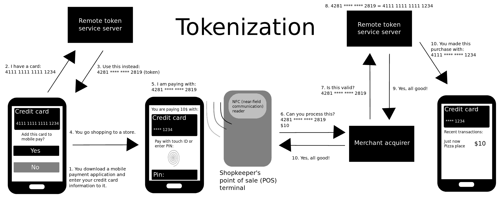

# 域2：资产安全

- [域2：资产安全](#域2资产安全)
  - [D2-1：信息和资产的识别和分类](#d2-1信息和资产的识别和分类)
    - [一、定义敏感数据](#一定义敏感数据)
    - [二、定义数据分类](#二定义数据分类)
    - [三、定义资产分类](#三定义资产分类)
    - [四、理解数据状态](#四理解数据状态)
    - [五、确定合规性要求](#五确定合规性要求)
    - [六、确定数据安全控制](#六确定数据安全控制)
  - [D2-2：建立信息和资产处理要求](#d2-2建立信息和资产处理要求)
    - [一、数据维护](#一数据维护)
    - [二、数据防泄漏](#二数据防泄漏)
    - [三、标记敏感数据和资产](#三标记敏感数据和资产)
    - [四、处理敏感信息和资产](#四处理敏感信息和资产)
    - [五、数据收集限制](#五数据收集限制)
    - [六、数据位置](#六数据位置)
    - [七、存储敏感数据](#七存储敏感数据)
    - [八、数据销毁](#八数据销毁)
    - [九、确保数据和资产保留](#九确保数据和资产保留)
  - [D2-3：保护数据方法](#d2-3保护数据方法)
    - [一、数字版权管理](#一数字版权管理)
    - [二、云访问安全代理（CASB）](#二云访问安全代理casb)
    - [三、假名化（Pseudonymization）](#三假名化pseudonymization)
    - [四、令牌化（Tokenization）](#四令牌化tokenization)
    - [五、匿名化（Anonymization）](#五匿名化anonymization)
  - [D2-4：理解数据角色](#d2-4理解数据角色)
    - [一、数据所有者（Data Owner）](#一数据所有者data-owner)
    - [二、资产所有者(Asset Owners)](#二资产所有者asset-owners)
    - [三、业务/任务所有者(Business/Mission Owners)](#三业务任务所有者businessmission-owners)
    - [四、数据处理者和数据控制者 (Data Processors and Data Controllers)](#四数据处理者和数据控制者-data-processors-and-data-controllers)
    - [五、数据托管员（Data Custodians）](#五数据托管员data-custodians)
    - [六、管理员（Administrators）](#六管理员administrators)
    - [七、用户和主体（User and Subjects）](#七用户和主体user-and-subjects)
  - [D2-5：使用安全基线](#d2-5使用安全基线)
    - [一、剪裁（Tailoring）](#一剪裁tailoring)
    - [二、范围界定（Scoping）](#二范围界定scoping)
    - [三、最佳实践](#三最佳实践)

## D2-1：信息和资产的识别和分类

现如今最重要的资产便是组织的数据，在这种情况下，资产包括敏感数据、用于处理该数据的硬件以及存储该数据的介质。

### 一、定义敏感数据

1. 个人身份信息（Personally Identifiable Information，PII）

任何可以识别个人的信息，如姓名、社会保险账号、出生日期、出生地点、母亲的娘家姓或生物识别记录，也包括关联信息，如医疗、教育、金融和就业信息等。

2. 受保护的健康信息（Protected Health Information，PHI）

与个人有关的任何健康信息，如身体健康状况、病例信息、医疗费用等。从另一方面来说，PHI也属于PII。

3. 专有数据（Proprietary Data）

影响组织核心竞争力、一旦泄露会对组织造成损害的数据，典型例子有设计图纸、药物配方、客户信息等。

### 二、定义数据分类

1. 政府数据

- 绝密(Top Secret)：对国家安全造成异常严重损害。
- 秘密(Secret)： 对国家安全造成严重损害。
- 机密(Confidential)： 对国家安全造成损害。
- 未分类 (Unclassified)：对国家安全不会造成损害。
  - 未分类还有一些子分类，如仅供官方使用（for official use only，FOUO）和敏感但未分类 (sensitive but unclassified, SBU），该分类文件会限制分发。

2. 非政府组织

- 机密/专有(Confidential/Proprietary)：泄密会对企业竞争力造成异常严重影响，偏重于商业秘密、专利等。
- 私有(Private)：泄密会对企业造成严重影响，偏重于企业员工或用户的个人数据或财务数据等。
- 敏感(Sensitive):泄密会对企业造成影响，偏重于网络拓扑图、内部流程制度等。
- 公开(Public):泄密不会对企业造成影响，通常会保护其完整性，如防网页篡改。

非政府组织可灵活使用各种类型的分类方法，如ABCD、12345、颜色等。

### 三、定义资产分类

资产分类就很简单，遵循存储数据分类的最高级别即可，如一个数据库存储了绝密和秘密级别的数据，那么该服务器定级应该为绝密。

通常需要在硬件资产上使用物理标签，提醒人员注意资产的敏感性。

### 四、理解数据状态

1. 静止的数据

也叫存储中的数据，是指存储在辅助存储设备上的任何数据，即硬盘、USB、SAN、磁盘等，最常规保护方式是使用对称加密算法进行加密，如AES、DES等。

2. 传输中的数据

也叫移动或通信中的数据，是通过网络传输的任何数据，最常规保护方式是使用TLS进行传输加密，保障传输过程无法被截获、监听和解密。

3. 使用中的数据

也叫处理中的数据，是加载到内存或临时存储缓冲区的任何数据，通常内存中的数据是解密的，可使用同态加密（homomorphic encryption）在内存中处理加密数据以降低风险。

### 五、确定合规性要求

每个组织都有责任了解适用于他们的法律要求，并确保他们满足所有合规要求，特别是在不同国家处理PII。

一些组织已经专门设立了职位，称为合规官（compliance officer）来专门解决合规性问题。

### 六、确定数据安全控制

定义数据和资产分类后，必须定义安全要求并确定安全控制以实现这些要求。通常先将安全要求和控制措施落地形成文档，然后通过数据防泄漏（DLP）解决方案来实现。

## D2-2：建立信息和资产处理要求

管理敏感数据的一个关键目标是防止数据泄露，以下过程确定了组织内人员应遵循的基本步骤，以限制数据泄露的可能性。

### 一、数据维护

数据维护（data maintenance）是指在数据的整个生命周期中不断组织和维护数据的活动。为了降低保护数据的成本，使用空气间隔（air gap）技术将非机密数据和机密数据置于不同网络进行处理，即物理网络隔离技术。

对于隔离网络中数据传输需求，有以下三种方法：

- 手工：通过移动存储介质进行数据传输。
- 单向网桥（unidirectional network bridge）：仅允许数据从非敏感网络到敏感网络。
- 防护方案（guard solution）：允许被正确标记的数据在两个网络之间传输（感觉像指的是DLP）。

### 二、数据防泄漏

数据防泄漏（DLP）系统扫描未加密数据，基于模式匹配查找关键字和数据模式来检测数据，如带有机密词汇的文件或11位数字手机号等。

1. 基于网络的DLP

对网络流量中的特定数据进行检测和拦截，防止机密文件通过网络传输泄漏。

2. 基于终端的DLP

对终端上的文件和发送到外部的文件进行检测和拦截，防止机密文件通过网络和移动存储介质等方式泄漏，还能支持文件加解密。

3. 其他

还有一些延伸类型，如邮件DLP、数据库DLP等，原理与前两种一样，只不过检测方法有些许区别。

### 三、标记敏感数据和资产

对数据进行分类后，那就需要对数据进行标记，标记（marking）或标签（labeling）敏感信息可确保用户能够轻松识别任何数据的分类级别。

1. 标签分类

- 物理标签：标签信息应该有名称、级别、责任人等，打印出来贴在PC、服务器、USB、移动硬盘等设备上。
- 数字标签：比较简单的方式，如一个word文档添加页眉、页脚、水印等；桌面背景选择显示一个背景图片显示该PC的敏感程度等。有显式水印，也 • 会有隐式水印，这种数字标签无法用肉眼直观看到，可以使用专用读取工具获取标签信息。

2. 最佳实践

- 标签应该与存储数据的最高级别一致；
- 非机密介质或设备也需要打标签，以防敏感数据未标记的遗漏错误；
- 通常不进行设备的降级操作，因为数据清理的成本可能超过新购设备。

### 四、处理敏感信息和资产

处理（handling）是指介质在其生命周期内安全地传输。人员在保护数据时往往会不重视，如数据备份到磁带后，对磁带的安全控制缺失；数据上云后期待云服务商保护数据等等。需要制定数据处理规范，并持续监控落实情况。

### 五、数据收集限制

防止数据泄漏的最简单方式就是不收集数据，道理等同于服务器不插电就不会被攻击。

互联网大厂通过过度采集个人信息来做大数据分析，现在受到隐私政策的限制，采集个人信息必须有明确用途，有助于保护用户的个人隐私，不再被割韭菜。

### 六、数据位置

数据位置指的是数据备份或数据副本的位置。需要考虑将数据定期备份，并存储在一个灾难不会同时影响主设施和备份设施的位置。

如果存储在云上，需要识别存储的真实物理位置，以保证数据可用性。

### 七、存储敏感数据

敏感数据应该以防止任何类型的丢失的方式存储。

- 物理维度：存储数据的机房或房间是否有门禁？温湿度控制措施是否具备？
- 技术维度：参考静态数据的保护方式，使用对称加密算法。

数据的价值往往大于存储介质的价值，因此购买高质量的介质符合成本效益。

### 八、数据销毁

敏感数据不再被组织需要时需要执行数据销毁。销毁的方式根据组织的有钱程度和合规性要求进行选择，合规要求一定是首位的，如法规要求销毁硬盘，即使你不舍得也得物理超度掉；抛开合规后，那么组织有钱的话就直接物理超度，这样彻底保护敏感数据无法被还原，没钱的组织则可能需要使用覆盖或消磁等手段对存储介质进行处理，然后再重复使用。

1. 消除数据剩磁

数据残留(Data Remanence)是指擦除后仍遗留在存储介质上的数据。最典型的常见即磁盘格式化，格式化其实只是把数据的映射关系删除掉，实际数据仍存储在磁盘上，你再往介质里拷贝数据才能覆盖掉，因此我们需要关注敏感数据的残留问题。

2. 常用数据销毁方法

- 擦除(Erasing)：删除数据的映射链接，如删除和格式化操作，实际上没删除数据，需要拷贝新数据直到塞满空间才能把老数据彻底清除掉。
- 清理(Clearing)：也叫覆写（overwriting），知道了擦除的缺陷，则使用字符填充满介质的空间就能解决问题，但需要注意有一些空间，如坏道，无法通过该方法清除，因为逻辑上你也读取不了。
- 清除(Purging)：简单理解就是多次清理(Clearing)，可用于介质的重用，但无法保障彻底的可信。
- 消磁(Degaussing)：针对有磁性的存储介质(如磁带)，可以使用消磁对介质上的数据进行清理，不会被影响的介质有CD、DVD或SSD等。
- 销毁(Destruction)：物理超度——最安全的方式，但你得有钱。
- 解除分类(Declassification)：当你想要重复使用存储介质时，如存储绝密数据的介质，不再存储绝密数据，转而想存储公开数据时，则需要对介质进行解除分类操作，该操作会使用以上多种方法组合进行，但是通常安全解除介质分类所需的努力远大于在较不安全环境中使用新介质的成本，即数据价值大于介质成本。
- 净化(Sanitization)：净化指直接销毁介质或使用可信方法从介质中清除机密数据而不销毁它，其实就是以上方式的组合拳，最牛逼的清理方式，但物理超度更牛逼。

3. 加密擦除

如果数据在设备上加密，则可以使用加密擦除（cryptographic erasure）来销毁数据。加密擦除不是真的去擦除数据，而是销毁加密密钥，数据仍处于加密状态无法访问，使用其他方法再覆盖数据。需注意的是销毁本地密钥后，还需要销毁备份的密钥，适合云环境安全删除数据。

### 九、确保数据和资产保留

有一些数据虽然走到了生命周期的末尾，但不能直接销毁，因为存在需要再使用的可能，如审计或恢复等场景，那么无限制的保留这些资产也是不现实的，因为组织的资金是有限的，因此需要考虑记录保留（record retention），考虑的点无非是合规要求和内部要求。

在硬件资产的记录保留，需要考虑如下概念：

- 寿命终止（EOL，end of life）：也叫销售终止（EOS，end of sale)，通常指的是产品的销售终止时间。
- 支持终止（EOS，end of support）：也叫服务寿命终止（EOSL，end of service life），通常指的是产品不再支持更新。

通常仅使用寿命终止（EOL）和支持终止（EOS）。

## D2-3：保护数据方法

除了加密和DLP外，还有一些数据保护方法。

### 一、数字版权管理

数字版权管理（DRM）方法试图为受版权保护的作品提供版权保护。

1. DRM许可（DRM License）

许可授予对产品的访问权并定义使用条款，通常是一个文件或序列号。

2. 持久在线身份验证（Persistent Online Authentication）

要求系统连接到互联网才可使用。

3. 持续审计跟踪（Continuous Audit Trail）

能给持续审计跟踪产品所有使用情况，常用于检测滥用行为。

4. 自动过期（Automatic Expiration）

订阅方式购买，到期后无法继续使用。

### 二、云访问安全代理（CASB）

CASB是逻辑上部署在用户和云计算资源直接的软件，支持本地和云环境部署，能监控所有访问云计算资源的活动并执行安全策略。CASB解决方案可以有效检测影子IT。影子IT（shadow IT）指的是未经IT部门批准，甚至不知情的情况下使用IT资源。

### 三、假名化（Pseudonymization）

使用假名来替代原有数据，如张三，假名后成法外狂徒。该方法也是有缺陷的，由于需要还原真实数据，因此有一张假名-真名对应表，该表一旦泄漏则保护方法无效。

### 四、令牌化（Tokenization）

使用令牌（通常是一个随机字符串）来替代原有数据，通常用于信用卡交易。信用卡令牌化过程如下：

1. 注册（Registration）：信用卡与手机绑定，通过APP将信用卡信息发送到信用卡处理中心，信用卡处理中心建立令牌-信用卡号-手机三者关联关系。
2. 使用（Usage）：购买商品刷手机时，发送令牌到POS系统，POS系统去信用卡处中心请求收费。
3. 验证（Validation）：信用卡处理中心基于数据库存储的关联信息进行验证并处理扣费。
4. 完成销售（Completing the Sale）：信用卡处理中心回复POS系统，可以赚钱给卖方。

令牌化主要解决信用卡数据在传输过程中的安全性，原理基本类似假名化。

### 五、匿名化（Anonymization）

删除所有相关数据的过程，因此理论上不可能识别原始主体或个人，如张三、25岁、法外狂徒，匿名化后删除姓名，则剩余数据为25岁、法外狂徒，即不含个人信息。该方法可通过推理还是可以知道张三是25岁，因为法外狂徒的名声大大的。

因此需要随机屏蔽（Randomized masking）来实现匿名化。屏蔽将每列的数据随机排序组成新的表，当数据量小的时候还可能通过推理还原数据，但当数据量大的时候就无法还原原是数据，且过程不可逆。

## D2-4：理解数据角色

### 一、数据所有者（Data Owner）

对数据负有最终组织责任的人，如CEO、CFO等，但也不能说数据所有者就是高管，如员工自己写的文档，则数据所有者便是员工。主要职责：

1. 识别和分类数据，并确保正确标记；
2. 确保安全策略要求有足够的安全控制；
3. 决定谁有什么权利访问什么系统；
4. 最终背锅侠。

### 二、资产所有者(Asset Owners)

也称为系统所有者（system owner），处理敏感数据的资产或系统的人员，系统所有者和数据所有者通常是一个人，但也可以不是一个人，如ERP系统是归IT部门管理，但其数据是财务部门的。主要职责：

1. 开发和维护系统安全计划；
2. 确保安全计划贯彻执行；
3. 确保系统用户和支持人员接受适当的安全培训。

### 三、业务/任务所有者(Business/Mission Owners)

负责业务持续运行，通常是指业务部门，如前面提到的财务部门。主要职责：

1. 为组织提供盈利；
2. 平衡安全控制要求与业务需求之间的关系，如参考COBIT。

### 四、数据处理者和数据控制者 (Data Processors and Data Controllers)

通常数据处理者指的是处理数据的任何系统。

1. GDPR中的概念

- 数据控制者：控制数据处理的个人或实体，通常是数据所有者。
- 数据处理者：仅代表数据控制者处理个人数据的自然人或法人、政府当局、机构或其他团体。

2. 主要职责

确保数据安全性，如果数据丢失，处理者负经济责任、所有者负最终责任。

### 五、数据托管员（Data Custodians）

执行数据保护的底层人民，如安全运维人员。所有者只喊口号和确认结果，不干实事。

### 六、管理员（Administrators）

通常是任何具有分配权力的人，即使没有完全的管理权限。在数据角色的语境中，数据管理员可能是数据托管员或其他数据角色，也就是说主要看语境。

### 七、用户和主体（User and Subjects）

用户也就是员一般员工。

主体指的是访问对象的任何实体，如用户、程序、流程、服务、计算机等等。

GDPR中定义的数据主体是可以通过标识符识别的人，如人的名字。

## D2-5：使用安全基线

安全基线（security baseline）是最低安全标准，通常是一个检查清单。

### 一、剪裁（Tailoring）

剪裁指的是为了符合组织任务，对基线里的安全控制列表进行修改。NIST SP 800-53B定义的活动有：

1. 识别和确定通用控制
2. 应用范围界定
3. 选择补偿控制
4. 分配控制值

### 二、范围界定（Scoping）

范围界定是剪裁过程的一部分，审查基线安全控制列表，并选择应用于组织的控制。

### 三、最佳实践

NIST SP 800-53附录D、PCI DSS、GDPR等，根据组织所处行业、特点按需选择。
