# 域3：安全架构和工程

- [域3：安全架构和工程](#域3安全架构和工程)
  - [D3-1：密码基础](#d3-1密码基础)
    - [一、密码学的目标](#一密码学的目标)
    - [二、密码学概念](#二密码学概念)
    - [三、密码数学](#三密码数学)
    - [四、密码](#四密码)
  - [D3-2：对称加密算法](#d3-2对称加密算法)
    - [一、密码运行模式](#一密码运行模式)
    - [二、常见对称加密算法](#二常见对称加密算法)
    - [三、对称密钥管理](#三对称密钥管理)
    - [四、密码算法生命周期](#四密码算法生命周期)
  - [D3-3：非对称加密算法](#d3-3非对称加密算法)
    - [一、RSA](#一rsa)
    - [二、EI Gamal](#二ei-gamal)
    - [三、Elliptic Curve](#三elliptic-curve)
    - [四、Diffie–Hellman密钥交换](#四diffiehellman密钥交换)
    - [五、量子密码（Quantum Cryptography）](#五量子密码quantum-cryptography)
    - [六、非对称密钥管理](#六非对称密钥管理)
  - [D3-4：哈希函数](#d3-4哈希函数)
    - [一、安全散列算法（Secure Hash Algorithm，SHA）系列](#一安全散列算法secure-hash-algorithmsha系列)
    - [二、消息摘要（Message Digest，MD）系列](#二消息摘要message-digestmd系列)
    - [三、RACE原始完整性校验消息摘要（RACE Integrity Primitives Evaluation Message Digest，RIPEMD）系列](#三race原始完整性校验消息摘要race-integrity-primitives-evaluation-message-digestripemd系列)
  - [D3-5：数字签名](#d3-5数字签名)
    - [一、哈希消息身份认证码（HMAC）](#一哈希消息身份认证码hmac)
    - [二、数字签名标准](#二数字签名标准)
  - [D3-6：公钥基础设施（PKI）](#d3-6公钥基础设施pki)
    - [一、证书](#一证书)
    - [二、证书颁发机构](#二证书颁发机构)
    - [三、证书生命周期](#三证书生命周期)
    - [四、证书格式](#四证书格式)
    - [五、混合密码学](#五混合密码学)
  - [D3-7：密码学应用](#d3-7密码学应用)
    - [一、便携设备](#一便携设备)
    - [二、电子邮件](#二电子邮件)
    - [三、Web应用程序](#三web应用程序)
    - [四、隐写术（Steganography）](#四隐写术steganography)
    - [五、网络](#五网络)
    - [六、新兴应用](#六新兴应用)
  - [D3-8：密码学攻击](#d3-8密码学攻击)
    - [一、分析攻击（Analytic Attack）](#一分析攻击analytic-attack)
    - [二、实施攻击（Implementation Attack）](#二实施攻击implementation-attack)
    - [三、统计攻击（Statistical Attack）](#三统计攻击statistical-attack)
    - [四、爆破攻击（Brute-Force Attack）](#四爆破攻击brute-force-attack)
    - [五、故障注入（Fault Injection Attack）](#五故障注入fault-injection-attack)
    - [六、侧信道攻击（Side-Channel Attack）](#六侧信道攻击side-channel-attack)
    - [七、时间攻击（Timing Attack）](#七时间攻击timing-attack)
    - [八、频率分析和唯密文攻击（Frequency Analysis and the Ciphertext-Only Attack）](#八频率分析和唯密文攻击frequency-analysis-and-the-ciphertext-only-attack)
    - [九、已知明文攻击（Known Plaintext Attack）](#九已知明文攻击known-plaintext-attack)
    - [十、选定明文攻击（Chosen Plaintext Attack）](#十选定明文攻击chosen-plaintext-attack)
    - [十一、选定密文攻击（Chosen Ciphertext Attack）](#十一选定密文攻击chosen-ciphertext-attack)
    - [十二、中间相遇攻击（Meet in the Middle）](#十二中间相遇攻击meet-in-the-middle)
    - [十三、中间人攻击（Man in the Middle）](#十三中间人攻击man-in-the-middle)
    - [十四、生日攻击（Birthday）](#十四生日攻击birthday)
    - [十五、重放攻击（Replay）](#十五重放攻击replay)
  - [D3-9：安全设计原则](#d3-9安全设计原则)
    - [一、对象和主体](#一对象和主体)
    - [二、封闭和开放系统](#二封闭和开放系统)
    - [三、安全缺省（Secure Defaults）](#三安全缺省secure-defaults)
    - [四、故障安全（Fail Securely）](#四故障安全fail-securely)
    - [五、保持简单（Keep it simple）](#五保持简单keep-it-simple)
    - [六、零信任（Zero Trust）](#六零信任zero-trust)
    - [七、设计隐私（Privacy by Design，PbD）](#七设计隐私privacy-by-designpbd)
    - [八、信任但验证（Trust but Verify）](#八信任但验证trust-but-verify)
    - [九、确保CIA的技术](#九确保cia的技术)
  - [D3-10：安全模型基本概念](#d3-10安全模型基本概念)
    - [一、描述对象安全属性的方法](#一描述对象安全属性的方法)
    - [二、可信计算基](#二可信计算基)
    - [三、状态机模型](#三状态机模型)
    - [四、信息流模型](#四信息流模型)
    - [五、非干扰模型](#五非干扰模型)
    - [六、组合理论](#六组合理论)
    - [七、Take-Grant模型](#七take-grant模型)
    - [八、访问控制矩阵](#八访问控制矩阵)
    - [九、Bell-LaPadula模型](#九bell-lapadula模型)
    - [十、Biba模型](#十biba模型)
    - [十一、BL和Biba模型组合记忆](#十一bl和biba模型组合记忆)
    - [十二、Clark-Wilson模型](#十二clark-wilson模型)
    - [十三、Brewer and Nash模型](#十三brewer-and-nash模型)
    - [十四、Goguen-Meseguer模型](#十四goguen-meseguer模型)
    - [十五、Sutherland模型](#十五sutherland模型)
    - [十六、Graham-Denning模型](#十六graham-denning模型)
    - [十七、Harrison–Ruzzo–Ullman模型](#十七harrisonruzzoullman模型)
  - [D3-11：基于系统安全需求选择控制](#d3-11基于系统安全需求选择控制)
    - [一、通用准则（Common Criteria）](#一通用准则common-criteria)
    - [二、授权运营（Authorization to Operate）](#二授权运营authorization-to-operate)
  - [D3-12：硬件及固件](#d3-12硬件及固件)
    - [一、处理器](#一处理器)
    - [二、存储器](#二存储器)
    - [三、输入/输出（I/O）设备](#三输入输出io设备)
    - [四、固件（Firmware）](#四固件firmware)
  - [D3-13：客户端的及服务器系统](#d3-13客户端的及服务器系统)
    - [一、客户端安全](#一客户端安全)
    - [二、服务器安全](#二服务器安全)
  - [D3-14：嵌入式设备相关技术](#d3-14嵌入式设备相关技术)
    - [一、静态系统](#一静态系统)
    - [二、联网设备](#二联网设备)
    - [三、网络物理系统](#三网络物理系统)
    - [四、专用设备（Specialized Devices）](#四专用设备specialized-devices)
    - [五、物联网](#五物联网)
    - [六、工业控制系统](#六工业控制系统)
  - [D3-15：虚拟化技术发展](#d3-15虚拟化技术发展)
    - [一、虚拟化技术](#一虚拟化技术)
    - [二、虚拟化软件（Virtual Software）](#二虚拟化软件virtual-software)
    - [三、虚拟化网络（Virtualized Networking）](#三虚拟化网络virtualized-networking)
    - [四、软件定义一切（Software-Defined Everything，SDx）](#四软件定义一切software-defined-everythingsdx)
    - [五、虚拟化安全管理](#五虚拟化安全管理)
    - [六、容器化（Containerization）](#六容器化containerization)
    - [七、无服务器架构（Serverless Architecture）](#七无服务器架构serverless-architecture)
    - [八、基础设施即代码（Infrastructure as code，IaC）](#八基础设施即代码infrastructure-as-codeiac)
    - [九、边缘计算（Edge Computing）](#九边缘计算edge-computing)
    - [十、雾计算（Fog Computing）](#十雾计算fog-computing)
  - [D3-16：移动设备](#d3-16移动设备)
    - [一、移动设备安全特性](#一移动设备安全特性)
    - [二、移动设备部署策略](#二移动设备部署策略)
  - [D3-17：基本安全保护机制以及常见安全体系架构缺陷和问题](#d3-17基本安全保护机制以及常见安全体系架构缺陷和问题)
    - [一、基本安全保护机制](#一基本安全保护机制)
    - [二、常见安全体系架构缺陷和问题](#二常见安全体系架构缺陷和问题)
  - [D3-18：站点和设施设计的安全原则](#d3-18站点和设施设计的安全原则)
    - [一、安全设施计划](#一安全设施计划)
    - [二、站点选择](#二站点选择)
    - [三、设施设计](#三设施设计)
  - [D3-19：实施站点和设施的安全控制](#d3-19实施站点和设施的安全控制)
    - [一、物理安全控制类型](#一物理安全控制类型)
    - [二、控制的功能顺序](#二控制的功能顺序)
    - [三、设备故障](#三设备故障)
    - [四、配线间](#四配线间)
    - [五、数据中心](#五数据中心)
    - [六、入侵检测系统](#六入侵检测系统)
    - [七、访问滥用](#七访问滥用)
    - [八、介质存储设施](#八介质存储设施)
    - [九、证据存储](#九证据存储)
    - [十、受限区与工作区安全](#十受限区与工作区安全)
    - [十一、HVAC相关](#十一hvac相关)
    - [十二、火灾预防、检测和抑制](#十二火灾预防检测和抑制)
  - [D3-20：实施和管理物理安全](#d3-20实施和管理物理安全)
    - [一、边界安全控制](#一边界安全控制)
    - [二、内部安全控制](#二内部安全控制)

## D3-1：密码基础

### 一、密码学的目标

1. 保密性

数据在静止、传输和使用三种状态下始终保持机密，由对称密码和非对称密码实现。

2. 完整性

确保数据没有被人未经授权更改，由消息摘要实现。

3. 身份验证

验证系统用户所声称的身份，由零知识证明实现。

4. 不可否认性

保证消息确实来自发送者，由数字签名实现。

### 二、密码学概念

1. 明文（plaintext）通过密码算法生成密文（ciphertex）。
2. 密码算法依靠秘钥维持安全性，秘钥空间越大越安全。
3. 显式安全，也叫科克霍夫（Kerckhoffs）原则，算法完全公开也是安全的。
4. 隐式安全（security through obscurity），算法不公开才是安全的。
5. 创建和执行代码和密码的科学叫密码术（cryptography），研宄的打败代码和密码的科学叫密码分析（cryptanalysis），两者结合叫密码学（cryptology）。

### 三、密码数学

1. 布尔数学

就是二进制，1为真、0为假。

2. 逻辑运算

- AND和：两个值都为真才为真。
- OR或：两个值至少一个为真才为真。
- NOT非：一个值的反值。
- XOR异或：两个值只有一个为真才为真。

3. 模函数mod

除法求余。

4. 单向函数

A经过运算得到B，但无法逆向从B得到A。

5. Nonce

一个随机数，典型例子为初始化向量（IV）。

6. 零知识证明

书上山洞里有门的故事理解就行。

7. 分隔知识

将职责分离和双人控制融合的做法称为分割知识，典型例子是密钥托管。4一个8位密码被4个人分别记住2位，即4个人同时操作才能执行登录或访问操作。M of N控制要求，N人数中的M个同事在场才能执行高安全任务。

8. 代价函数

计算破解密码系统的成本，用于衡量密码系统的强度。

### 四、密码

1. 代码和密码

代码（code）不一定提供保密性（用于单词和短语），密码（cipher）始终隐藏消息真是含义（用于字符和位）。

2. 移位密码（transposition ciphers）

重新排列明文消息形成密文。

3. 替换密码（substitution cipher）

用不同字符替换明文消息形成密文，例子有凯撒密码（单表替换）、Vigenere（多表替换，需要秘钥）。分析方法有频率分析（单表）和二阶式频率分析（多表）。

4. 单次密本（one-time pad）

也叫Vernam密码，是强力的替换密码，需要秘钥，非常安全但也麻烦，因为保障其安全性有如下要求：

- 密码本必须随机生成
- 密码本必须物理保护
- 密码本只能使用一次
- 秘钥至少比被加密消息长

5. 运动秘钥密码（running key cipher）

也称为书密码，高级版单次密本，就是把自己编的单次密本换成了生活中常用的书。

6. 块密码（block cipher）

同一时间对整个消息执行加密算法，如移位密码。

7. 流密码（stream cipher）

一次在消息的一个字符或位上执行加密算法，如凯撒密码、单次密本。

8. 混淆（confusion）和扩散（diffusion）

替换带来混淆，移位带来扩散。

## D3-2：对称加密算法

发送者和接收者共用一个共享秘钥，同时用作加密和解密消息，具有以下弱点：

1. 秘钥分发问题：如何在通信前把共享秘钥安全的分发给双方是个问题。
2. 不提供不可否认性：无法确认加密消息来自哪一方。
3. 缺乏可伸缩性：参与者太多时所需维护秘钥数量巨大，秘钥数=n(n-1)/2。
4. 秘钥生命周期短：参与者离开通信群体后，其所知秘钥均需销毁。

### 一、密码运行模式

1. 电子密码本（Electronic Code Book, ECB）

每个块都使用相同秘钥加密，易被密码分析。

2. 密码块链接（Cipher Block Chaining，CBC）

第一个块使用IV进行XOR再加密，后面的块都使用前一密文块进行XOR运算再加密。错误传播（errors propagate）需注意，即一个块丢失或损坏，则该块即后续块都无法解密。

3. 密码反馈（Cipher Feedback，CFB）

CBC流密码版，不把消息分解成块，而是使用存储缓冲区，存储缓冲区满时加密数据。

4. 输出反馈（Output Feedback, OFB）

CFB升级版，不同的是第一个块先使用IV创建种子值（seed value），再使用SV进行XOR运算再加密，后面的块使用的SV是前一个SV通过DES运算得出。

5. 计数器（Counter，CTR）

OFB降级版，不使用DES对SV做运算，而使用计数器对SV做运算。

6. 伽罗瓦/计数器模式（Galois/Counter Mode，GCM）

采用标准CTR加密模式，并添加数据真实性控制，为接收方提供接收数据完整性的保证。这是通过向加密过程中添加身份验证标记来实现的。

7. 具有密码块链接消息身份验证码的计数器模式（Counter with Cipher Block Chaining Message Authentication Code Mode，CCM）

与GCM类似，密码块链接消息认证码（CBC-MAC）算法替代标记实现身份验证。

### 二、常见对称加密算法

1. DES（Data Encryption Standard）

64位块密码，其中秘钥长度为56位，剩余8位包含奇偶校验信息。

注意：DES是加密标准，NSA国家安全局采纳的是128位秘钥的Lucifer算法，但对算法进行了修改，改为64位秘钥，称为数据加密算法（Data Encryption Algorithm，DEA），一般认为DES就是DEA，但二者还是有区别。

2. Triple DES

3DES通过增加秘钥数量的方式提高安全性，有4个版本：

- DES-EEE3：使用三个秘钥给明文加密三遍，秘钥长度168。
- DES-EDE3：使用三个秘钥，用一次解密运算替换了第二次加密运算，秘钥长度168。
- DES-EEE2：使用两个秘钥，其中一个秘钥加密了两次，秘钥长度112。
- DES-EDE2：使用两个秘钥，其中一个秘钥执行解密运算，秘钥长度112。

DES-EEE3是目前NIST认为安全的3DES的唯一变体。

3. IDEA（International Data Encryption Algorithm）

安全不够、长度来凑，秘钥长度为128位。该算法虽然是专利，但因专利到期可无限制使用，常用于PGP（Pretty Good Privacy, 良好隐私）安全邮件中。

4. Blowfish

可变长的秘钥长度32~448位，且可免费使用。

5. Twofish

秘钥长度1~256位，处理128位块，使用两种特殊技术：预白化处理（prewhitening）和白化后处理（postwhitening），即加密前后使用子密钥进行XOR运算。

6. Skipjack

秘钥长度为80位，处理64位块，常用于政府机构，因为秘钥受NIST和财政部把控。

7. RC（Rivest Ciphers）

RSA中的Ron Rivest创建的一系列对称加密算法，其享有专利权。

- RC4：流密码，密钥长度40～2048位，已不再安全。
- RC5：块密码（32、64、128位），密钥长度0～2040位，已不再安全。
- RC6：块密码（128位），密钥长度128、192、256位，目前安全的算法。

8. AES（Advanced Encryption Standard）

秘钥长度128、192、256位，处理128位块。AES也是一个加密标准，最终Rijndael算法被选中替代DES，参选的算法还有MARS、RC6、Serpent、Twofish。

9. CAST

CAST算法使用Feistel网络，有两种形式：

- CAST-128：块密码（64位），密钥长度40～128位。
- CAST-256：块密码（128位），密钥长度128、160、192、224或256位。

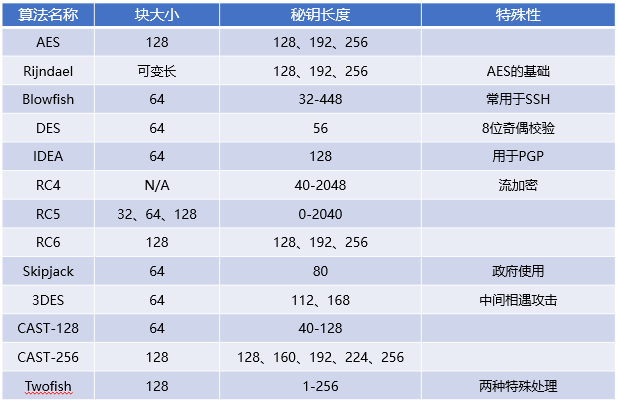

### 三、对称密钥管理

1. 创建和分发对称秘钥

- 线下分发：物理上交换秘钥。
- 公钥加密：利用非对称加密算法传递对称秘钥。
- Diffie-Hellman：类似非对称加密算法，但仅限于共享秘钥的交换。

2. 存储和销毁对称秘钥

- 不将加密秘钥与加密数据存放在一个系统里。
- 采用分隔知识原则。
- 用户离开秘钥必须销毁。

密钥存储机制有基于软件和基于硬件两种机制，基于软件易实现、但易被软件自身安全性影响，基于硬件实现方法复杂、成本也更高，但提供了额外的安全性，如硬件安全模块（HSM）。

3. 秘钥托管和恢复

- 公平密码系统：秘钥采用分隔知识原则分别存储在独立第三方。
- 受托加密标准：如Skipjack，为政府或其他授权代理提供了解密密文的技术手段。

### 四、密码算法生命周期

由于技术的发展，计算机算力不断提升，原来被视为安全的密码算法已不再安全，因此组织在使用密码算法时需要注意密码算法的生命周期。

## D3-3：非对称加密算法

发送者和接收者分别拥有一个公钥和一个私钥，用对方的公钥加密，用自己的私钥解密，具有以下优点：

1. 秘钥分发简单：每个人的公钥所有人都可知道，私钥自己保管，可直接开始通信。
2. 提供完整性、身份验证和不可否认性：私钥能够提供这些功能。
3. 可伸缩性：秘钥维护简单，秘钥数=n*2
4. 秘钥生命周期长：参与者提供公钥即可加入通信群体，离开也不会影响其他参与者。

缺点就是运算速度慢，而对称加密算法运算速度快。因此，现在都会使用非对称加密算法交换对称秘钥，使用对称密码算法提供后续通信安全。

### 一、RSA

由Ronald Rivest、Adi Shamir 和Leonard Adleman三人提出，利用素数因式分解题构成该算法基础，算法申请专利但已到期，可免费使用。

背包算法（Knapsack algorithm）：Merkle-Hellman提出的算法，利用因式分解运算题构成该算法的基础，已证实不安全。

### 二、EI Gamal

是由T.EI Gamal提出，基于Diffie-Hellman算法的扩展，可免费使用，缺点是密文长度比明文长度大了一倍，对于传输会造成问题。

### 三、Elliptic Curve

Elliptic curve cryptography (ECC)算法利用椭圆曲线离散对数题构成该算法的基础，可使用较短秘钥长度产生高安全性，如160位ECC秘钥长度的强度与1024位RSA强度一样。

### 四、Diffie–Hellman密钥交换

Diffie–Hellman算法使用素数的数学原理，类似于RSA算法，用于秘密的交换共享密钥。通常用于创建共享密钥以用于传输层安全性（TLS），其中它被称为DHE或EDH。

### 五、量子密码（Quantum Cryptography）

量子计算（quantum computing）使用量子力学原理，用称为量子比特（qubits）的多维量子比特取代数字计算的二进制1位和0位。目前，量子计算机仅限于理论研究。量子计算机可能能够解决在当代计算机上无法解决的问题，这一概念被称为量子至上（quantum supremacy），如果实现了这一概念，可以很容易地解决许多经典非对称加密算法所依赖的因式分解问题。如果出现这种情况，可能会使RSA和Diffie–Hellman等流行算法变得不安全。因此，组织需要考虑当前加密数据的敏感周期是否超过了量子计算的应用时间，那么加密数据就会遭到泄露。

### 六、非对称密钥管理

1. 加密系统的选择

算法不能有缺陷即选最佳实践，如RSA或ECC；

2. 秘钥长度的选择

满足安全要求和性能的平衡；

3. 保护好私钥

一旦丢失破坏了整个加密系统的安全性；

4. 秘钥轮换机制

需定期更换密钥，像密码策略一样；

5. 备份秘钥

秘钥一旦丢失则无法解密数据；

6. 使用硬件安全模块（HSM）管理秘钥

就像硬件令牌一样。

## D3-4：哈希函数

目的是将一条任意长度的明文消息生成一个固定长度的唯一值，即消息摘要（message digest），且不可逆向（即单向函数），用于验证消息完整性。散列函数的5个基本要求：

1. 输入可以是任意长度；
2. 输出有一个固定长度；
3. 计算相对容易；
4. 单向的，无法从摘要逆向得到明文消息；
5. 无冲突，不同的消息不会产生相对的消息摘要（也叫散列值）。

### 一、安全散列算法（Secure Hash Algorithm，SHA）系列

1. SHA-1

生成160位摘要消息，不安全。

2. SHA-2

有4个版本，对应生成的消息摘要长度，即SHA-256、SHA-224、SHA-512、SHA-384，安全可靠。

3. SHA-3

以Keccak算法为标准，可生成任意长度消息摘要，但SHA-3标准中定义了4个版本，分别是SHA3-224、SHA3-256、SHA3-384、SHA3-512。SHA-3提供了与SHA-2相同的安全级别，但它比SHA-2慢，因此除了在硬件中高效实现算法的一些特殊情况外，SHA-3不常用。

### 二、消息摘要（Message Digest，MD）系列

生成128位消息摘要，不安全；

2. MD4

生成128位消息摘要，不安全；

3. MD5

生成128位消息摘要，不安全；

4. HAVAL可变长散列

MD5的修订版，生成128、160、192、224 和256 位消息摘要，目前128位3轮计算的HAVAL已被证实不安全。

### 三、RACE原始完整性校验消息摘要（RACE Integrity Primitives Evaluation Message Digest，RIPEMD）系列

RIPEMD哈希函数是某些应用程序（如比特币加密货币实现）中使用的SHA系列的替代品。

1. RIPEMD

生成128位消息摘要，因结构缺陷，不安全；

2. RIPEMD-128

同样生成128位消息摘要，不安全；

3. RIPEMD-160

最常用的RIPEMD变体，产生一个160位消息摘要，安全可靠。

RIPEMD-256是基于RIPEMD-128、RIPEMD-320是基于RIPEMD-160的改进版，但不增加安全性，仅提高了消息摘要的长度。

## D3-5：数字签名

目的是身份验证（零知识证明）、不可否认性（由非对称加密算法文件提供）和完整性（由哈希函数提供），过程是明文消息通过散列函数计算得到消息摘要（或散列值），消息摘要通过私钥加密得到数字签名。

### 一、哈希消息身份认证码（HMAC）

1. 消息身份验证代码（MAC）

由于传递含消息摘要的信息过程中可以被攻击者截获，篡改明文消息再计算消息摘要进而无法确保完整性，因此需要消息身份验证代码（MAC）。

2. 哈希消息身份认证码（HMAC）

MAC有两种计算方式

- 先计算消息摘要，再使用共享密钥进行加密。
- 计算消息摘要时将共享密钥和数据同时输入，这种方法叫做哈希消息身份验证码（HMAC）。

HMAC算法实现了部分数字签名特性，它保证了消息在传输过程中的完整性，但不提供不可否认性。

### 二、数字签名标准

1. DSA数字签名算法
2. RSA算法
3. 椭圆曲线DSA（ECDSA）

## D3-6：公钥基础设施（PKI）

### 一、证书

数字证书（Digital certificates）就是个人公钥经由可信发证机构（CA）签注的副本，即经过第三方验证是合法的。不经过CA签注的数字证书也不能说是不合法，但一般仅用于内网使用。数字证书标准是X.509，包含如下内容：

- 证书符合X.509版本
- 序列号
- 签名算法标志符
- 颁发者名称
- 有效期
- 主体名称
- 主体公钥
- 自定义变量

### 二、证书颁发机构

这仅关乎一个信任问题，你只要信任某机构就可以让其发证，但普遍都信任规模大的公司（如赛门铁克等）。

注册机构（Registration authorities，RA）分担证书颁发机构（Certificate authorities，CA）签发证书前验证用户身份的职责，即用户申请证书需先经过RA验证，再到CA进行签发。

组织也可以选择成为内部CA，提供自签名证书（self-signed certificates）供组织内部使用，从而节省证书费用。

### 三、证书生命周期

1. 注册

用户申请数字证书，需先向CA证明其身份信息。然后组织通过证书签名请求（certificate signing request，CSR）的形式向CA提供自己的公钥。CA基于组织身份信息和公钥创建数字证书，然后使用CA的私钥对数字证书进行数字签名，然后该数字签名就可以正常使用。数字证书根据组织身份信息验证的级别，分为以下几种类型：

- 域名验证（DV）：需验证域名的控制权。
- 组织验证（OV）：需验证组织的资质信息。
- 扩展验证（EV）：最严格的组织信息验证。

2. 验证

当收到一个用户的数字证书时（也就是该用户的、经过验证的公钥），使用CA的公钥检查该证书的数字签名，用以确定该用户数字证书的合法性。除了验证CA的数字签名外，还需要查看证书注销列表（CRL）或在线证书状态协议（OCSP）检查证书有效性。

3. 注销

当证书失信、证书误发、证书内容变更、安全关系变更时，需要对证书进行注销。有三种技术来验证证书的真实性并识别已吊销的证书：

- 证书注销列表（CRL）：CA提供的证书列表，用户可下载验证。
- 在线证书状态协议（OCSP）：用户可向OCSP服务器发送验证请求进行验证。
- 证书装订（Certificate Stapling）：OCSP的扩展技术，如果每个用户都对证书进行验证，OCSP服务器的压力非常大，因此网站可进行验证，将OCSP响应绑定证书发送给用户，进而降低OCSP服务器压力。

### 四、证书格式

1. DER：二进制格式，常见后缀为der、crt、cer。
2. PEM：DER格式的ASCII文本版本，常见后缀为pem、crt。
3. PFX：Windows系统通常使用，二进制格式，常见后缀为pfx、p12。
4. P7B：Windows系统通常使用，ASCII文本格式，常见后缀为p7b。

### 五、混合密码学

由于对称加密算法和非对称加密算法各有优劣势，因此在使用过程中会混合使用，即混合密码学（Hybrid Cryptography）。

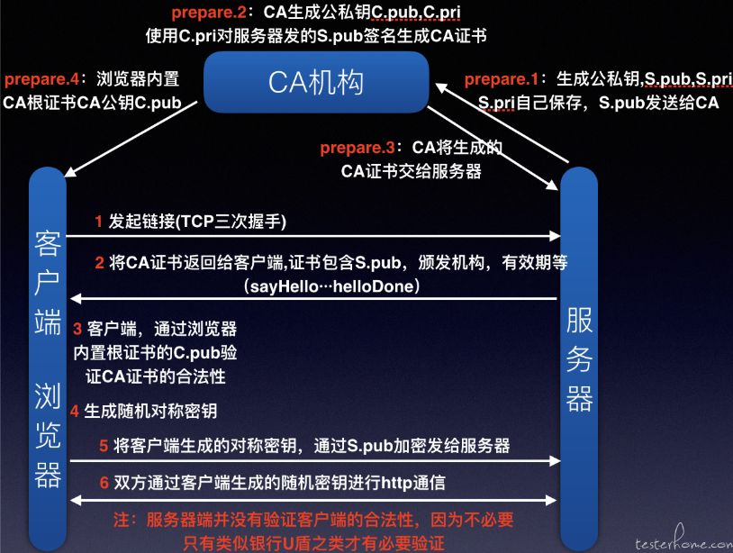

## D3-7：密码学应用

### 一、便携设备

1. Windows系统

使用Bitlocker和Encrypting File System(EFS)加密数据。

2. Mac OS X系统

使用FileVault加密数据。

3. 适配所有系统

VeraCrypt开源程序包。

4. 可信平台模块（TPM）

安装在主板上的芯片，管理硬盘加密的秘钥，防止移除硬盘在他处读取。

### 二、电子邮件

1. 良好隐私（PGP）

利用信任网（web of trust）提供安全性，商业版使用RSA进行秘钥交换、IDEA进行加解密、MD5生成消息摘要；免费版使用Diffie-Hellman进行秘钥交换、CAST-128进行加解密、SHA-1生成消息摘要。

2. 安全多用途互联网邮件扩展（S/MIME）

使用X.509证书进行秘钥交换（RSA）、AES或3DES进行加解密、SHA-1或MD5生成消息摘要。

### 三、Web应用程序

1. 安全套接字层（SSL）

HTTPS超文本传输协议通过443端口协商Web服务器和浏览器之间的加密通信会话，其过程如下：

- 浏览器访问网站获取服务器证书提取公钥
- 浏览器生成随机对称秘钥（临时密钥），用户服务器公钥加密对称秘钥发送给服务器
- 服务器使用私钥解密对称秘钥（临时密钥），用于后续通信加密

2. 传输层安全（TLS）

由于POODLE攻击，TLS代替SSL成为主流。

3. 洋葱和暗网（Tor and Dark Web）

Tor提供一种通过加密和一组中继节点在互联网上匿名路由流量的机制。它依赖于一种称为完美前向保密（perfect forward secrecy）的技术，在这种技术中，加密层防止中继链中的节点读取除接受和转发流量所需的特定信息以外的任何信息。通过使用完美的前向保密和一组三个或更多的中继节点，Tor既可以匿名浏览标准互联网，也可以在暗网上托管完全匿名的网站。

### 四、隐写术（Steganography）

通过加密技术把敏感消息嵌入另外一条消息的技术，常用于图片嵌入敏感消息用于传递给外部。隐写术的合法用途是数字水印（Watermarking），用于保护知识产权。

### 五、网络

1. 电路加密

保护网络传输数据的有两种类型加密技术。

- 链路加密：所有数据都是加密的，包括IP地址和路由信息，用于低层协议加密。
- 端到端加密：数据头部信息不加密，用于高层协议加密。

2. 互联网协议安全（IPSec）

实现端到端加密，通过公钥加密算法提供安全性，但只能基于IP协议。

- 两个重要组件

AH身份验证头提供完整性和不可否认性；

ESP封装安全载荷提供数据内容的机密性和完整性。

- 两种模式

传输模型，只加密数据包载荷；

隧道模式，加密所有数据内容。

- 需要创建安全关联（SA）来建立IPSec会话，SA记录了会话的所有配置和状态信息。

3. 互联网安全关联和密钥管理协议（ISAKMP）

用于管理IPSec的SA的协议。

### 六、新兴应用

1. 区块链（Blockchain）

区块链是一个分布式、不可改变的公共账本，即创建了一个没有人可以篡改或破坏的数据存储。可应用于加密货币、供应链跟踪、资产所有权管理等。

2. 轻量级密码（Lightweight Cryptography）

加解密性能是一个问题，可通过专用加解密硬件实现轻量级密码，如银行使用的加密机。

3. 同态加密（Homomorphic Encryption）

加密的数据保留了对该数据执行计算的能力，即不需要解密就能对数据进行计算。

## D3-8：密码学攻击

### 一、分析攻击（Analytic Attack）

一种数学运算，试图降低算法的复杂性，关注算法本身的逻辑。

### 二、实施攻击（Implementation Attack）

一种利用加密系统实施中的弱点进行攻击的类型，关注软件代码和编程方法。

### 三、统计攻击（Statistical Attack）

利用密码系统中的统计弱点，例如浮点错误和无法生成真正的随机数。

### 四、爆破攻击（Brute-Force Attack）

尝试密钥或密码的所有可能有效组合，可通过以下方法提高爆破效率：

1. 彩虹表（Rainbow Tables）

该表存储可能是密码的哈希值，常用于爆破离线的哈希密码。可通过盐、胡椒和密钥延伸（key stretching）技术防范彩虹表。

2. 专用硬件设备

专门为进行暴力攻击而设计的专用、可扩展的计算硬件。

### 五、故障注入（Fault Injection Attack）

攻击者试图通过引起某种类型的外部故障来破坏加密设备的完整性，如使用高压电、高温或低温破坏加密设备。

### 六、侧信道攻击（Side-Channel Attack）

该攻击通过记录系统活动特征，如CPU利用率、功耗或电磁辐射等变化来破解加密信息。

### 七、时间攻击（Timing Attack）

攻击者精确测量加密操作完成所需的时间，获取可能用于破坏其安全性的加密过程的信息。

### 八、频率分析和唯密文攻击（Frequency Analysis and the Ciphertext-Only Attack）

仅有消息密文尝试破解密文，常通过频率分析进行，如密文中常见英文字母多，则可能是换位密码，否则可能是替换密码。

### 九、已知明文攻击（Known Plaintext Attack）

拥有明文和密文猜测加密方法。

### 十、选定明文攻击（Chosen Plaintext Attack）

能够加密部分明文获得密文来尝试找出秘钥。

### 十一、选定密文攻击（Chosen Ciphertext Attack）

能够解密部分密文来尝试找出秘钥。

### 十二、中间相遇攻击（Meet in the Middle）

可破解使用两轮加密的加密算法，2DES不安全的原因。

### 十三、中间人攻击（Man in the Middle）

也叫路径攻击（on-path attacks），截获双方通信流量，冒充通信双方对流量进行监听或篡改。

### 十四、生日攻击（Birthday）

利用散列函数的碰撞来保持伪造的数字签名是有效性。

### 十五、重放攻击（Replay）

用于攻击不包含临时保护的加密算法，截获用户认证信息重放来尝试建立通信会话。

## D3-9：安全设计原则

### 一、对象和主体

一个终端访问一个web服务，此时会有两个小过程：

1. 终端访问web服务，请求相关数据；（终端是主体、web服务是对象）
2. web服务访问数据库，并将数据返回给终端。（web服务是主体、数据库是对象）

终端是没有权利直接访问数据库的，但是通过web服务可以获取到数据库数据，这就是信任传递（transitive trust），需要关注这类风险。

### 二、封闭和开放系统

1. 封闭系统

标准是专有的，不易集成其他系统，但是相对安全。

2. 开放系统

标准是公开的，易集成其他系统，但更容易遭受攻击。

3. 开源系统

指代码公开，大家可以白嫖并不断改善系统，如开源项目社区，大家群策群力。

4. 闭源系统

指代码隐藏，开发商可以卖钱获得商业价值，需要依靠开发商进行维护。

### 三、安全缺省（Secure Defaults）

通常产品的默认配置都是不安全的，但这样方便产品的快速部署。现在许多产品也支持默认配置是安全的，但一些人会认为安全缺省是阻碍，因此需要平衡默认配置的可用性和安全性。

### 四、故障安全（Fail Securely）

系统运行中会出现故障，系统或环境如何处理故障非常重要，最理想的结果是故障安全（Fail Securely），如编程中的异常处理。还有一些易混概念需要注意：

1. 故障弱化（fail-soft）

指允许系统在组件发生故障后继续运行，如操作系统一个APP挂了，其他APP都正常运行。

2. 故障安全（fail-secure）

故障安全系统优先考虑资产的物理安全，而不是任何其他因素，如有人物理入侵银行金库，则门禁需要自带关闭并锁定。

3. 故障安全（fail-safe）

当系统故障能够影响物理世界时，则需要考虑人类生命安全的优先级，这种人类保护优先顺序被称为故障安全，如火灾时门禁自动打开。

4. 故障开放（fail-open）

当系统故障需要保障可用性时称为故障开放，如防火墙的bypass功能。

5. 故障关闭（fail-closed）

当系统故障需要保障机密性时称为故障关闭，如防火墙不再转发流量。

在物理世界的上下文中，术语fail-open是fail-safe的同义词，fail-closed是fail-secure的同义词。在数字世界的上下文中，fail-safe、fail-secure、fail-closed是同义词。

### 五、保持简单（Keep it simple）

也被称为KISS原则，鼓励避免环境、组织或产品设计过于复杂。系统越复杂，安全就越困难。还有许多其他具有类似或相关重点的概念，例如：

1. 不要重复自己（DRY）

通过不在多个地方重复相同的代码来消除软件中的冗余。

2. 计算简化（Computing Minimalism）

精心设计代码，以便尽可能少地使用必要的硬件和软件资源。

3. 最小能力规则（Rule of Least Power）

使用适合所需解决方案的能力最小的编程语言。

4. 越差越好（Worse Is Better）

软件功能越少，安全性越高。

5. 你不需要他（YAGNI）

程序员不应该在实际需要之前添加功能和函数。

### 六、零信任（Zero Trust）

通常认为内部网络是安全的，外部网络是不安全的，更多地关注边界安全。但新技术的发展（如云计算、物联网等），安全边界变得越来越模糊。因此，零信任概念被提出，组织内部的任何内容都不会自动受到信任，即绝不信任、始终验证。

零信任通过微隔离（microsegmentation）和加强最小特权原则来实现。微隔离是将内部网络划分为多个子区域。每个区域通过内部分段防火墙（ISFW）、子网或VLAN与其他区域分开。区域可以小到单个设备，例如高价值服务器，甚至客户端或端点设备。区域之间的任何和所有通信都经过过滤，可能需要进行身份验证，通常需要会话加密，并且可能受到允许列表和阻止列表控制。

零信任解决方案通常是非常大的，包括但不限于内部分段防火墙（ISFW）、多因素身份验证（MFA）、身份和访问管理（IAM）以及下一代终端安全。只有实现了持续验证和监视用户活动的方法，安全管理的零信任方法才能成功。

### 七、设计隐私（Privacy by Design，PbD）

在早期设计阶段将隐私保护集成到产品中，而不是试图在开发结束时将其附加到产品中的指导原则。PhD七项原则：

1. 主动而非被动；预防而非补救（Proactive not reactive; preventive not remedia）
2. 默认隐私（Privacy as the default）
3. 隐私融入设计（Privacy embedded into design）
4. 全功能–正和而非零和（Full functionality – positive-sum, not zero-sum）
5. 端对端安全—全生命周期保护（End-to-end security – full lifecycle protection）
6. 可见性和透明性（Visibility and transparency）
7. 尊重用户隐私（Respect for user privacy）

### 八、信任但验证（Trust but Verify）

信任但验证指的是经过一次验证后就对其信任，如内网通常都被认为是安全的。该方法使组织容易受到内部攻击，并使入侵者能够轻松地在内部系统之间执行横向移动。该模型已被认为是过时的，大多数安全专家现在建议围绕零信任模型设计组织安全。

### 九、确保CIA的技术

以下概念不仅可用于数字世界，也可用于物理世界。

1. 限制（confinement）

约束进程的手段，进程只能访问分配给自己的内存空间（偏动词）。

2. 界限（bound）

限制访问的内存边界即是界限（偏名词）。

3. 隔离（isolation）

限制进程只能在某内存空间活动的状态称为隔离（一种状态）。

4. 访问控制

高频知识点，详见域5。

5. 信任和保证

信任是安全机制、功能或能力的存在。保证是对满足安全需求的信心程度。

## D3-10：安全模型基本概念

### 一、描述对象安全属性的方法

1. 安全令牌（token）

与资源关联并描述其安全属性的单独对象，可以在请求访问实际对象之前传递有关对象的安全信息。

2. 能力表（capability）

为每个受控对象维护一行安全属性。

3. 安全标签（label）

分配给对象的自定义安全属性，通常无法更改。

### 二、可信计算基

可信计算基础（TCB）设计原则是硬件、软件和控制的组合，它们共同构成一个可信基础，以执行组织的安全策略。TCB组件的职责是确保系统在所有情况下都能正常运行，在所有情况下都遵守安全策略。

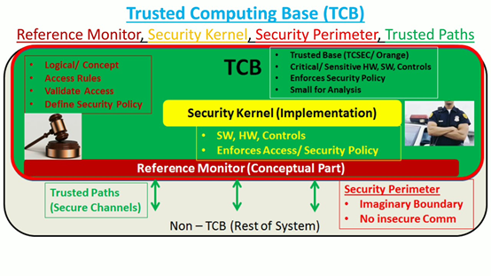

1. 安全边界（security perimeter）

是TCB与系统其余部分间的假想边界，TCB与系统其余部分通信必须创建安全通道，即可信路径（trusted paths）。

2. 参考监视器（reference monitors）

TCB中负责访问控制的执行。

3. 安全内核（security kernel）

TCB中实现参考监视器功能的组件集合。

### 三、状态机模型

系统受外部输入影响会改变系统状态，保障系统所有转换的状态都是安全的，这就称为安全状态机模型。

### 四、信息流模型

基于状态机模型，关注信息的流向，通过识别正常信息流路径解决隐蔽通道问题。

### 五、非干扰模型

基于信息流模型，关注较高安全级别主体的行为如何影响系统状态或较低安全级别主体的行为，只要不产生影响就是非干扰模型。

### 六、组合理论

一些属于信息流范畴的模型建立在多个系统之间输入和输出的概念上，这些被称为组合理论。

1. 级联（Cascading）：A的输出是B的输入。
2. 反馈（Feedback）：A的输出是B的输入，B的输出是A的输入。
3. 连接（Hookup）：A的输出不仅是B的输入，而且也是C的输入。

### 七、Take-Grant模型

1. 获取规则：主体A可以从主体B获取权限；
2. 授予规则：主体A可以将权限授予主体B或客体C；
3. 创建规则：主体A创建新权限；
4. 删除规则：主体A删除其权限。

### 八、访问控制矩阵

能力表是行（关注主体），访问控制列表是列（关注客体），两者组成访问控制矩阵。

### 九、Bell-LaPadula模型

专注于维护机密性，采用强制访问控制和格子概念。

1. 简单安全属性：不准向上读；
2. *安全属性：不准向下写；
3. 自由安全属性：使用访问控制矩阵实现自主访问控制。

### 十、Biba模型

专注于维护完整性，适用于非军事组织。

1. 简单完整性属性：不准向下读；
2. *完整性属性：不准向上写。

### 十一、BL和Biba模型组合记忆

1. BL涉及机密性，其属性全是安全属性；
2. Biba涉及完整性，其属性全是完整性属性；
3. 简单属性肯定是读操作，*属性肯定是写操作。

### 十二、Clark-Wilson模型

专注于维护完整性，采用三元组（主体/程序/客体）架构，主体无法直接访问对象，这被称为约束接口（restrictive interface）。

1. 受约束数据项（CDI）：受保护的数据；
2. 无约束数据项（UDI）：不受保护的数据；
3. 完整性验证过程（IVP）：扫描数据并确认其完整性的过程；
4. 转换过程（TP）：唯一允许修改CDI的过程。

UDI经过IVP转换成CDI，CDI不能被直接修改，必须经过TP才能修改。

### 十三、Brewer and Nash模型

别名为Chinese Wall，基于用户行为动态分配主体的权限。其实是将客体进行分类、隔离并添加逻辑判断规则以实现动态的权限分配。如A和B是竞争对手，那么C在访问A的数据后，就不能再访问B的数据，避免出现利益冲突。

### 十四、Goguen-Meseguer模型

专注于维护完整性，是非干涉模型的基础。

### 十五、Sutherland模型

专注于维护完整性，可防止隐蔽通道。

### 十六、Graham-Denning模型

专注于主体和客体的安全创建与删除，共有八个规则：

1. 安全地创建对象
2. 安全地创建主体
3. 安全地删除对象
4. 安全地删除主体
5. 安全地提供读取访问权限
6. 安全地提供授予访问权限
7. 安全地提供删除访问权限
8. 安全地提供转移访问权限

### 十七、Harrison–Ruzzo–Ullman模型

Graham-Denning模型的扩展，着重于对象访问权的分配以及这些分配权利的弹性。

## D3-11：基于系统安全需求选择控制

### 一、通用准则（Common Criteria）

国际标准，用于评估IT产品安全性。

1. CC的目标

- 增加买家对经过评估、评级的IT产品安全性的信心
- 消除重复评估
- 不断提高安全评估的成本效益和效率
- 确保对IT产品的评估符合高且一致的标准
- 促进评估并提高经评估、评级的IT产品的可用性
- 评估评估目标（target of evaluation，TOE）的功能和保证

2. CC的两个关键要素

- 保护范畴（PP）：客户对欲购产品提出的安全要求。
- 安全目标（ST）：厂商对自己产品的安全声明。

3. 评估保证级别（evaluation assurance level，EAL）

EAL级别涉及两个方面的评估

- 功能（functionality）：详细的功能要求，即功能测试项的描述。
- 保证（assurance）：详细的保证要求，涉及运营方面的描述。

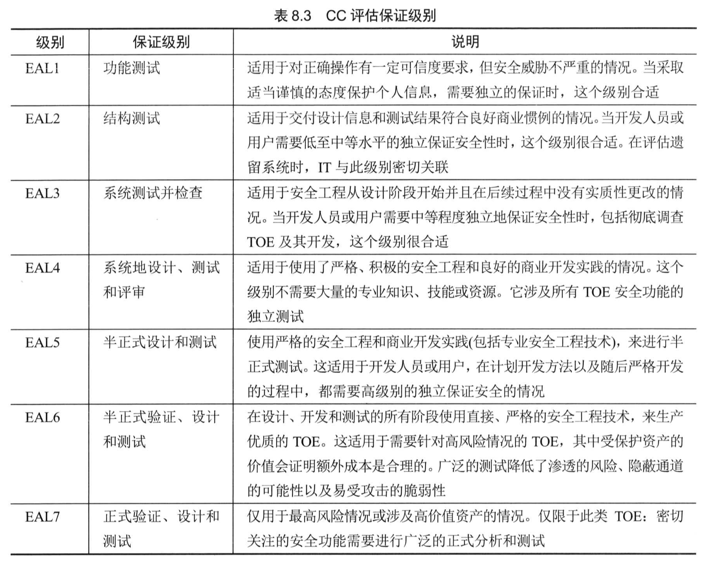

4. 理解CC的价值

客户想要买IT产品（提出安全要求，即PP），但是怕被坑，毕竟厂商自卖自夸，客户很难知道是否有吹嘘的功能点。那么有一个测评中心，采用CC的评估标准对厂商的产品进行评估（厂商会对送测的产品进行安全声明，即ST），并给予产品安全性的级别（即EAL）。客户再根据测评中心提供的评估报告进行IT产品采购就具有一定的参考性，大概率降低被坑的风险。

### 二、授权运营（Authorization to Operate）

在很多环境中，为了运营目标使用安全的系统必须获取官方批准，该过程被称为授权运营（ATO）。

PS：ATO替代了老旧术语鉴定（accreditation）。

1. 授权官（Authorizing Official，AO）

执行评估和分布ATO的实体，也被称为指定审批机构（DAA）、审批机构（AA）、安全控制评估员（SCA）和推荐官（RO）

2. 需重新获取ATO的条件

- ATO时间范围已过期。
- 系统遭遇重大安全漏洞。
- 系统遭遇重大的安全变更。

3. AO的授权决策

- 授权运营（ATO）：系统的风险管理到可接受水平时。
- 通用控制授权（Common Control Authorization）：当从另一个供应商继承安全控制时，以及当与通用控制相关的风险处于可接受水平并且已经有来自同一AO的ATO时。
- 授权使用（Authorization to Use）：当第三方供应商（如云服务）提供的产品被认为具有可接受的风险水平时。
- 拒绝授权（Denial of Authorization）：风险不可接受时。

## D3-12：硬件及固件

### 一、处理器

中央处理器（CPU），通常称为处理器或微处理器，是计算机的神经中枢。

1. 执行类型

指的是使用不同方法来解决CPU同时做多件事的问题。

- 多任务（Multitasking）：单核CPU条件下，不是真正的多任务处理，依靠操作系统模拟实现。
- 多核（Multicore）：多核CPU同时处理多个事务。
- 多处理（Multiprocessing）：多个CPU条件下，利用多个CPU完成多任务处理。
- 多程序（Multiprogramming）：类似多任务处理，过时的技术，区别在于多程序用于大型机使用，而多任务用于个人电脑使用；多程序需要专门的软件才能实现，多任务由操作系统直接实现。
- 多线程（Multithreading）：多线程允许在单一进程中执行多个并发任务。多任务处理多个任务时占用多个进程；与多任务处理不同，多线程允许多个任务在单一进程中运行。

2. 保护机制

- 保护环
  - 环0具有最高的特权级别，基本上可以访问任何资源，运行内核；
  - 环1运行操作系统除内核外的其他部分；
  - 环2运行I/O驱动程序和系统应用程序；
  - 环3运行应用程序。

- 进程状态
  - 就绪状态（ready）
  - 等待状态（waiting）
  - 运行状态（running）
  - 停止状态（stopped）

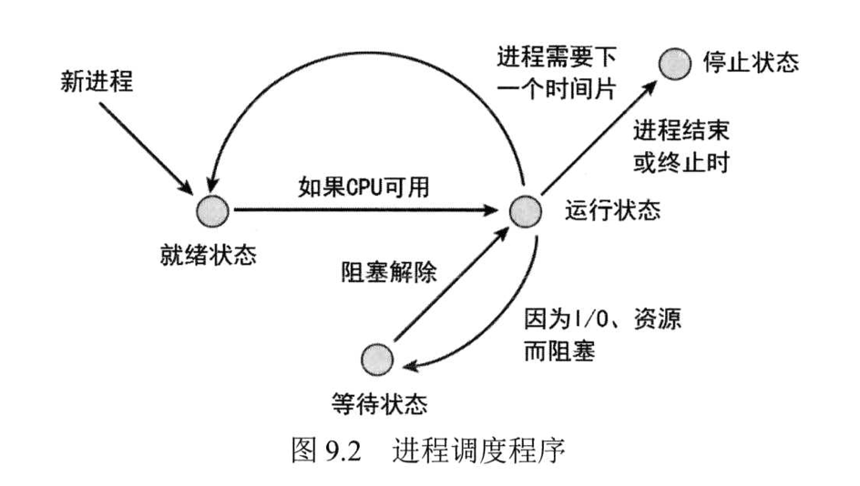

注意运行状态的两个特殊状态，一般运行状态叫问题状态（problem）（用户模式，权限低），当需要执行特权时成为监管状态（supervisory）（监管模式，权限高）。

- 操作模式
  - 用户模式：运行在环3。
  - 特权模式：运行在环0-2，也叫监管模式或内核模式。

### 二、存储器

计算机需要随时保存的信息的存储库。

1. 只读存储器（ROM）

ROM是可以读取但不能更改的内存(不允许写入)，但这就对后期维护就不友好了，因此有了以下几种子类型的ROM。

- 可编程只读存储器（PROM）：可允许出厂后再烧入内容。
- 可擦除只读存储器（EPROM），其中用光擦的叫UVEPROM，用电擦的叫EEPROM。
- 闪存（Flash Memory）：高级版EEPROM，可按块或页进行擦除，用于存储卡、U盘等。

2. 随机存取存储器（RAM）

随机存取存储器（RAM）是可读写存储器，但属于易失性存储介质，断电后数据消失。

- 实际存储器（Real Memory），也叫主内存，也就是日常说的内存。
- 高速缓存RAM（Cache RAM），也就是内存与存储设备的缓冲地带，提前读取数据到缓存中，提高处理速度。

3. 寄存器（registers）

CPU的板载存储器，为算数逻辑单元（ALU）在执行指令时提供可以直接访问的存储位置。

4. 内存寻址（Memory Addressing）

使用内存资源时，CPU必须具有一些引用内存中各个位置的方法。

- 寄存器寻址：CPU直接用就行，毕竟离得最近；
- 立即寻址：将数据作为指令的一部分提供给CPU；
- 直接寻址：要访问的内存的实际地址会提供给CPU；
- 间接寻址：要访问的内存的实际地址会通过另一个内存地址（间接地址）提供给CPU；
- 基址+偏移量寻址：使用存储在CPU的某个寄存器中的数值作为开始计算的基地址。

5. 辅助存储器（Secondary memory）

通常指磁性、光学或基于闪存的介质，或其他存储设备，包含CPU不能直接获得的数据。虚拟内存（Virtual memory）是一种特殊类型的辅助内存，由操作系统管理，可使其像真实内存一样。

6. 数据存储设备

- 主存储设备（内存）与辅助存储设备（硬盘）
- 易失性存储设备（内存）与非易失性存储设备（硬盘）
- 随机存取（大多数都是）与顺序存取（典型的是磁带，便宜哦）

7. 存储方面的安全问题

- 总体上还是数据安全的问题，主要是数据在三种状态（静态、传输和使用）下的保护，静态（对称加密）和传输（TLS）都使用加密来防范，使用中的数据无法加密，被攻击的风险也低，因为断电就数据就没了，但需要注意一种攻击方法，冻结内存芯片以延迟驻留数据的衰减然后再尝试读取。
- 数据残留问题，其中因SSD耗损均衡机制或坏块的存在，可能会导致净化过程不能完全擦除SSD上的数据。耗损均衡（wear leveling）指的是为了保障每个存储块的写入/擦除次数一致，避免对某一部分区块的过度地重复进行擦除操作而报废，从而有效延长了固态硬盘的写入寿命。
- 辅助存储设备易被物理盗取，需要加强物理安全的保护。

8. 放射安全（Emanation Security）

许多电子类设备发出的电信号或辐射可被截获，其中可能包含机密信息。用于防止放射攻击的对策和防护措施类型称为TEMPEST。TEMPEST也可用于进行攻击，远程读取设备产生的电子辐射，此攻击被称为Van Eck phreaking，防范机制如下：

- 法拉第笼（Faraday Cage）：被动机制，设计一个金属罩子防止信号的传播。
- 白噪声（White Noise）：主动机制，主动发送干扰信号防止远程读取。
- 控制区（Control Zone）：划定区域实施法拉第笼或白噪声。

### 三、输入/输出（I/O）设备

1. 显示器

- Van Eck入侵，使用TEMPEST技术可远程读取屏幕上的信息。
- 肩窥（shoulder surfing），用眼睛或摄像机看到你屏幕上的内容。

2. 打印机

- 趁打印者未取走敏感信息的纸质前查看或带走敏感信息。
- 审查打印机是否本地存储打印的数据。
- 打印机数据传输安全性。
- 打印机的身份验证机制。

3. 键鼠

易受TEMPEST技术监听，泄露击键操作。

4. 调制解调器

过时设备赶紧弃用，避免成为风险点。

### 四、固件（Firmware）

存储在ROM芯片中的软件。

1. 主板BIOS

phlashing攻击，会安装官方 BIOS 或固件的恶意变体版本，将远程控制或其他恶意功能引入设备。2011年之后，统一可扩展固件接口（UEFI）取代了传统BIOS。

2. 设备固件

迷你操作系统，仅完成一些功能，如物联网设备。

## D3-13：客户端的及服务器系统

### 一、客户端安全

1. 移动代码

applet由服务器发送给客户端，以便客户端可以做本地处理，降低服务器压力、提升处理速度。applet允许远程系统将代码发送到本地系统运行，那么服务器发送的代码如果包含恶意程序（服务器运营或攻击者插入），则客户端就会面临风险。两个历史示例时Java applet和ActiveX 控件，都已过时淘汰。JavaScript作为嵌入式代码成为了新的风险点，可引发XSS、XSRF等漏洞，防范机制如下：

- 在客户端侧保持浏览器更新。
- 在服务器侧实施JavaScript安全组件，如ADsafe、SES、Caja（服务器）。
- 使用内容安全策略（CSP），对浏览器活动执行严格的同源限制。

2. 本地缓存

- ARP缓存：ARP缓存中毒，使用动态持续发送错误ARP响应包或创建静态ARP条目等方式，改变客户端ARP缓存的IP/MAC映射关系，可用于发动中间人或拒绝服务等攻击。
- DNS缓存：DNS缓存中毒，攻击原理与ARP缓存类似，可攻击HOSTS文件、授权DNS服务器、缓存DNS服务器等，改变的是IP/domain映射关系，可用于重定向攻击。
- Internet文件缓存：从web网站下载的临时存储文件，可为访问web网站提速，存在插入恶意代码的风险。

### 二、服务器安全

攻击大多数针对的是服务端，后续学到的攻击方法基本都是针对服务端的。

1. 大规模并行数据系统

并行数据系统或并行计算是一种设计用于同时执行大量计算的计算系统。

- 对称多处理（symmetric multiprocessing，SMP）：所有处理器被同等对待并由一个操作系统控制的场景。适合以极高速率处理简单操作，即个人电脑使用。
- 非对称多处理（asymmetric multiprocessing，AMP）：处理器通常彼此独立运行，每个处理器都有自己的操作系统和/或任务指令集，以及专用的数据总线和内存资源的场景。
- 大规模并行处理（massive parallel processing，MMP）：AMP的变体，其中多个AMP系统相互连接，以便处理单个主要任务。适合处理庞大、复杂和计算密集的任务，即科研使用。

2. 网格计算

网格计算指的是由一个中央核心服务器发布和管理任务到互联网，当网格成员的本地处理能力空闲或部分空闲时，可选择进入网格执行任务，网格成员不想执行任务时随时可以离开。网格计算理解起来就是众筹，某个任务需要100个人干，他可以拆成100份工作包发布出去，由网格成员选择执行，共同完成最终目标。网格计算的风险点：

- 发布的任务不能涉密，因为内容都会暴露在互联网上；
- 传输过程中工作包完整性遭到破坏会导致返工；
- 中央核心服务器是单点故障点和风险点。

3. 对等网络（P2P）

跟网格计算的目的是一样的，众筹一起把某个任务完成。区别在于P2P没有中央管理器，服务是实时的，可以参考一些P2P下载软件。

4. 高性能计算系统

高性能计算（High-performance computing，HPC）系统是设计用于以极高速度执行复杂计算或数据操作的计算平台，如超级计算机和MPP等。HPC由三个主要元素组成：计算资源、网络能力和存储能力，每个元素必须能够提供等效的功能才能保证整体性能。

实时操作系统（real-time operating system，RTOS）设计用于在数据到达系统时以最小延迟处理数据。RTOS通常存储在只读存储器（ROM）中，设计为在硬实时或软实时条件下运行。

5. 分布式系统

分布式系统（distributed system）或分布式计算环境（distributed computing environment，DCE）是单个系统的集合，这些系统协同工作以支持资源或提供服务。分布式系统提供弹性、可靠性、性能和可扩展性优势。借口定义语言（IDL）是一种用于定义分布式系统中客户端和服务器进程或对象之间接口的语言。

6. 微服务（Microservices）

面向服务体系结构（SOA）指的是利用现有但独立的软件服务构建新的应用程序或功能，如软件A和软件B功能整合，推出了新产品软件C。微服务是基于web的解决方案的SOA的衍生产品。微服务仅是web应用程序的一个元素、特性、功能、业务逻辑或功能，可以被其他web应用程序调用或使用。

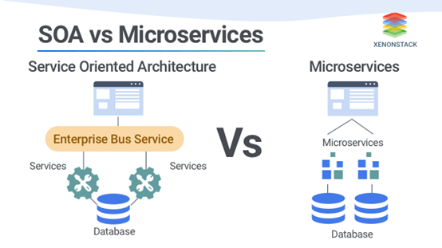

## D3-14：嵌入式设备相关技术

嵌入式系统（embedded system）是为了提供自动化、远程控制或监控而添加到现有机械或电子系统中的任何形式的计算组件。大多数嵌入式系统的设计都着眼于将成本和无关功能降至最低，这通常会导致缺乏安全性和升级或修补程序的困难。由于嵌入式系统可能控制物理世界中的某个机制，因此安全漏洞可能会对人员和财产造成伤害。

### 一、静态系统

嵌入式系统通常是静态系统，是指用户和管理员希望保持不变的任何系统。目标是防止或至少减少用户实施可能导致安全性或功能操作降低的更改的可能性，如ATM、网吧电脑等。

### 二、联网设备

联网设备（network-enabled devices）指的是是具有本机网络功能的任何类型的设备，嵌入式系统的示例包括网络连接打印机、智能电视、HVAC控制。

### 三、网络物理系统

网络物理系统（Cyber-physical Systems）指的是提供计算手段来控制物理世界中某些东西的设备。嵌入式设备关注计算，网络物理系统关注结果。示例包括提供人体增强假肢、车辆避碰、空中交通管制、机器人手术的精确性等，扩展为IoT。

### 四、专用设备（Specialized Devices）

专用设备是为某一特定目的而设计、由特定类型的组织使用或执行特定功能的任何设备，如医疗设备、智能车辆、自动驾驶飞机和智能仪表。这些设备随着技术发展都可以联网管控，提高便利性的同时引入新的风险，且这些风险通常都会导致人身安全的损害，优先级极高。

### 五、物联网

物联网（IoT）是一类通过互联网连接的智能设备，旨在为设备或设备提供自动化、远程控制或人工智能处理。与嵌入式设备不同之处在于，IoT可以是独立设备，也可以结合现有系统，而嵌入式设备通常仅用于集成到某系统。

与物联网相关的安全问题通常与访问和加密有关，如摄像头被控制。一种可能的安全实施方式是为物联网设备部署一个独立的网络，该网络与主网络保持分离和隔离，被称为三哑路由器（three dumb routers）。

工业物联网（IIoT）是物联网的衍生产品，更侧重于工业、工程、制造或基础设施层面的监督、自动化、管理和传感。IIoT是ICS和DCS的演变，它集成了云服务来执行数据收集、分析、优化和自动化。IIoT的示例包括边缘计算和雾计算。

### 六、工业控制系统

工业控制系统（ICS）是一种控制工业过程和机器的计算机管理设备，也称为操作技术（OT）。ICS的形式包括分布式控制系统（DCS）、可编程逻辑控制器（PLC）和监控与数据采集（SCADA）。

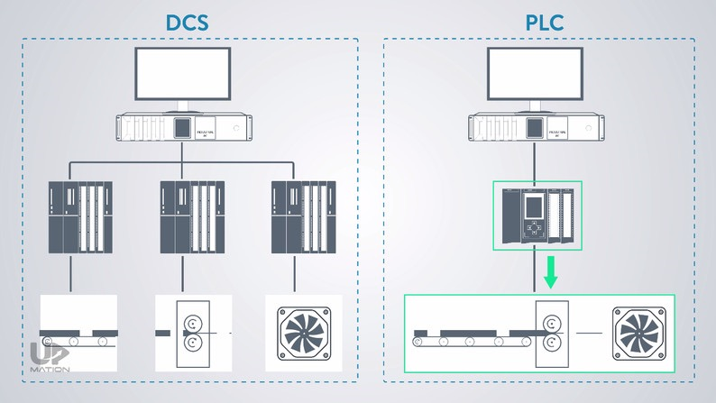

在实践中，SCADA和ICS系统仍然常常安全性差、易受攻击、更新不频繁。常见的重要安全控制包括隔离网络、限制物理和逻辑访问、将代码仅限于基本应用程序以及记录所有活动。

## D3-15：虚拟化技术发展

### 一、虚拟化技术

虚拟化技术用于在单个主机的内存中托管一个或多个操作系统，或运行与主机操作系统不兼容的应用程序。

1. 主要组件

- 虚拟机监控程序（hypervisor）：创建、管理和操作虚拟机的虚拟化组件。
- 宿主机操作系统（the host OS）：运行虚拟机监控程序的计算机。
- 来宾操作系统（guest OS）：也就是虚拟机。

2. hypervisor的类型

- 类型1：hypervisor直接安装到主机操作系统通常驻留的硬件上，通常用于支持服务器虚拟化，如EXSI。
- 类型2：硬件上存在一个标准的常规操作系统，然后将hypervisor作为另一个软件应用程序安装，通常用于桌面部署，如VMware。

3. 弹性与可伸缩性

弹性（Elasticity）是指扩展或收缩资源以满足当前的处理需求，而可伸缩性（scalability）是指承担更多工作或任务的能力。

### 二、虚拟化软件（Virtual Software）

虚拟化软件可以使虚拟机像真实主机一样运行，如VMware。

### 三、虚拟化网络（Virtualized Networking）

虚拟化网络将硬件和软件网络组件组合成单个集成实体，允许对所有网络功能进行软件控制，如管理、流量调整、地址分配等，如SDN、虚拟化SAN、虚拟机和端口隔离等。

### 四、软件定义一切（Software-Defined Everything，SDx）

软件定义的一切（SDx）是指使用虚拟化以软件取代硬件的趋势。

1. 虚拟桌面基础设施（VDI）

通过在用户远程访问的中央服务器上托管桌面操作系统虚拟机来降低终端设备安全风险和性能要求的方法，也被称为虚拟桌面环境（VDE）。

2. 虚拟移动基础设施（VMI）

与VDI基本一样，但指的是移动设备的操作系统在中央服务器上虚拟化。

3. 瘦客户机（Thin Client）

用户本地仅保留显示、I/O设备，可节省开支。

4. 软件定义可见性（SDV）

一个自动化网络监视和响应过程的框架，其目标是能够分析每个数据包，并就转发、丢弃或以其他方式响应威胁做出基于深度智能的决策。

5. 软件定义数据中心（SDDC）

用虚拟提供的解决方案替换物理IT元素，通常由外部第三方（如云服务提供商（CSP））提供，因此SDDC其实就是IT即服务（ITaaS）。

### 五、虚拟化安全管理

1. 保持更新

定期对虚拟机、虚拟机监控程序、宿主机进行补丁更新，使用虚拟化技术变相增加了受攻击面和管理成本。

2. 定期备份

定期对虚拟机资产进行备份，如使用镜像或快照，方便快速恢复。

3. 安全测试

定期对虚拟化环境进行安全评估和渗透测试。

4. VM风险

- 虚拟机蔓延（VM sprawl）：指的是大量未充分利用的虚拟机在运行，当没有没有制定全面的IT管理或安全计划时就容易出现该情况。
- 服务器蔓延（server sprawl）：与虚拟机蔓延一样，不过指的是服务器。
- 影子IT（shadow IT）：用于描述部门在高级管理层或IT团队不知情或未经其许可的情况下部署的IT组件（物理或虚拟）。
- 虚拟机逃逸（VM escaping）：当虚拟机中软件能够破坏hypervisor提供的隔离保护，从而渗透到其他虚拟机或宿主机时，就会发生VM逃逸。

### 六、容器化（Containerization）

容器化或操作系统虚拟化（OS-virtualization）指的是基于消除虚拟机中操作系统元素重复的概念。每个应用程序都放在一个容器中，该容器只包含支持封闭应用程序所需的实际资源，而公共或共享操作系统元素则是hypervisor的一部分或使用一组通用二进制文件和库。

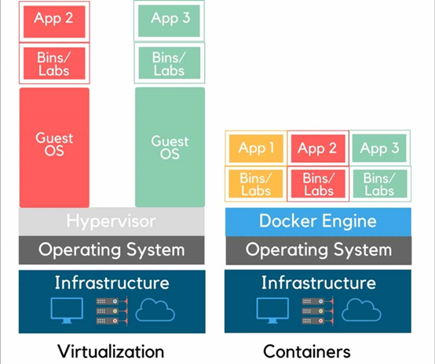

### 七、无服务器架构（Serverless Architecture）

一种云计算概念，其中代码由客户管理，平台（即支持的硬件和软件）或服务器由云服务提供商（CSP）管理。此执行模型允许开发人员仅关注其代码的逻辑，而不必关心特定服务器的参数或限制，这也称为功能即服务（FaaS）。这与平台即服务（PaaS）不同之处在于，功能或函数仅在调用时运行，然后在操作完成时终止，从而将成本降至最低。

### 八、基础设施即代码（Infrastructure as code，IaC）

IaC将硬件配置视为一个元素集合，以与在DevSecOps（安全、开发和操作）下管理软件和代码相同的方式进行管理，即以软件代码管理方式对硬件基础设施进行管理。

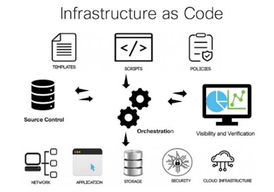

### 九、边缘计算（Edge Computing）

边缘计算是一种网络设计理念，其中数据和计算资源尽可能靠近，以优化带宽使用，同时最小化延迟，典型示例是CDN。

### 十、雾计算（Fog Computing）

雾计算依靠传感器、物联网设备甚至边缘计算设备来收集和处理数据，然后将加工后的数据传输回中心位置进行处理。

## D3-16：移动设备

移动设备（Mobile Device）需关注的安全问题主要涉及是智能手机、平板电脑以及笔记本电脑。最常用的两大类操作系统是Android和iOS，其中SEAndroid是安全增强版本。

### 一、移动设备安全特性

1. 移动设备管理（Mobile Device Management，MDM）

MDM通过注册员工的移动设备来管理他们，包括但不限于资产管理、配置管理、远程擦除等功能。企业移动管理（EMM）是MDM的加强版，可实现更细粒度的内容控制，由保护设备转到保护企业数据。统一终端管理（UEM）是MDM和EMM的整合版，扩大了管控范围，包括但不限于移动设备、PC、IoT、可穿戴设备、ICS等。

2. 设备身份验证

常见设备身份验证方法如密码、指纹、人脸识别等，详情见域5。

3. 全设备加密（Full-Device Encryption，FDE）

与硬盘加密一样，额外对移动设备的数据提供保障。

4. 通信保护

可使用VoIP提供移动设备的语音加密服务，有效对抗窃听攻击。

5. 远程擦除

当移动设备丢失后，应采取远程擦除对数据进行清理。需注意该操作需要有网络的情况下才可执行，因此最好配合FDE组合使用。

6. 设备锁定

类似账户锁定，如手机解锁密码错误多次锁定手机。

7. 屏幕锁定

类似屏幕保护程序，如手机一定时间不使用自动锁定屏幕。

8. GPS和定位服务

- 地理位置（Geolocation）数据通常用于导航工具、身份验证服务和定位服务。
- 地理标记（Geotagging）是指移动设备能够在其创建的任何媒体（如照片、视频和社交媒体帖子）中包含其位置的详细信息，可被用于攻击目的的信息收集。
- 地理围栏（Geofencing）指定一个特定的地理区域，然后用于在移动设备上自动实施功能或触发设置。

9. 内容管理

移动内容管理（MCM）系统用于通过在移动设备上访问或使用的方式控制公司资源，目标是大限度地提高性能和工作效益，可绑定MDM确保数据安全。

10. 应用控制

限制可以在设备上安装哪些应用程序，机制依靠应用程序允许列表（allow listing，术语白名单的替代）实现。移动应用程序管理（MAM）属于MDM的子解决方案，只关注应用程序管理。

11. 推送通知

推送通知服务能给将信息发送到移动设备，如APP推送的各种广告。推送通知可被用于社会工程、网络钓鱼、垃圾通知等，其中推送锁（push locker）指的是用户点通知消息不停被重定向到其他通知消息，除非杀掉进程才可关闭。

12. 第三方应用商店

第三方应用程序源显著增加了数据泄漏或恶意软件入侵组织网络的风险，打开禁止安装未知来源的应用程序功能、禁止设备越狱、部署MDM等可降低第三方应用程序源风险。

13. 存储分割

用于人为地划分存储介质上各种类型或值的数据，如华为手机的隐私空间。

14. 资产跟踪和库存控制

资产跟踪也就是移动设备管理，库存控制指的是使用移动设备当作扫码枪管理仓库。

15. 可移动存储

移动设备可以外接可移动存储，如microSD卡，需关注可移动存储的安全风险问题。

16. 连接方法

移动设备支持多种连接方式，如蜂窝网络或本地无线网络，需采用可靠和安全的通信服务，如WPA3。

17. 禁用未使用的功能

最小化安装原则。

18. 越狱（Rooting or Jailbreaking）

越狱指在移动设备的引导加载程序上破坏数字版权管理（DRM）安全性的行为，以便能够以root或完全系统权限操作设备。一方面，大多数恶意软件无法以用户模式运行，但在越狱设备上如鱼得水；另一方面，越狱设备可能会得不到原厂支持，因此组织应该禁用越狱设备。

19. 侧向加载（Sideloading）

指通过某种形式的文件传输或USB存储方法将安装程序文件带到设备上，从而在设备上安装应用程序的活动。侧向加载能给绕过安全限制，应禁止该功能或强制对所有应用程序进行数字签名。

20. 自定义固件

使用自定义固件替换原有固件的活动被称为刷机。组织不应允许用户操作具有定制固件的移动设备，除非该固件已获得组织的预先批准。

21. 运营商解锁（Carrier Unlocking）

合约机只能使用某一个运营商的某一张SIM卡，合约机到期后运营商解锁九可使用其他运营商的SIM卡了，该活动并不影响移动设备安全性。

22. 固件OTA（over-the-air）升级

通过蜂窝网络或无线网络从运营商或供应商处下载的固件更新。

23. 密钥管理

大多数移动设备也使用密钥，且保存在本地，因此需要关注密钥安全存储问题。

24. 凭据管理

凭据管理器也被称为密码保险库（password vault），用于存储各类网络或系统的账号密码，方便用户自动登录。通常来说凭据管理器都是加密的，必须解锁才能访问。

25. 短信

短消息服务（SMS）、多媒体消息服务（MMS）和丰富的通信服务（RCS）都是有用的通信系统，但它们也作为攻击向量，如smishing和SPIM。短信可以用作身份验证因素，称为基于短信的双因子身份验证（SMS-based 2FA）。

### 二、移动设备部署策略

1. 自带设备（Bring Your Own Device，BYOD）

该策略允许员工自带个人移动设备工作，可提高员工士气和工作满意度，但会增加组织的安全风险，可能涉及采集设备上员工的个人信息。

2. 公司所有、个人使用（Corporate-Owned, Personally Enabled，COPE）

该策略是组织购买设备并提供给员工，组织可以控制移动设备符合安全策略要求，也可能涉及采集设备上员工的个人信息。

3. 自选设备（Choose Your Own Device，CYOD）

该策略为用户提供了一个经批准的设备列表，用户可以从中选择要使用的设备。如果是员工自己买，则是BYOD变体，该策略通常会导致员工不太爽；如果是公司买，则是COPE变体。

4. 组织自有移动战略（Corporate-Owned Mobile Strategy，COMS）

也叫组织自有、仅限业务（corporate-owned, business-only，COBO），公司购买能够支持符合安全策略的安全性的移动设备，仅供公司业务使用，禁止执行个人活动。该策略是最具安全性的。

5. 移动设备实施策略关注点

- 数据所有权
- 所有权支持
- 补丁和更新管理
- 安全产品管理
- 取证
- 隐私
- 入职/离职
- 遵守公司策略
- 用户接受度
- 架构/基础设施考虑
- 法律问题
- 可接受使用策略
- 机载摄像头/视频
- 录音话筒
- Wi-Fi直连
- 个人热点
- 非接触式支付方式
- SIM克隆

## D3-17：基本安全保护机制以及常见安全体系架构缺陷和问题

### 一、基本安全保护机制

1. 进程隔离

操作系统为每个进程开辟独立的内存空间，进程间互不影响。

2. 硬件分割

与进程隔离类似，无非是通过硬件层面进行隔离，通常仅限于国家安全设施使用。

3. 系统安全策略

为系统的整个生命周期制定安全策略，指导系统的设计、开发、实施、测试和维护。

### 二、常见安全体系架构缺陷和问题

1. 隐蔽通道（Covert Channels）

一种用于在通常不用于通信的路径上传递信息的方法。

- 时间隐蔽通道：通过改变系统组件的性能或以可预测的方式修改资源的定时来传递信息，通常非常难以检测，如摩斯密码。
- 存储隐蔽通道：通过将数据写入另一进程可以读取的公共存储区域来传输信息，如隐写术。

2. 基于设计和编码问题的攻击

人类永远不会编写完全安全的代码。

3. Rootkits

Rootkits是黑客的工具包，指的是获得对系统的全部控制权，最典型的就是手机越狱。

4. 增量攻击（Incremental Attacks）

某些形式的攻击以缓慢、渐进的方式发生，而不是通过明显或可识别的尝试来危害系统安全性或完整性，典型的攻击形式有数据欺骗（data diddling）和腊肠攻击（salami）。

## D3-18：站点和设施设计的安全原则

物理安全控制是所有安全控制的基础，一个部署了各种安全防护设备的机房如果没有关门，黑客想要破坏它是多么的简单。

### 一、安全设施计划

干啥都得先有计划，可通过关键路径分析（critical path analysis）和评估技术融合（technology convergence）来完成计划编制，信息安全人员必须参与设计，避免出现遗漏。

### 二、站点选择

基于组织安全需求，评估成本、位置、规模以及安全要求共同决定站点位置。工业伪装（Industrial Camouflage）是试图通过提供一个呈现可信或令人信服的替代方案的表像来掩盖或隐藏设施的实际功能、目的或操作，如数据中心可能以炸鸡店的形式出现。

### 三、设施设计

设施设计首先考虑的是人身安全，其次需要满足合规要求。通过环境设计预防犯罪（CPTED），其指导思想是通过构建物理环境和周边设施，来降低甚至打消潜在入侵者的犯罪企图。CPTED主要有三种策略：

1. 自然访问控制（natural access control）

通过设置入口、使用围栏和柱子以及设置灯光，对进出建筑物的人员进行微妙的引导。

2. 自然监视（natural surveillance）

通过增加被观察的机会使罪犯感到不安的任何手段。

3. 自然领土强化（natural territorial reinforcement）

试图使该地区感觉像一个包容、关爱的社区。

传统物理屏障和CPTED策略的混合能够更好的保障物理安全。

## D3-19：实施站点和设施的安全控制

### 一、物理安全控制类型

1. 管理类

设施建造与选择、站点管理、人员控制、安全意识培训以及应急响应与流程。

2. 技术类

访问控制、入侵检测、警报、CCTV、监视、HVAC 的电力供应以及火警探测与消防。

3. 物理类

围栏、照明、门锁、建筑材料、捕人陷阱、警犬与警卫。

### 二、控制的功能顺序

1. 威慑

如内有恶犬，到底有没有或厉不厉害无所谓，精神压制。

2. 阻挡

如围墙、门禁等，实际能够阻挡进入的措施。

3. 监测

如CCTV，能实现监控和事后审计。

4. 延迟

如把数据中心设置在走廊尽头，达到的时间就比较长。

5. 确定

确定事故原因或评估情况，以了解发生了什么。

6. 决策

根据评估结果，决定实施什么应对措施。

### 三、设备故障

1. 做好备件管理
2. 与硬件供应商签订服务水平协议（SLA）
3. 评估允许中断窗口（AIW）、服务交付目标（SDO）和最大可容忍停机/停机（MTD/MTO）
4. 确定平均故障时间（MTTF）和平均修复时间（MTTR），MTBF（平均故障间隔时间）约等于MTTF

### 四、配线间

电缆设备管理策略用于定义设施内网络布线和相关设备的物理结构和部署。

1. 电缆设备元素

- 接入设施（Entrance facility）：互联网线路的接入点。
- 机房（Equipment room）：放服务器的地方。
- 骨干布线系统（Backbone distribution system）：打通大楼顶层到底层的布线。
- 配线间（Wiring closet）：供通信线缆部署的房间。
- 横向布线系统（Horizontal distribution system:）：打通一层内各个房间的布线。

2. 受保护的布线系统（protective distribution systems，PDS）

PDS是保护电缆免受未经授权的访问或伤害的手段。

- 不要使用配线间作为一般的储物区
- 配备充足的门锁，必要时采用生物因素
- 保持该区域整洁。
- 该区域中不能存储易燃品。
- 配备视频监控设备，监视配线间内的活动。
- 使用开门传感器进行日志记录。
- 钥匙只能由获得授权的管理员保管。
- 对配线间进行常规的现场巡视以确保其安全。
- 将配线间纳入组织的环境管理和监控中，既能够确保合适的环境控制和监视，也是为了及时发现类似水情和火警的危险。

### 五、数据中心

1. 总体上的原则和要求

- 数据中心与人相容性越差，就越能提供保护，即机房没人最安全。
- 数据中心应位于建筑核心位置，避免在一楼、顶楼或地下室，且远离各类管道。
- 数据中心墙壁具备至少一小时耐火等级。

2. 智能卡和徽章

- 智能卡（smart card）：是能够进行信息处理的身份标识工具，配合PIN码可实现多因素身份验证提高安全性。
- 磁条卡（magnetic stripe cards）：带有磁条的机器可读身份标识工具，可以保留少量数据，但无法像智能卡那样处理数据。
- 徽章（badge）：可用于识别或认证，需配合其他手段实现。

3. 接近式设备

- 被动设备（passive device）：该类设备是具有特定特性的小磁铁（无电装置），通过改变读取器设备产生的电磁场来进行识别。
- 区域供电接近式设备（field-powered proximity device）：该类设备从阅读器的电磁场中产生电来为自己供电进行识别。
- 应答器接近式设备（transponder proximity device）：该类设备自供电（电池或太阳能）并发送读取器接收的信号进行识别。

### 六、入侵检测系统

物理安全中的IDS主要是检测非法活动，并通过报警系统及时通知安保人员处理。

1. 物理IDS需要考虑的两个方面
- 备用电源：没有电源什么东西都无法工作；
- 线路监控：告警线缆被切断，入侵告警无法及时传送给安保人员。

2. 物理IDS的组件

- 运动检测器（motion detector）：一种能够感知特定区域内的运动或声音的设备。
  - 数字运动检测器（digital motion detector）：即智能安全摄像头。
  - 被动红外（passive infrared，PIR）：即基于热量的移动检测器，监测区域内热量变化。
  - 波形运动检测器（wave pattern motion detector）：主动发送信号到监测区域，监测反射信号的变化。
  - 电容运动检测器（capacitance motion detector）：感测被监测对象周围电场或磁场的变化。
  - 光电运动检测器（photoelectric motion detector）：感测监控区域可见光水平的变化。
  - 被动音频运动检测器（assive audio motion detector）：监听监控区域内的异常声音。

- 入侵警报（intrusion alarms）：当运动检测器检测到异常就会触发警报。
  - 威慑警报（deterrent alarms）：可能会开启额外的锁、关门等，目的是使进一步的入侵或攻击更加困难。
  - 驱除警报（repellent alarms）：通常会发出声音警报或铃声并打开灯，用于威慑入侵者继续其恶意或侵入活动，并迫使他们离开场所。
  - 通知警报（notification alarms）：通常是无声的，但会记录有关事件的数据，并通知管理员、安全警卫和执法部门。
  - 本地报警系统：依靠广播通知本地安保团队进行处理。
  - 中心站系统：通常是静默的，但会通知中心站派遣安保团队前往现场处理。
  - 辅助报警系统：辅助本地和中心站报警系统，通知消防、警察和医疗服务进行现场处理。

- 二次验证机制：当使用运动探测器、传感器和报警器时，应设置二次验证机制，用以减少误报，如使用安全摄像头。

### 七、访问滥用

由于物理访问控制可以被伪装（Masquerading）、捎带（piggybacking）等方式绕过，因此需要部署安全警卫、审计跟踪、访问日志或其他监控系统以防止滥用。

### 八、介质存储设施

放置各类存储介质的地方，主要是为了保护这些介质被植入恶意代码，如OS基线镜像安装盘被植入木马，那么后续安装的操作系统都会有问题，影响面较大。通用要求：

1. 将存储介质保存在上锁的柜子或保险箱里。
2. 介质存放在上锁的柜子里，并指定专人进行管理。
3. 建立登入/登出制度，跟踪库中介质的查找、使用与归还行为。
4. 可重用介质归还时，执行介质净化与清零过程(使用全零这样的无意义数据进行改写)，清除介质中的数据残余。
5. 采用基于 hash 的完整性检查机制，来校验文件的有效性，或验证介质是否得到彻底净化，不再残留以前的数据了。
6. 介质按照敏感级别打标签进行标识和资产管理。

### 九、证据存储

存储日志、审计记录、安全事件等数据，方便安全事故发生后进行调查取证。通用要求：

1. 使用与生产网络完全不同的专用存储系统。
2. 如果没有新数据需要存入，应让存储系统保持离线状态。
3. 关闭存储系统与互联网的连接。
4. 跟踪证据存储系统上的所有活动。
5. 计算存储在系统中所有数据的哈希值。
6. 只有安全管理员与法律顾问才能访问。
7. 对存储在系统中的所有数据进行加密。

### 十、受限区与工作区安全

简单来说就是把设施内的区域按敏感程度划分，边界用墙、隔断等进行隔离，可参考数据分类分级。安全受限工作区的实例是敏感隔间信息设施(Sensitive Compartmented Information Facility, SCIF)，常用于政府或军工。

### 十一、HVAC相关

1. 电力管理设备

- 浪涌保护器（surge protectors）：仅提供电源过载保护，出现电力尖峰时跳闸切段电源，因此仅适用于瞬间断电不会对设备造成损坏或损失时。
- 电源调节器（power conditioner）：高级版浪涌保护器，可消除或过滤线路噪音。
- 不间断电源（uninterruptible power supply，UPS）：除了包含以上功能外，还提供额外电力供设备正常关机。
- 备用电池（battery backup）：可供整个基础设施运行，但会存在电池切换中断。
- 发电机（generators）：高级版备用电池，理论上燃料不断电力不断。

2. 电力问题术语

- 故障(Fault): 瞬时断电。
- 停电(Blackout): 完全失去电力供应。
- 骤降(Sag): 瞬时低电压。
- 低电压(Brownout): 长时低电压。
- 尖峰(Spike): 瞬时高电压。
- 浪涌(Surge): 长时高电压。
- 突入(Inrush): 通常与连接到电源相关的初始电力浪涌。
- 接地(Ground): 电路中接地导线。

3. 噪音

噪声是通过某种形式的干扰、中断或流动而产生的功率干扰。电磁干扰（EMI）和射频干扰（RFI）都会影响IT设备的正常运转。

4. 温度、湿度和静电

- 最合适的温度范围为摄氏15~32度
- 最合适的湿度范围20%~80%

湿度太高会腐蚀电脑中的配件，湿度太低会产生静电。

5. 水

一句话机房别被水淹了。

### 十二、火灾预防、检测和抑制

1. 火灾三要素

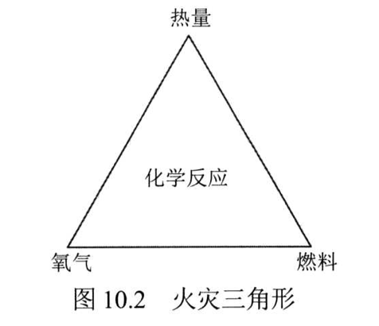

燃料、高温与氧气，以及三者化学反应。

2. 火灾的四个阶段

- 阶段1：早期阶段会出现电离反应。
- 阶段2：烟雾阶段能看到烟雾冒出。
- 阶段3：火焰阶段能看到火焰。
- 阶段4：炙热阶段温度急剧升高，燃烧一切。

越早检测到火灾，越容易扑灭，造成的损坏越小。

3. 灭火器

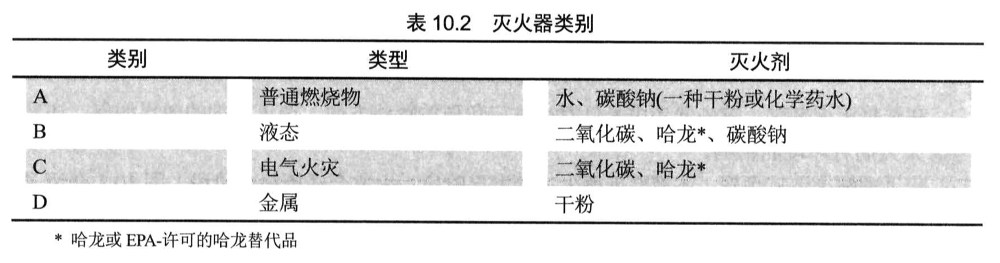

4. 火灾检测系统

- 固定温度探测（Fixed-temperature）：温度到达阈值就触发。
- 上升率探测（Rate-of-rise）：温度上升速率到达阈值就触发。
- 火焰驱动探测（Flame-actuated）：探测到火焰就触发。
- 烟雾驱动探测（Smoke-actuated）：探测到电离反应或烟雾就触发。

火灾探测系统触发告警后还需要火灾响应系统配合才能达到灭火效果，就像IDS只能检测攻击，需要与防火墙联动才能阻断。由于火灾引发的影响很大，因此触发告警后首先应自动通知当地消防部门，然后再联动灭火系统进行灭火。

5. 水抑制系统

- 湿管（wet pipe）：管道里一直存有水，触发后立即喷水灭火。
- 干管（gry pipe）：管道里充满压缩气体，触发后气体释放后才会喷水。
- 洪水（deluge）：干管的管道粗一点就是洪水系统。
- 预作用（preaction）：管道里充满压缩气体，检测到火灾后开始注水，达到一定温度才会喷水，最适合人机共存环境使用。

6. 气体排放系统

使用气体进行灭火，不适用于有人活动的环境，如CO2、Halon等，其中Halon有害环境已禁止使用（蒙特利尔协议），FM-200洁净气体，对人无害。

7. 损害

由于灭火系统可能会对人员、设备等造成损害，因此应对组织环境进行评估，选择合适的灭火系统。

## D3-20：实施和管理物理安全

### 一、边界安全控制

1. 围栏（Fences）

边界界定装置，可以是实体（如水泥墙）也可以是不可见的（如激光）。围栏的高级形式是边界入侵检测和评估系统（perimeter intrusion detection and assessment system，PIDAS），可参考监狱外围。

2. 门（Gates）

配合围栏使用作为出入控制点，越少越好，一般配备安保人员或安全摄像头。

3. 旋转门（Turnstiles）

一次只能通过一人的单向门，常见于火车站。

4. 门禁前厅（access control vestibule）

即陷阱门（Mantraps），一种配备警卫的内、外双道门设施，能够防止捎带和尾随，常见于政府机关。

5. 安全隔离桩（Security bollards）

一般用于阻止车辆闯入，能够自动升降，常见于重要设施。

6. 路障（Barricades）

用于控制行人和车辆。

7. 照明（Lighting）

主要提供威慑作用，配合其他控制措施使用。

8. 安保人员与警犬

唯一能够提供主动干预的控制措施，缺点是贵且不稳定。

9. 机器哨兵（Robot sentries）

可用来自动巡逻一个地区，查看任何异常情况。

### 二、内部安全控制

1. 钥匙和组合锁

- 预设锁（preset locks）：钥匙锁是最常见、最便宜的物理安全控制装置，易遭受shimming（复制钥匙）和bumping（万能钥匙）攻击。
- 可编程锁（programmable locks）：也叫组合锁，可以配置多个有效的访问组合，也可以包括使用键盘、智能卡或密码设备的数字或电子控制装置，如电子门禁（electronic access control，EAC）。

2. 环境和生命安全

人命高于一切。乘员应急计划（occupant emergency plans，OEP）指导和协助在灾难发生后维持人员安全。BCP和DRP解决IT、业务连续性和恢复问题。

3. 监管要求

物理安全也需要满足合规要求。

4. 物理安全的关键绩效指标（KPI）

与技术指标一样，用以评估物理安全的有效性。
