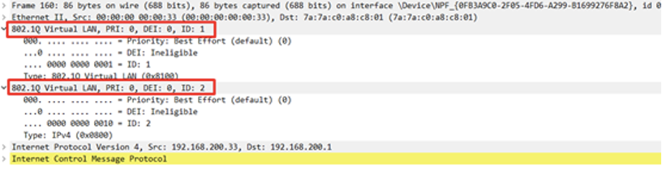
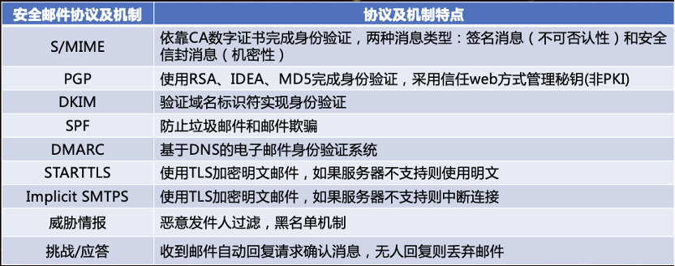

# 域4：通信和网络安全

- [域4：通信和网络安全](#域4通信和网络安全)
  - [D4-1：OSI和TCP/IP模型](#d4-1osi和tcpip模型)
    - [一、模型对比](#一模型对比)
    - [二、封装/解封装](#二封装解封装)
    - [三、分析网络流量](#三分析网络流量)
    - [四、常见应用层协议](#四常见应用层协议)
    - [五、传输层协议](#五传输层协议)
    - [六、域名系统](#六域名系统)
    - [七、IP网络](#七ip网络)
    - [八、ARP](#八arp)
    - [九、安全通信协议](#九安全通信协议)
    - [十、多层协议](#十多层协议)
    - [十一、微隔离](#十一微隔离)
  - [D4-2：无线网络](#d4-2无线网络)
    - [一、无线网络标准](#一无线网络标准)
    - [二、无线部署模式](#二无线部署模式)
    - [三、保护SSID](#三保护ssid)
    - [四、无线信道](#四无线信道)
    - [五、实地调查](#五实地调查)
    - [六、无线安全标准](#六无线安全标准)
    - [七、无线安全机制](#七无线安全机制)
    - [八、通用Wi-Fi安全程序](#八通用wi-fi安全程序)
    - [九、无线天线管理](#九无线天线管理)
    - [十、无线通信](#十无线通信)
    - [十一、无线攻击](#十一无线攻击)
  - [D4-3：其他通信协议](#d4-3其他通信协议)
    - [一、光保真技术（LiFi）](#一光保真技术lifi)
    - [二、卫星通信（Satellite communications）](#二卫星通信satellite-communications)
    - [三、窄带无线（Narrow-band wireless）](#三窄带无线narrow-band-wireless)
    - [四、紫蜂（Zigbee）](#四紫蜂zigbee)
    - [五、蜂窝网络（cellular network）](#五蜂窝网络cellular-network)
    - [六、内容分发网络（CDN）](#六内容分发网络cdn)
  - [D4-4：安全网络组件](#d4-4安全网络组件)
    - [一、网络架构](#一网络架构)
    - [二、通用网络设备](#二通用网络设备)
    - [三、网络准入控制（NAC）](#三网络准入控制nac)
    - [四、防火墙](#四防火墙)
    - [五、终端安全](#五终端安全)
  - [D4-5：网工技术](#d4-5网工技术)
    - [一、传输介质](#一传输介质)
    - [二、网络拓扑](#二网络拓扑)
    - [三、以太网](#三以太网)
    - [四、以太网技术子集](#四以太网技术子集)
  - [D4-6：安全通信和网络攻击](#d4-6安全通信和网络攻击)
    - [一、协议安全机制](#一协议安全机制)
    - [二、安全语音通信](#二安全语音通信)
    - [三、远程访问安全管理](#三远程访问安全管理)
    - [四、多媒体协作](#四多媒体协作)
    - [五、负载均衡](#五负载均衡)
    - [六、管理邮件安全](#六管理邮件安全)
    - [七、虚拟专用网](#七虚拟专用网)
    - [八、交换机和虚拟局域网](#八交换机和虚拟局域网)
    - [九、网络地址转换](#九网络地址转换)
    - [十、第三方连接](#十第三方连接)
    - [十一、交换技术](#十一交换技术)
    - [十二、广域网技术](#十二广域网技术)
    - [十三、光纤链路](#十三光纤链路)
    - [十四、安全控制特征](#十四安全控制特征)
    - [十五、阻止和缓解网络攻击](#十五阻止和缓解网络攻击)

## D4-1：OSI和TCP/IP模型

网络模型被设计出来的目的是统一网络通信协议标准。

### 一、模型对比

### 二、封装/解封装

1. 封装（encapsulation）

发送数据时，从高层到底层进行封装，每经过一层都会加个头部或尾部，最后在物理层变成比特流进行传输。

2. 解封装（deencapsulation）

接收到比特流后，从低层到高层进行解封装，每经过一层都会拆个头部或尾部，最后在应用层查看到消息内容。

3. 封装与解封装的机制可以参考多层信封送信和收信或俄罗斯套娃。

### 三、分析网络流量

网络流量分析是网络管理的基本能力，检查网络流量内容的工具被称为协议分析器（protocol analyzer），也称为嗅探器（sniffer）、网络评估器（network evaluator）、网络分析器（network analyzer）、流量监视器（traffic monitor）或包捕获实用程序（packet-capturing utility）。协议分析器通常将NIC置于混杂模式（promiscuous mode），以查看和捕获本地网段上的所有以太网帧。

### 四、常见应用层协议

### 五、传输层协议

传输层通过端口进行通信，IP与端口号的组合称为套接字（socket）。

1. 端口类型

- 知名/服务端口（well-known/service ports）：0-1023
- 已注册软件端口（registered software ports）：1024-49151
- 随机端口（random ports）：49152-65535

2. TCP握手机制

3. UDP不靠谱

UDP没有三次握手机制，就是使劲传数据，没收到就再重新传，因此传输速度快，适用于传输不重要的数据。

4. 报文头部

### 六、域名系统

域名系统使用DNS协议解决域名与IP地址的映射关系（域名可比IP地址好记多了，如密码短语），就如ARP协议解决IP与MAC的映射关系一样。

1. 报文格式

DNS运行在TCP和UDP的53端口，TCP用于区域传输和响应超过512字节的情形，UDP用于常规DNS查询。

2. 域名分类

全限定域名（fully qualified domain names，FQDNs）有三个组成部分：

- 顶级域名（top-level domain，TLD）：com、org、edu、mil、gov、net、int（最初的）；info、museum、telephone、mobi、biz等（行业）；cn、us、fr、uk（国家/地区）。
- 注册域名（registered domain name）：google、baidu、sina等，一般是公司或组织申请。
- 子域名或主机名（subdomain or hostname）：www、mail、ftp等，一般用于表示提供的服务；支持多级子域名，如www.server1.google.com。

每一个注册域名都有一个指定的权威名称服务器，管理该域名的原始区域文件（映射关系的详细记录），可通过区域传递给到辅助权威名称服务器只读副本（只能用，不能改）。

3. DNS解析优先级

- 本地hosts文件
- 本地dns缓存
- 本地DNS服务尝试解析，本地区域文件有则权威解析，本地缓存有则非权威解析
- 从根到注册域名递归或迭代，最终得到结果

4. 域名系统安全扩展（DNSSEC）

为每个DNS服务器提供数字证书，用于身份验证，并提供加密会话，解决DNS服务器滥用问题。

5. DNS over HTTPS（DoH）

针对客户端的安全协议，在客户端与DNS服务器间创建加密会话以保护DNS查询和响应。DoH的升级版是Oblivious DoH (ODoH)，在客户端与DNS服务器间添加DNS代理，为DNS查询提供匿名性和隐私。

6. DNS投毒

伪造客户端使用的DNS信息致使客户端访问了非预期系统的行为。

- 恶意DNS服务器：可以监听客户端的DNS查询，伪造含正确QID的虚假DNS响应包给客户端。
- DNS缓存中毒：攻击DNS服务器并将不正确的信息放入其区域文件或缓存，导致客户端直接解析到虚假IP。
- DNS域欺骗（pharming）：通过修改系统上的本地主机文件或通过中毒或欺骗DNS解析来发生，可以理解是攻击的集合。
- 改动Hosts文件：篡改主机的hosts中DNS记录来实现攻击。
- 破坏IP配置：篡改主机的IP配置或DHCP配置来实现攻击。
- DNS查询欺骗：与恶意DNS服务器一样，只不过该攻击主机发起。
- 使用代理伪造：虚假代理服务器来实现篡改，针对web通信。

7. 域名劫持

域名劫持（domain hijacking）或域名盗窃（domain theft）是指未经有效所有者授权而更改域名注册的恶意行为。这可以通过窃取所有者的登录凭据、使用XSRF、劫持会话、使用路径/MitM攻击或利用域注册器系统中的漏洞来实现。防止域名劫持的最佳防御措施是在登录域注册器时使用强多因素身份验证，并设置域名自动续费，并在续费日期前一周再次检查付款方式。

- 误植占用（Typosquatting）：通常注册与合法域名类似的域名来实现攻击，如googel.com、gooogle.com、googles.com、googe.edu等。
- 同形异义（Homograph）攻击：利用字符集的相似性来注册肉眼看来合法的虚假国际域名，如https://www.apple.com (拉丁文)和https://www.аррӏе.com (西里尔字母)。
- URL劫持（URL hijacking）攻击：指的是显示链接或广告的行为，该链接或广告看起来像知名产品、服务或网站的链接或广告，但单击后会将用户重定向到其他位置、服务或产品，如百度推广。
- 点击劫持（Click hijacking）攻击：一种将用户在网页上的点击或选择重定向到另一个通常是恶意的目标而不是预期和期望的位置的方法，如透明框劫持。

### 七、IP网络

1. IPv4和IPv6

IPv4是最流行的版本，32位寻址，如192.168.1.1；IPv6是逐步推广的版本，128位寻址，如240e:428:4831:77b4:bcdb:1b9f:1744:bf22，目的是解决IPv4地址不足的问题。IPv6引发的安全问题：

- 攻击者得到了大量源地址用于攻击，导致基于IP的过滤效果降低。
- 安全产品的支持问题可能导致IPv6成为新的隐蔽通道。
- 干掉NAT后可能导致隐私泄漏。

IPv4和IPv6同时使用的方法：

- 双栈：同时运行，互不干扰。
- 隧道：使用一个协议，再用隧道封装另外一个协议。
- NAT-PT：可使IPv4和IPv6互相转换，类似NAT转换内外部地址。

2. IP分类

- 黑洞网络（blackhole network）：A的0段地址，该段地址的流量都将被路由丢弃。
- 回环地址（loopback address）：A的127段地址，该段地址用于测试协议栈是否被正确安装和配置，通常仅用127.0.0.1。
- 可变长子网掩码和无类域间路由（VLSM/CIDR）：可灵活配置子网大小，如192.168.1.0/30。

3. ICMP

常用于ping、traceroute等网管工具，确定网络或特定链路的运行状况，利用该协议的攻击方法有有ping of death（超大包）、Smurf（广播反射）、icmp flood（流量型DoS）等。

4. IGMP

允许系统支持组播。

### 八、ARP

ARP用与将IP地址解析为MAC地址，使用缓存和广播来执行其功能，是一个二层协议。

1. 工作原理

检查本地ARP缓存，有目的MAC直接转发，没有则发送ARP请求；如果是一个子网，则目的MAC为全F；如果不在一个子网，则目的MAC为默认路由的MAC（重复以上过程）；收到ARP响应后正常通信。

2. ARP攻击

- ARP欺骗：攻击者篡改ARP响应包，将目的IP的MAC篡改。
- ARP缓存投毒：ARP欺骗引起客户端ARP缓存中毒，实质上是一个攻击。
- 免费ARP：客户端直接发送IP-MAC映射关系到子网内，通常用于IP变化或故障切换时更新记录。
- 静态ARP：客户端手工创建静态ARP记录，进而造成映射关系错误。

3. ARP攻击防御

- 启用交换机或安全设备的端口安全功能。
- 创建静态ARP记录，不是灵活的方法。

### 九、安全通信协议

### 十、多层协议

1. 正常封装 [MAC[IP[TCP[HTTP]]]]

2. 应用层封装 [MAC[IP[TCP[TLS[HTTP]]]]]

3. 网络&应用层封装 [MAC[MPLS[IP[TCP[HTTP]]]]]

4. VLAN跳跃

利用多层封装实现跨VLAN间传输。

5. 多层协议优点

- 可在更高层使用各种协议。
- 加密可包含在各个层中。
- 支持复杂网络结构中的灵活性和弹性。

6. 多层协议缺点

- 允许隐蔽通道。
- 可以绕过过滤器。
- 逻辑上强加的网段边界可超越。

7. 融合协议（converged protocols）

将专有协议与标准协议结合，实现使用TCP/IP网络基础来支持专有协议。

- 存储区域网络（SAN）：用于将各种存储设备整合和管理到一个整合的网络可访问存储容器中，将数据存储信号封装或聚合到TCP/IP通信中，增强网络存储设备读写能力。
- 以太网光纤通道（FCoE）：网络存储解决方案（SAN或NAS），可替代光纤部署，以以太网封装光纤通道通信，但需要10Gbps以太网才能支持，IP光纤通道（FCIP）扩展了其能力，不再需要特定的网络速度。
- 多协议标签交换（MPLS）：基于路径标签进行转发，用于VPN通道。
- Internet小型计算机系统接口（iSCSI）：被视为FCoE的低成本替代方案。

8. 网络电话（VoIP）

VoIP是一种隧道机制，将音频、视频和其他数据封装到IP数据包中，以支持语音呼叫和多媒体协作，是一种融合协议。针对VoIP的攻击：

- 攻击者可以伪造来电显示，实现vishing（VoIP网络钓鱼）或互联网垃圾电话攻击（Spam over Internet Telephony，SPIT）。
- 呼叫管理器系统和VoIP电话本身可能容易受到主机操作系统攻击和DoS攻击。
- 攻击者可能通过欺骗呼叫管理器或端点连接协商和/或响应来执行MitM/路径攻击。
- 与桌面和服务器系统相连的同一个交换机上部署VoIP电话kennel引发VALN跳跃和VoIP跳跃。
- 未加密的VoIP通信可能会被监听造成信息泄漏。

安全实时传输协议或安全RTP（Secure Real-Time Transport Protocol，SRTP）是对许多VoIP通信中使用的实时传输协议（RTP）的安全改进。SRTP旨在通过强健的加密和可靠的身份验证，将拒绝服务、路径攻击和其他VoIP攻击的风险降至最低。RTP或SRTP在会话启动协议（SIP）建立端点之间的通信链路后接管。

9. 软件定义网络（SDN）

SDN将基础设施层（即数据平面和转发平面，硬件及相关配置）与控制层（数据传输管理的网络服务）分离。控制平面使用协议来决定向何处发送流量，而数据平面包含决定是否转发流量的规则。SDN取代了传统组网方案，通过SDN控制器对不同厂商的网络设备进行统一管理，灵活、便利、具有成本效益。

- 虚拟SAN：由于传统SAN的硬件复杂、成本高，可通过虚拟化网络创建SAN。
- 软件定义存储（SDS）：一种策略驱动的存储管理和资源调配解决方案，独立于实际的底层存储硬件。
- 软件定义广域网（SDWAN）：可用于管理远程数据中心、远程位置和跨WAN链路的云服务之间的连接和控制服务。

### 十一、微隔离

1. 网络分段的示例

- 基于交换机VLAN、路由器或防火墙等创建网段。
- 创建带外路径（out-of-band pathway）：为了为流量创建一个单独和独特的网络结构，否则会干扰生产网络，或者如果将其放置在生产网络上，其本身可能会面临风险，如SAN、VoIP、备份数据、补丁分发、管理操作等。

2. 网络分段的优点

- 提高网络性能
- 减少通信问题
- 提高安全性

3. 微隔离（microsegmentation）

微隔离将内部网络划分为多个子区域，可能小到单个设备，例如高价值服务器或甚至客户端。每个区域通过内部分段防火墙（ISFW）、子网、VLAN或其他虚拟网络解决方案与其他区域分开。区域之间的任何通信都经过过滤，可能需要进行身份验证、会话加密、访问控制等。

4. 虚拟可扩展局域网（VXLAN）

VXLAN可使VLAN跨子网和地理距离进行扩展，可用于实现微隔离。

## D4-2：无线网络

### 一、无线网络标准

### 二、无线部署模式

Wi-Fi可以在ad hoc模式（也称为点对点Wi-Fi）或基础设施模式下部署，ad hoc模式不需要无线接入点（WAP），基础设施模式需要WAP。

1. ad hoc模式

- ad hoc模式：两个终端互接，仅支持WEP。
- Wi-Fi Direct模式：ad hoc模式升级版，支持WPA2和WPA3。

2. 基础设施模式

- 独立模式：一个WAP连接客户端，但不连接有线网络。
- 有线扩展模式：一个WAP连接客户端，且连接有线网络。
- 企业扩展模式：多个WAP连接客户端，且连接有线网络，WAP使用同一个扩展服务集标识（ESSID）实现漫游。
- 网桥模式：使用无线连接连接两个有线网络。

### 三、保护SSID

服务集标识符（SSID），用于区分不同无线网络。

1. 独立服务集标识符（ISSID）

由Wi-Fi Direct模式或ad hoc模式使用。

2. 基本服务集标识符（BSSID）

BSSID是基站的MAC地址，用于区分支持ESSID的多个基站。

3. 扩展服务集标识符（ESSID）

ESSID是使用WAP时无线网络的名称。

禁用SSID可使其不进行广播，但仍可以使用无线工具探测到，因此不是真正的安全机制，应采用WPA2或WPA3加强安全性。

### 四、无线信道

在无线信号的指定频率中细分通信路径就是信道（channels）。当同一区域有多个WAP时（使用2.4GHz），使用同一个信道可能会影响无线网络速度，应根据WAP物理部署位置进行信道规划。5GHz可以避免这种信道重叠和干扰问题，但其传输距离没有2.4GHz远，6GHz亦是如此。

### 五、实地调查

实地调查是调查环境中部署的无线接入点的位置、强度和范围的过程，对于评估现有无线网络部署、规划当前部署的扩展以及规划未来部署都非常有用。

1. 无线单元（wireless cells）

物理环境中无线设备可以连接到无线接入点的区域。

2. 热图（heat map）

无线信号强度测量图，实地调查的产物。

3. 热点（hot spots）

信号饱和区域。

4. 冷点（cold spots）

信号不足区域。

### 六、无线安全标准

1. 向WAP进行身份验证的两种方法

- 开放系统身份验证（SOA）：不需要身份验证，且以明文形式传输所有内容，因此不提供保密或安全性。
- 共享密钥身份验证（SKA）：必须在网络通信发生前进行某种形式的身份验证。

2. SKA支持的安全标准

- 有线等效隐私（WEP）：使用预定义的RC4密钥进行身份验证（即预共享密钥认证-PSK）和加密。由于共享密钥是静态的且RC4的缺陷，导致WEP极度不安全。
- WiFi受保护访问（WPA）：使用RC4算法，采用临时密钥完整协议（TKIP）以及轻量级可扩展身份验证协议（LEAP）。WPA已不再安全，容易受到coWPAtty等工具的破解。
- WiFi受保护访问（WPA2）：使用AES算法，采用计数器模式密码块链消息完整码协议（CCMP）以及两种身份验证协议，分别是PSK（也称个人-PER）和802.1X（也称企业-ENT）。PSK使用静态密码，802.1X支持使用AAA服务，如RADIUS。
- WiFi受保护访问（WPA3）：使用AES算法，采用数器模式密码块链消息完整码协议（CCMP），但将ENT密钥长度增加到192位（PER仍使用128位）。将PSK身份验证替换为等值同时认证（SAE），仍然使用密码，但不再加密发送密码，而是采用蜻蜓密钥交换（Dragonfly Key Exchange）技术，是Diffie–Hellman的衍生物。WPA3实现了管理帧保护，加强管理操作的安全性。

3. 身份验证机制

- 802.1X：可将其他技术和解决方案(如RADIUS、TACACS、证书、智能卡、令牌设备和生物识别技术)集成到无线网络中提供多因素身份验证。
- 可扩展身份验证协议（EAP）：是一个身份验证框架，允许新的身份验证技术与现有的无线或点对点连接技术兼容。
- 轻量级可扩展身份验证协议（LEAP）：TKIP替代方案，现在已不再安全，可被asleap攻击工具攻陷。
- 受保护的可扩展身份验证协议（PEAP）：单数字证书提供TLS加密。
- EAP传输层安全（EAP-TLS）：双数字证书提供TLS加密。

### 七、无线安全机制

- Wi-Fi保护设置（WPS）：无线网络的安全标准，它旨在减少将新客户端添加到无线网络的工作量，也就是Wi-Fi安全配置的引导程序。由于可以配置PIN码来远程启动引导程序，因此容易遭受爆破攻击，建议禁用WPS。
- 无线MAC过滤：基于MAC黑白名单进行过滤。
- 强制门户（Captive Portals）：连接Wi-Fi后强制跳转到认证页面，最典型的就是酒店的WiFi。

### 八、通用Wi-Fi安全程序

- 更新固件。
- 将默认管理员密码更改为唯一且复杂的密码。
- 启用WPA2或者WPA3加密。
- 启用ENT身份验证或者启用长且复杂密码的PSK/SAE。
- 更改SSID
- 更改无线MAC地址
- 根据部署要求决定是否禁用SSID广播
- 如果无线客户端池相对较小且是静态的，则启用MAC过滤
- 考虑使用静态IP地址，或者配置带有保留的DHCP（仅适用小网络）。
- 将无线视为外部或远程访问，并使用防火墙将WAP与有线网络分开。
- 将无线视为攻击者的入口点，并使用NIDS监控所有WAP到有线网络的通信。
- 部署无线入侵检测系统（WIDS）和无线入侵预防系统（WIPS）。
- 考虑需要在Wi-Fi链路上使用VPN。
- 实现一个强制门户
- 跟踪/记录所有无线活动和事件。

### 九、无线天线管理

1. 天线类型

- 全向天线：向四面八方发送和接收信号。
- 定向天线：单一方向发送和接收信号，传输距离较全向天线远。

2. 天线位置

- 使用中心位置
- 避免固体物理障碍
- 避免反光或其他扁平金属表面
- 避免电气设备。

3. 功率水平

通常来说功率水平越高，信号强度越强，电费越贵。

### 十、无线通信

1. 通用无线概念

无线通信使用无线电波在一定距离上传输信号。无线电波频谱数量是有限的，这就需要进行管理，防止频谱间相干扰。

- 扩频（Spread Spectrum）：通信在多个频率上同时发生，也就是并发通信。
- 跳频扩频（FHSS）：串行通信，但每发一段数据就改变频率。
- 直接序列扩频（DSSS）：同时并行使用所有可用频率，吞吐量得到了提升。
- 正交频分复用（OFDM）：采用数字多载波调制方案，减少干扰、提高吞吐量。

2. 蓝牙（802.15）

蓝牙主要用于外设配对，使用4位PIN（默认0000）来授权，因此极不安全。蓝牙低功耗（Bluetooth Low Energy，BLE）是标准蓝牙的低功耗衍生产品，用于物联网、边缘/雾设备、移动设备、医疗设备和健身跟踪器等。

- 蓝牙监听（Bluesniffing）：针对蓝牙网网络数据包捕获。
- 蓝牙纠缠（Bluesmacking）：针对蓝牙设备的DoS攻击，可以通过传输垃圾流量或信号干扰来实现。
- 蓝牙劫持（Bluejacking）：在未经所有者/用户许可的情况下向支持蓝牙功能的设备发送未经请求的消息。
- 蓝牙侵吞（Bluesnarfmg）：允许黑客在你不知情的情况下与你的蓝牙设备连接并从中提取信息。
- 蓝牙窃听（Bluebugging）：可让黑客远程控制蓝牙设备的功能，如打开麦克风。

3. 射频识别（RFID）

RFID芯片含有序列号，当靠近阅读器时供电读取内容，然后与后端数据库进行匹配，通信距离可达数百米。

4. 近场通信（NFC）

NFC是RFID的衍生技术，读取距离很短，常用于智能手机或设备。

### 十一、无线攻击

1. Wi-Fi扫描器

战争驾驶（war driving）是指使用检测工具寻找无线网络信号的人，这些信号通常是他们无权访问的。

2. 恶意接入点（rogue access points）

在内部或外部建立虚假WAP，用于吸引无线接入端连接。

3. 邪恶双胞胎（evil twin）

黑客操作一个虚假接入点，该接入点将根据客户端设备的连接请求自动克隆接入点的身份。

4. 解除关联（disassociation）

是无线管理帧的一种，用于切断无线连接，可用于发动将客户端踢下线。

5. 干扰（jamming）

通过降低有效信噪比有意阻止或干扰通信的无线电信号传输。

6. IV滥用（IV abuse）

当IV太短、以明文交换或选择不当时，它就会成为弱点，如WEP。

7. 重放（replay）

重新传输捕获的通信，以期获取访问目标系统的权限。

## D4-3：其他通信协议

### 一、光保真技术（LiFi）

一种利用光进行无线通信的技术，理论传输速率为100 Gbps，但传输距离极短且造假昂贵，不被视为可靠的传输方式。

### 二、卫星通信（Satellite communications）

基于在特定地点和在轨人造卫星之间传输无线电波，用于支持电话、电视、广播、互联网和军事通信。

### 三、窄带无线（Narrow-band wireless）

被SCADA系统广泛用于在电缆或传统无线无效或不合适的距离或地理空间进行通信。

### 四、紫蜂（Zigbee）

一种基于蓝牙的物联网设备通信概念，是一种低速短距离传输的无线网上协议。

### 五、蜂窝网络（cellular network）

蜂窝网络是许多移动设备，特别是手机和智能手机使用的主要通信技术，如4G、5G。

### 六、内容分发网络（CDN）

CDN是部署在互联网上众多数据中心的资源服务的集合，目的是为托管内容提供低延迟、高性能和高可用性，常用于多媒体分发。

## D4-4：安全网络组件

### 一、网络架构

1. 内部网（intranets）：也就是内部局域网。
2. 外联网（extranets）：内部网与互联网之间的缓冲地带。
3. 屏蔽子网（screened subnet）：旧称为DMZ，是一种专用外联网，专门为低信任度和未知用户设计，用于访问特定系统，如web前置。
4. 屏蔽主机（screened host）：是一个防火墙保护的系统，逻辑上位于网段内部，用于充当内网主机的代理。

### 二、通用网络设备

1. 中继器、集中器、放大器（RCA）：增强通信信号，连接使用相同协议的网段。
2. 集线器：连接使用相同协议的网段。
3. 调制解调器：支持PSTN线路的计算机通信。
4. 网桥：连接使用相同协议的网段，已被交换机替代。
5. 交换机：基于MAC进行转发，支持VLAN和VLAN间路由。
6. 路由器：基于IP进行转发，用于连接相似的网络并控制两者之间的流量。
7. LAN扩展器：一种远程访问、多层交换机，用于通过WAN链路连接远程网络。
8. 跳转盒（jumpbox）：跳转服务器，一种远程访问系统，用于使访问特定系统或网络更容易或更安全。
9. 传感器（sensor）：收集信息，然后将其传输回中央系统进行存储和分析，常用于雾计算、ICS、IoT、SIEM、SOAR等。
10. 收集器（collector）：类似传感器，用于收集安全信息。
11. 聚合器（aggregators）：一种多路复用器，大量输入被接收、定向或传输到单个目的地。

### 三、网络准入控制（NAC）

通过严格遵守和实施安全策略来控制对环境的访问。

1. NAC的目标

- 直接阻止/减少已知攻击，间接阻止/减少零日攻击。
- 在整个网络中实施安全策略。
- 使用标识执行访问控制。

2. NAC通过两个阶段实现安全控制

- 准入前对终端进行全面检测，包括但不限于IP、MAC、身份信息、补丁信息、杀毒软件等，来确定是否能够介入到网络中。
- 准入后控制终端的网络访问，并对其行为进行审计跟踪。

3. NAC实现方式

- 基于代理：在每个受管系统上安装NAC监控代理，定期检索配置文件，以对照本地系统检查当前配置基线要求。
- 基于无代理：从NAC服务器对网络系统执行端口扫描、服务查询和漏洞扫描，以确定设备是否经过授权且符合基线。

### 四、防火墙

防火墙是管理、控制和过滤网络流量的基本工具，典型的防火墙是基于隐式拒绝原则。

1. 防火墙典型功能

- 阻止声称具有内部源地址的入站数据包
- 阻止声称具有外部源地址的出站数据包
- 阻止源地址或目标地址列在阻止列表上的数据包
- 阻止具有来自局域网的源地址或目标地址但尚未正式分配给主机的数据包

防火墙通常不具备检测和防御恶意代码或网络攻击的能力，但可以添加安全模块来实现，如多功能设备（MFD）、统一威胁管理（UTM）设备或下一代防火墙（NGFW）。

2. 防火墙的基本类型

- 静态包过滤防火墙：基于五元组的单包过滤，也叫无状态防火墙。
- 应用层防火墙：基于单个互联网服务、协议或应用程序过滤流量，如web应用防火墙（WAF）。
- 电路级防火墙：基于SOCKS（会话层）进行过滤，不过滤流量内容。
- 状态检测防火墙：评估网络流量的状态、会话或上下文再进行过滤，还可以执行深度数据包检查（DPI），即对数据包的有效载荷内容进行分析。
- 下一代防火墙：安全综合体，啥功能都有。
- 内部分段防火墙：部署在内部网络分段或公司部门之间的防火墙，用于微隔离技术实现。
- 安全web网关（SWG）：NGFW和WAF思想的变体和组合。

3. 代理

代理服务器是应用程序级防火墙或电路级防火墙的变体，常用于为专用网络上的客户端提供internet访问，同时保护客户端的身份。

- 转发代理：作为外部资源查询中介的标准代理。
- 反向代理：提供与正向代理相反的功能，它处理从外部系统到内部服务的入站请求。
- 透明代理：客户端未配置直接向代理发送查询，但网络仍将出站流量路由到代理。
- 非透明代理：当客户机配置为直接向代理发送出站查询时，将使用非透明代理。非透明代理可以使用手工设置或使用代理自动配置（PAC）文件设置。

4. 内容/URL过滤

- 内容过滤是基于关键字匹配，检查应用程序协议有效负载的内容，也叫深度包检查（DPI）。
- URL过滤对web访问中的URL进行匹配和过滤。
- Web安全网关（WSG）是一种web内容过滤器（通常基于URL和内容关键字），也支持恶意软件扫描。

### 五、终端安全

终端检测和响应（EDR）通过代理或无代理+集中管控的模式，检测可能比传统防病毒程序或HIDSs检测到的更高级的滥用行为，同时优化事件响应的响应时间，清除误报，对高级威胁实施阻止，以及针对同时发生的多个威胁以及通过各种威胁向量进行保护。通常具备主机防火墙、主机入侵检测/防御、反恶意软件等功能。

1. 托管检测和响应（MDR）：侧重于威胁检测和仲裁，但不限于终端的范围。
2. 终端保护平台（EPP）：比EDR更加主动，核心四个功能是预测、阻止、检测和响应。
3. 扩展检测和响应（XDR）：综合方案，通常包括EDR、MDR、EPP、NTA、NID和NIPS等功能。

托管安全服务提供商（MSSP）可以提供集中控制和管理的XDR解决方案。

## D4-5：网工技术

### 一、传输介质

1. 同轴电缆

过时的传输介质，具有抗电磁干扰（EMI）能力，支持较长距离传输，但需要分段终端器。

- 细网：10Base2，最长185米，速度10Mbps。
- 粗网：10Base5，最长500米，速度10Mbps。

常见问题

- 弯曲不能超过最大圆弧半径
- 长度受限（500米）
- 必须使用分段终端器
- 必须接地

2. 基带和宽带电缆

网络电缆命名语法XXyyyyZZ：

- XX代表最大速度
- yyyy代表代表基带或宽带
- ZZ代表最远传输距离或电缆技术

10Base2=最大速度10Mbps、基带、最远200米（实际185）。

3. 双绞线

导线有金属箔保护的称为屏蔽双绞线（STP），没有金属箔保护的称为非屏蔽双绞线（UTP）。

屏蔽双绞线是为了解决串扰（crosstalk）问题，也就是外部电磁干扰。

常见问题

- 使用错误类别的双绞线
- 长度受限（100米）
- 强干扰环境使用STP

4. 导线

- 线缆的距离限制主要取决于使用的金属电阻，传输距离越远、信号衰减越大。
- 可使用中继器、放大器、集中器用以延长电缆长度，不建议使用4个以上的中继器（5-4-3原则）。
- 光纤是目前传输速度和距离最远的线缆类型。

### 二、网络拓扑

1. 环形拓扑

常用于令牌网，拥有令牌的系统才有通信的权利，一般为单向环路，也支持双向环路以解决单点故障问题。

2. 总线拓扑

将每个系统连接到干线上，可同时进行通信，但会发生冲突，可采用冲突避免机制（如CSMA/CD）。

有两种小分类：线性和树形，区别在于分支上是否可以多接系统。

3. 星形拓扑

采用集中式连接设备连接系统，存在单点故障问题，但布线时可减少线缆使用，且容易识别损坏的电缆。

逻辑总线和逻辑环可以实现物理星形网络。

4. 网状拓扑

使用多个路径将系统连接到其他系统，提高整体的冗余性，但会使用更多的线缆。

### 三、以太网

一种共享介质局域网技术，也叫广播技术。

- 冲突域：两个系统同时发送数据，则该域内会发生数据冲突，交换机隔离冲突域。
- 广播域：一个系统在该域内进行广播，则该域内所有系统都讲收到该广播包，路由器隔离广播域。

### 四、以太网技术子集

1. 模拟和数字

- 模拟信号：字面意思，模拟出来的信号。
- 数字信号：真实电压脉冲，长距离衰减和干扰影响较模拟信号小。

2. 同步和异步

- 同步通信：依赖时间，支持非常高的数据传输速率。
- 异步通信：依赖启停位，适合于较少量的数据通信。

3. 基带和宽带

- 基带：只支持单个通信通道，是数字信号。
- 宽带：可支持多个同步信号，是模拟信号。

4. 广播、组播和单播

- 广播：与广播域内的所有系统进行通信。
- 组播：与特定分组内的系统进行通信。
- 单播：一对一进行通信。

5. LAN介质访问

- 载波侦听多路访问（CSMA）：不解决冲突，发送没有收到回复，则重新发送。
- 载波侦听多路访问/冲突避免（CSMA/CA）：通过授予通信权限来尝试避免冲突，会推举一个主系统分配权限。
- 载波侦听多路访问/冲突检测（CSMA/CD）：检测到冲突后随即等待一段时间再尝试发送。
- 令牌传递：拿到令牌的系统才可以进行通信。
- 轮询：标记一个主系统，依次询问其他系统是否进行通信。

## D4-6：安全通信和网络攻击

### 一、协议安全机制

1. 身份验证协议

- 密码身份验证协议（PAP）：PAP以明文形式传输用户名和密码。
- 挑战握手身份验证协议（CHAP）：CHAP使用无法重播的质询响应对话执行身份验证，定期对会话进行重新验证。由于CHAP基于MD5，已不再安全，替代协议是MS-CHAPv2。
- 扩展身份验证协议（EAP）：一个身份验证框架，而不是实际的协议，支持自定义身份验证方法。
- 轻量级可扩展身份验证协议（LEAP）：TKIP的替代方案，已被弃用。
通过安全隧道进行灵活身份验证（EAP-FAST）：用以替代LEAP，已被弃用。
- EAP-MD5：使用MD5散列密码，已被弃用。
EAP受保护的一次性密码（EAP-POTP）：支持在多因素身份验证中使用OTP令牌，用于单向和相互身份验证。
- 受保护的可扩展身份验证协议（PEAP）：将EAP封装在TLS隧道中，单证书验证。
- EAP传输层安全性（EAP-TLS）：用于保护认证流量的TLS协议的实现，双证书验证。
- EAP隧道传输层安全性（EAP-TTLS）：是EAP-TLS的扩展，它在身份验证之前在终端之间创建类似VPN的隧道。
- 用户识别模块（EAP-SIM）：基于SIM卡，实现全球移动通信系统（GSM）网络认证移动设备。

2. 端口安全

- 物理端口安全：物理网络端口具备非授权访问保护机制。
- 端口MAC过滤：通常由交换机端口实现客户端MAC过滤。
- 传输层端口安全：非必要服务端口禁用、端口探测过滤等。

3. 服务质量

服务质量（QoS）是对网络通信效率和性能的监督和管理，如今通常通过上网行为管理实现。

### 二、安全语音通信

1. 公共电话交换网（PSTN）

PSTN是传统电话通信网络，也用于互联网连接。

2. 互联网语音协议（VoIP）

互联网语音协议（VoIP）是一种将音频封装到IP数据包中的技术，以支持通过TCP/IP网络连接的电话呼叫。

3. 语音钓鱼和飞客攻击

- 语音钓鱼（vishing）通过语音电话进行社工攻击。
- 飞客攻击（phreakers）通常是针对电话系统和语音服务的一种特定类型的攻击，如拨打免费长途电话，改变电话服务功能，窃取专门服务，甚至造成服务中断。

4. PBX欺诈和滥用

专用分支交换机（PBX）是一种部署在私人组织中的电话交换系统，用于支持多站使用少量外部PSTN线路。

采用直接拨入系统访问（DISA）技术，提供身份验证，可以减少外部实体对PBX的访问，需要与其他防护措施配合使用。

### 三、远程访问安全管理

1. 远程访问和远程办公技术

- 特定服务：为特定服务提供远程访问，如仅能远程访问邮件。
- 远程控制：即远程桌面连接提供的能力。
- 抓屏/录屏：抓屏即远程控制，录屏即自动化人机交互。
- 远程节点操作：即拨号连接。

2. 远程连接安全

- 远程访问用户在被授予访问权限之前应该经过严格的身份验证。
- 只有那些特别需要对其分配的工作任务进行远程访问的用户才应被授予建立远程连接的权限。
- 应保护所有远程通信免受截获和窃听

3. 远程访问安全策略

- 远程连接技术：对使用的特定远程连接技术进行评估。
- 传输保护：通信加密。
- 身份验证保护：远程连接前需要进行身份验证。
- 远程用户助手：针对远程用户遇到的问题进行培训和指导。

### 四、多媒体协作

1. 远程会议

需评估远程会议系统的安全性，如之前疫情期间崛起的Zoom视频会议软件被爆出信息泄露。

2. 即时通讯

组织使用IM软件时需要评估其安全性，如内部通信feiQ、外部通信企业微信等。

### 五、负载均衡

负载平衡的目的是获得更优化的基础设施利用率、最小化响应时间、最大化吞吐量、减少过载和消除瓶颈。

1. 虚拟IP

由于存在多个服务器共同处理流量，必须协商一个虚拟IP对外提供访问。

2. 负载持久性

客户端建立通信后，后续通信也将发送到同一个服务器处理，被称为持久性（persistence）。

3. AA与AS

主主（AA）模式指的是服务器都正常运行、共同处理网络流量。

主备（AS）模式指的是一些服务器正常运行，一些服务器休眠，当主机宕机后备机接管。

### 六、管理邮件安全

1. 邮件安全目标

- 限制预期收件人对邮件的访问（即隐私和机密性），以保持邮件的完整性
- 对消息源进行身份验证和验证
- 提供不可抵赖
- 验证消息的传递
- 对邮件中或邮件附加的敏感内容进行分类

2. 邮件安全问题

- 使用明文协议传输，易被拦截和窃听；
- 附件包含恶意代码；
- 缺乏源认证，易假冒邮件地址；
- 邮件服务易被DoS攻击；
- 垃圾邮件（spamming）占用资源。

3. 邮件安全解决方案

### 七、虚拟专用网

虚拟专用网络（VPN）是两个实体之间跨中间非信任网络的通信通道。

1. 隧道技术

一种网络通信过程，通过将协议数据包封装另一种协议报文中，对协议数据内容进行保护，即使用多层协议。

隧道技术时一种低效通信方式，因为消息比原始大了很多，且隧道技术也是流量监控变得不容易实现。

2. 工作原理

VPN能够连接两个单独的系统或两个完整的网络，仅在隧道中保护流量，是专线的替代方案。

- 传输模式：端到端加密，加密载荷部分，但不加密报头。

- 隧道模式：对整个IP报文都进行加密。

- 站点到站点VPN：通过internet连接两个网络。

- 远程访问VPN：也称为链路加密VPN，远程客户端通过internet连接到办公室局域网。

3. 始终在线

始终在线（always-on）的VPN是指每当网络链接激活时，尝试自动连接到VPN服务的VPN。由于使用开放式公共互联网链接的风险，拥有一个始终在线的VPN将确保在每次尝试使用在线资源时建立安全连接。

4. 拆封隧洞和全隧道

- 拆封隧道（split tunnel）：允许VPN连接的客户端，能够同时通过VPN和internet直接访问组织网络，被视为不安全的VPN配置。
- 全隧道（full tunnel）：所有客户端流量通过VPN链路发送到组织网络，然后任何以互联网为目的地的流量从组织网络的代理或防火墙接口路由到互联网。

5. 常用VPN协议

- 点到点隧道协议（PPTP）：运行在数据链路层，用于IP网络，端口1723，支持PAP、CHAP、EAP、MS-CHAPv2身份验证，初始验证未加密，过时技术。
- 二层隧道协议（L2TP）：运行在数据链路层，用于IP网络，端口1701，支持PAP、CHAP、EAP、MS-CHAPv2、802.1X身份验证，本身不支持加密，依靠IPSec提供有效负载加密。
- SSH：端口22，可用于telnet的替代、加密协议（如SFTP）和VPN。SSH用于VPN仅提供传输模式。
- OpenVPN：基于TLS提供VPN，使用预共享密码或证书进行身份验证，常用于WAP。
- IP安全协议（IPSec）：仅支持工作在IP网络中，支持身份验证和加密传输。
  - 身份验证头（AH）：提供身份验证、完整性和不可否认性。
  - 封装安全载荷（ESP）：提供机密性、完整性和有限的身份验证。
  - 基于散列的消息身份验证码（HMAC）：是主要散列或完整性机制。
  - IP有效负载压缩（IPComp）：用于在ESP加密数据之前对其进行压缩，以尝试跟上线速传输。
  - Internet密钥交换（IKE）：IPsec管理加密密钥的机制，包括OAKLEY（密钥生成）、SKEME（密钥交换）和ISAKMP（协同管理）。

### 八、交换机和虚拟局域网

1. 交换机机制

- 学习：收到数据包就将源MAC与端口关联，记录到MAC转发表。
- 转发：收到数据包后基于MAC转发表进行转发。
- 丢弃：转发时如果来源端口和目的端口一样则丢弃。
- 泛洪：转发时MAC地址无条目则复制数据包发送到所有端口。

2. 虚拟局域网（VLAN）

交换机模拟创建多个虚拟交换机，实现网络分段。默认所有端口都属于VLAN1，将不同端口分配不同VLAN ID实现网络分段，VLAN间无法进行通信，但可以利用外部路由实现。VLAN管理最常用于区分用户流量和管理流量。

3. VLAN跳跃

VLAN隔离不同网络流量的原理是利用数据包中的VLAN tag。当VLAN tag滥用时就会出现VLAN跳跃，实现跨VLAN通信。

4. MAC洪水攻击

MAC洪水攻击是一种是故意滥用交换机的学习功能，使其陷入泛洪状态，进而导致网络拥塞。

5. MAC克隆

一个广播域内不能存在两个相同MAC，否则出现地址冲突。通过嗅探或监听获取目标MAC，可实现MAC伪造、欺骗或克隆。

### 九、网络地址转换

NAT被设计出来的主要原因在于IPv4地址不足，可将内部私网IP地址转化为外部公网IP地址，进而可与互联网进行通信。NAT还有一些其他安全性：隐藏内部IP地址和网络拓扑、拦截非授权外部入网流量。

1. NAT类型

- NAT：一对一进行映射，即一个内部IP映射一个公网IP，是静态NAT的体现。
- PAT：利用端口号实现多对一映射，即多个内部IP映射一个公网IP，是动态NAT的体现。
- NAT穿越（NAT-T）：NAT与IPSec不兼容，因为NAT会改变IP头部，通过NAT-T实现IPSec的支持。

2. 私有IP地址

私有IP地址无法在互联网进行通信，RFC 1918中规定的地址段如下：

- 10.0.0.0~10.255.255.255，即10.0.0.0/8
- 172.16.0.0~172.31.255.255，即172.16.0.0/12
- 192.168.0.0~192.168.255.255，即192.168.0.0/16

3. 状态NAT

NAT通过维护内部客户端发出的请求、客户端的内部IP地址和所联系的internet服务的IP地址之间的映射来运行，因此必须维护NAT状态，就像状态检测防火墙的机制。

4. 自动私有IP寻址（APIPA）

Windows系统在通过DHCP无法获取IP地址时，会给自己自动配置169.254.0.1-169.254.255.254范围的IP，在这个IP范围内的系统是可以互相通信的，但无法与其他段的系统通信。

### 十、第三方连接

每当一个组织网络直接连接到另一个实体的网络时，它们的本地威胁和风险都会相互影响可，通过谅解备忘录（MOU）和互连安全协议（ISA）提供保障。

1. 谅解备忘录（MOU）

也叫协议备忘录（MOA），是一种更为正式的互惠协议，但不具备法律效应。

2. 互连安全协议（ISA）

ISA是两个组织的正式声明，定义在两个网络之间的通信路径上维护安全的期望和责任。

### 十一、交换技术

1. 电路交换（circuit switching）

用于公用电话交换网络，提供永久物理连接，也就是每次通信独占线路。

2. 分组交换（packet switching）

分组交换是将消息分段进行传输，不会独占线路。

3. 虚电路（virtual circuits）

一条逻辑路径或电路，在分组交换网络两个特定端点之间建立。

- 永久虚电路（PVC）：类似专线，建立完成后仅供自己使用，拿起来就可以通信。
- 交换虚电路（SVC）：每次通信前需要协商建立虚电路，传输结束后也会将虚电路拆除。

### 十二、广域网技术

WAN链路连接技术分类

- 专线（dedicated）：持续保留供特定客户使用的线路，如T1、T3、D3等，大多数已被光纤解决方案替代。
- 非专线（nondedicated）：在数据传输发生之前需要建立连接的线路，如标准调制解调器、数字用户线路（DSL）、综合业务数字网（ISDN）。

### 十三、光纤链路

同步数字体系（SDH）和同步光网络（SONET）是光纤高速网络标准。SDH由国际电信联盟（ITU）标准化，SONET由美国国家标准协会（ANSI）标准化。SDH和SONET都支持网状和环形拓扑。这些光纤解决方案通常作为电信服务的主干网实施，并向客户订购部分容量。

### 十四、安全控制特征

1. 机密性：由加密技术实现。
2. 完整性：由哈希算法实现。
3. 透明性：安全控制是用户无感知的。
4. 传输日志记录：侧重于通信的审计，有助于故障排除和跟踪未经授权的通信。
5. 传输错误纠正：一种内置于面向连接或会话的协议和服务中的功能。

### 十五、阻止和缓解网络攻击

已分散到其他章节。
