# 域5：身份与访问管理

- [域5：身份与访问管理](#域5身份与访问管理)
  - [D5-1：控制对资产访问](#d5-1控制对资产访问)
    - [一、控制物理和逻辑访问](#一控制物理和逻辑访问)
    - [二、CIA与访问控制](#二cia与访问控制)
  - [D5-2：管理标识和身份验证](#d5-2管理标识和身份验证)
    - [一、主体（subject）和客体（object）的区别](#一主体subject和客体object的区别)
    - [二、身份的注册、证明和建立](#二身份的注册证明和建立)
    - [三、授权和可问责性](#三授权和可问责性)
    - [四、身份验证因素概要](#四身份验证因素概要)
    - [五、你知道什么](#五你知道什么)
    - [六、你有什么](#六你有什么)
    - [七、你是什么](#七你是什么)
    - [八、多因素身份验证（MFA）](#八多因素身份验证mfa)
    - [九、无密码身份验证](#九无密码身份验证)
    - [十、设备身份验证](#十设备身份验证)
    - [十一、服务身份验证](#十一服务身份验证)
    - [十二、双向身份验证](#十二双向身份验证)
  - [D5-3：实施身份管理](#d5-3实施身份管理)
    - [一、单点登录（SSO）](#一单点登录sso)
    - [二、SSO和联合身份](#二sso和联合身份)
    - [三、凭据管理系统](#三凭据管理系统)
    - [四、凭据管理应用程序](#四凭据管理应用程序)
    - [五、脚本访问](#五脚本访问)
    - [六、会话管理](#六会话管理)
  - [D5-4：管理身份和访问配置生命周期](#d5-4管理身份和访问配置生命周期)
    - [一、配置和入职](#一配置和入职)
    - [二、取消配置和离职](#二取消配置和离职)
    - [三、定义新角色](#三定义新角色)
    - [四、账户维护](#四账户维护)
    - [五、账户访问审查](#五账户访问审查)
  - [D5-5：比较访问控制模型](#d5-5比较访问控制模型)
    - [一、比较权限、权力和特权](#一比较权限权力和特权)
    - [二、理解授权机制](#二理解授权机制)
    - [三、使用安全策略定义需求](#三使用安全策略定义需求)
    - [四、自主访问控制（DAC）](#四自主访问控制dac)
    - [五、非自主访问控制（Non-DAC）](#五非自主访问控制non-dac)
  - [D5-6：实施身份验证系统](#d5-6实施身份验证系统)
    - [一、在互联网实施SSO](#一在互联网实施sso)
    - [二、在内部网络实施SSO](#二在内部网络实施sso)
  - [D5-7：理解访问控制攻击](#d5-7理解访问控制攻击)
    - [一、常见访问控制攻击](#一常见访问控制攻击)
    - [二、核心保护方法](#二核心保护方法)

## D5-1：控制对资产访问

资产分为有形资产和无形资产，包括信息、系统、设备、设施、应用程序和人员，最高优先级需要保护的是人员。

### 一、控制物理和逻辑访问

1. 物理控制

通常物理控制可以触摸到，如边界安全控制（围墙、门锁等）和环境控制（HVA、灭火器等），是优先级高于逻辑控制的。

2. 逻辑控制

技术控制主要包括身份验证、授权和许可，即访问控制。

### 二、CIA与访问控制

- 未授权用户能够查看系统数据破坏了机密性；
- 未授权用户能够修改系统数据或授权用户进行了未授权的修改破坏完整性；
- 用户需要访问系统数据时被限制访问破坏可用性。

## D5-2：管理标识和身份验证

### 一、主体（subject）和客体（object）的区别

终端用户访问OA的过程，阶段1终端（主体）访问OA的web前端（客体），阶段二OA的web前端（主体）访问数据库（客体），不同过程中主客体会发生转换，该过程还会涉及一个概念叫信任传递，即终端实际无法访问数据库，但通过两者都信任的web前端实现了互通，是一个需要关注的风险点。

### 二、身份的注册、证明和建立

当你想要在某个组织创建新账号时，就会进行注册。为了确定确实你声明的身份是你自己，那就需要你来进行证明，通常有两种方式：

1. 线下注册：通常需要提交身份验证材料，如身份证、户口本等。
2. 线上注册：通常使用基于知识的身份验证（KBA），即问只有你自己知道的信息，如姓名、身份证号、手机号、房贷金额、车贷金额、家庭住址等。

验证通过后就可以完善账号信息了，包括昵称、密码、邮箱等，其中认知密码（cognitive password）或安全问题（security questions）常用于后期使用过程中忘记密码时进行密码重置，属于KBA。

KBA的风险在于现今社交媒体的发达，导致个人信息很容易不经意泄漏，导致认知密码的猜测，不是安全的身份验证方式。

### 三、授权和可问责性

授权是主体经过身份验证后获取执行权限的过程，如主体仅可以对文件执行读取操作。

审计、日志记录和监控通过确保受试者对其行为负责而提供可问责性。可问责性依赖身份识别和验证的强度，即身份有唯一标识且不易被冒充。

### 四、身份验证因素概要

1. 三种主要的身份验证因素

- 类型1-你知道什么：密码、PIN码等记忆到脑袋里的信息。
- 类型2-你有什么：物理可触碰的设备，如手机、USB-Key、门禁卡等。
- 类型3-你是什么：生物识别因素，如指纹、虹膜等。

单因素身份验证即只使用一种，多因素身份身份验证使用两种及以上。单个身份验证因素来说，类型1最弱、类型3最强，但类型3也易被绕过，如人脸识别绕过，因此建议采用多因素身份验证。

2. 基于属性的身份验证因素

- 你在哪：可标识物理位置的信息，如IP地址、座机号码、GPS等。常用于做异常位置登录验证，如钉钉上班打卡。
- 上下文感知身份验证（Context-Aware Authentication）：常用于移动设备管理的身份验证，基于设备指纹、地理位置、时间等多维度进行身份验证。举个例子，一个员工拿手机连公司的WiFi，上下文感知身份验证会从多个维度做身份验证，如手机型号、MAC地址、序列号、是否是上班时间等，如今提到的零信任身份验证采用的就是该方法。
- 你做什么：我们熟知的手势密码，常用于解锁移动设备的手机屏幕。

### 五、你知道什么

密码是最常用的身份验证技术，但也是最脆弱的，密码短语（Password Policy Components）是加强密码的方法，如“IPassedTheCISSPExam.”。个人身份号码（PINs）也属于类型1，不单独使用，通常与类型2配合使用。

1. 密码策略

- 最大使用期限：要求定期修改密码。
- 密码复杂度：要求密码包含大小写、符号和数字4种类型。
- 密码长度：密码越长越难破解，最直接提高爆破难度的策略。
- 最小使用期限：要求不能频繁修改密码。
- 密码历史：强制用户修改密码时不使用之前使用过的密码。

2. 权威密码建议

密码建议一直在改变，所有人都没有达到共识，因此需要定期关注相关动态并更新密码策略。

NIST SP 800-63B密码建议

- 密码必须哈希存储：不建议明文存储密码；
- 密码不应该过期：实践发现过期改密码用户总是只改1个字符，没太大意义；
- 用户不应该被要求使用特殊字符：特殊字符增加用户记忆密码的难度；
- 用户应该能够复制和粘贴密码：复杂密码不能复制粘贴会导致用户改用弱密码，毕竟手敲复杂密码非常烦；
- 用户应该能够使用所有字符：某些系统不能使用空格或特殊字符做密码；
- 密码长度应该最少8位、最大64位：超长密码可使用户方便地创建密码短语；
- 密码系统应该筛查密码：密码系统应该检查用户配置的密码是否是弱密码。

PCI DSS不同的密码要求

- 密码至少90天过期一次
- 密码长度必须超过7位

组织应根据自身所处行业以及合规要求制定符合自身的密码策略。

### 六、你有什么

智能卡和令牌是类型2的典型示例，由于存在用户共享或借用的情况，通常不会单独使用。

1. 智能卡

可做简单计算和存储，一般用于门禁，且通常“哔”完还需要再输入一下PIN码或密码。美国政府人员使用的智能卡是CAC（军事）和PIV（个人）。

2. 令牌

令牌是指可用于生成密码的设备，如网银令牌。

- 同步动态密码令牌：令牌与服务器时间同步，定期不停的生成密码。
- 异步动态密码令牌：手工触发令牌获取动态密码，使用nonce（一次使用的数字）确保密码的一次性。

同步使用TOTP标准（基于时间的一次性密码），异步使用HOTP标准（基于HMAC算法的一次性密码）。

令牌可以是硬件，也可以是软件，硬件相较来说更稳定和安全，但也存在没有电导致不可用的情况。

### 七、你是什么

生物识别因素可同时用作标识和身份验证。

1. 常见生物识别方法

- 指纹（fingerprint）：识别指头图案，常用于手机、电脑、USB等设备解锁。
- 面部扫描（face scans）：识别面部几何图形，除用于解锁设备，也用于抓捕罪犯，如天网系统。
- 视网膜扫描（retina scans）：识别眼球上血管模式，最准确的生物识别方法，但可能泄露健康信息（PHI）或对用户不友好。
- 虹膜扫描（iris scans）：识别瞳孔周围彩色区域，准确度与视网膜扫描一致，但可实现较远距离的识别。
- 手掌扫描（palm scans）：指纹扫描的plus版本。
- 语音模式识别（voice pattern recognition）：识别一个人说话声音的特征，即声纹（voiceprint），如电影《2012》里富商说的“Start Engine”。

还有一些弱鸡识别方法，如识别手部几何图形、心脏/脉冲模式、签名动态和击键模式等。

2. 生物识别因素错误率

- 错误拒绝率-FRR-I型错误：有效的生物特征也无法通过验证，安全要求高的环境使用。
- 错误接受率-FAR-II型错误：无效的生物特征被错误识别成有效身份，安全要求低的环境使用。

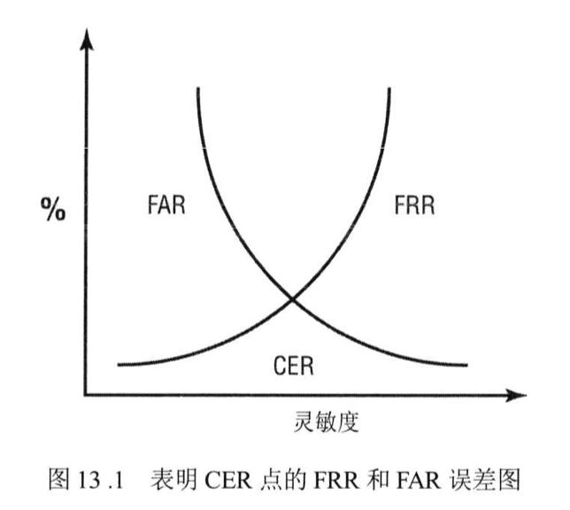

FAR与FRR的交叉点是交叉错误率CER或等错误率ERR，用于评估生物识别的质量。

3. 生物识别注册

生物识别登记存储的生物特征因素样本叫参考配置文件（reference profile）或参考模板（reference template），选择生物识别设备时需考虑注册所需时间（注册身份信息时间过长太耽误事）和吞吐量（生物识别的时间过长也无法忍受）。

### 八、多因素身份验证（MFA）

单独使用密码容易被爆破猜测，单独使用令牌容易丢失或被窃，单独使用生物识别会有误报，因此组合使用强度和准确度最高。

### 九、无密码身份验证

由于密码的不安全性，无密码身份验证方式越来越流行。快速在线身份识别（FIDO）标准用于解决减少用户对于密码依赖的问题，FIDO 2.0被称为Web身份验证或WebAuthn，通过生物识别、蓝牙设备等实现强身份验证，应用领域包括在线支付、系统身份验证等。

### 十、设备身份验证

现如今大部分公司都允许员工自带移动设备到公司办公，除了对用户进行身份验证外，还需要对其设备进行验证，以确保非法设备无法接入组织网络，降低内部威胁。

1. 设备指纹

用户将移动设备在公司进行注册，并关联到用户内部账户，实现账户和设备的双验证。设备指纹就如同人的指纹一样，具有唯一性。设备指纹包括设备型号、硬件配置、操作系统版本、序列号、MAC、IP等，采集的特征越多，设备指纹的唯一性越强。

2. 802.1x

基于端口的身份验证标准，与设备指纹集成到MDM或NAC解决方案。

### 十一、服务身份验证

用于非用户使用而建立的服务账号，如服务器A定期备份并上传到共享服务器B，服务器B建立备份服务账号，仅用于服务器A上传备份。服务账号一般权限较大，除采用密码验证方式外，还会使用数字证书实现身份验证。

### 十二、双向身份验证

通常仅提供服务端身份验证，但无法保证客户端的安全性，因此可使用数字证书进行双向认证，即服务端有证书、客户端也有证书。

## D5-3：实施身份管理

身份管理（Identity management，IdM）技术类型：

- 集中式：身份验证和授权由单个实体执行，适合小型组织、管理开销低、强制。
- 分散式：身份验证和授权由各个实体执行，适合大型组织、管理开销大、灵活。

### 一、单点登录（SSO）

集中式访问控制技术，用户登录一次就可以访问多个业务系统，对用户十分友好、简化账户管理，风险点是一旦被攻破，攻击者也可以获得多个业务系统的权限。

1. LDAP和集中访问控制

目录服务（directory service）是集中式的数据库，存储着主体和客体的信息，以及访问控制信息。微软的活动目录（AD）服务是基于轻量级目录访问协议（LDAP），也就是我们常说的域控。

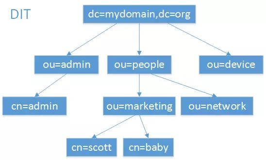

2. LDAP和PKI

LDAP应用于CA证书信任层级的查询。

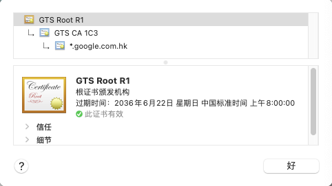

### 二、SSO和联合身份

SSO不仅在内部网络使用，还可以用于互联网第三方服务，如基于云的联合身份管理系统（federated identity management，FIM）。FIM是将一个系统中的用户身份与多个身份管理系统联系起来，将身份验证扩展到单个组织之外，如微信账号登录其他第三方应用。

1. 基于云的联合

通常使用第三方服务共享联合身份，将本地身份验证系统与第三方服务商建立身份信息映射，用户可直接使用本地身份访问第三方服务。

2. 本地联合

与基于云的联合原理一样，只是两个服务都是本地的，如公司A与公司B建立合作关系，双方的身份验证系统建立映射关系，双方用户可使用自己的身份访问对方业务系统。

3. 混合联合

基于云的联合与本地联合组合使用。

4. 即时（Just-in-Time，JIT）

联合身份解决方案支持即时配置（JIT provisioning），即在用户使用本地身份登录第三方服务时，第三方服务会检查本地是否存在身份信息，如果没有则自动创建身份信息，如果存在则更新身份信息。JIT系统通常使用SAML来交换身份信息，支持没有管理员干预的情况下创建身份映射关系。

### 三、凭据管理系统

凭据管理系统（Credential management systems）为用户在SSO不可用时保留其凭据，如浏览器支持存储不同网站的凭据。

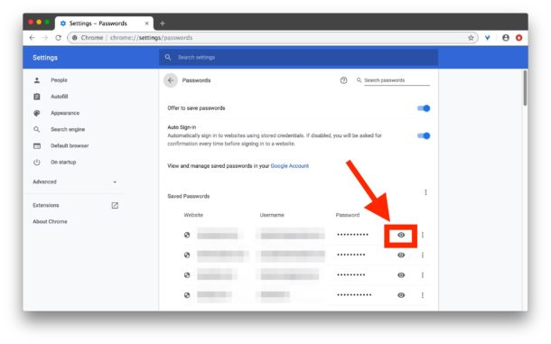

联合身份管理解决方案支持凭据管理API，实现不同web应用程序使用联合身份提供者实现SSO。

身份即服务（IDaaS）是提供身份和访问管理的第三方服务，如使用Google账号登录一次就可以访问多个基于Google云的应用程序，而无需再次登录。

### 四、凭据管理应用程序

1. Windows凭据管理程序

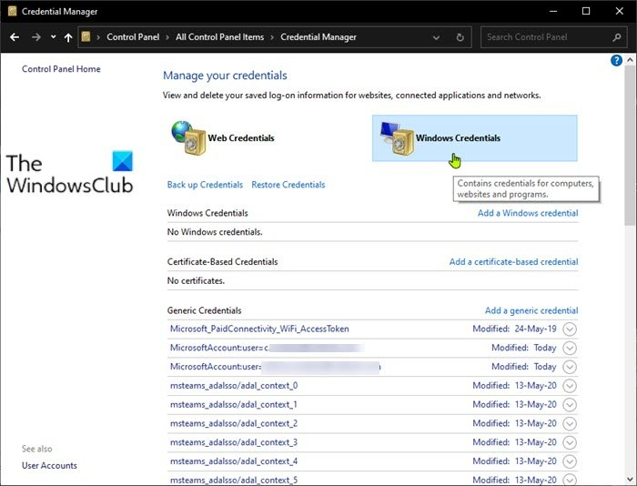

2. KeePass工具

### 五、脚本访问

典型场景便是使用SecureCRT，记录用户名和密码可实现自动登录功能。

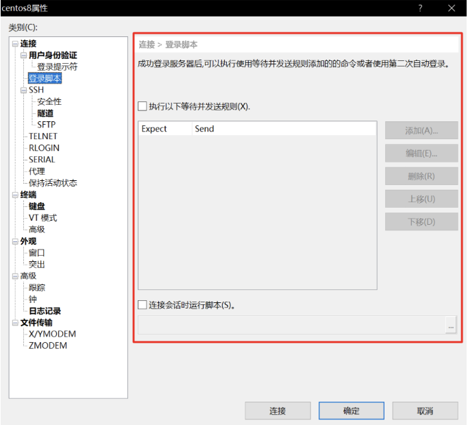

### 六、会话管理

1. 操作系统屏幕保护程序

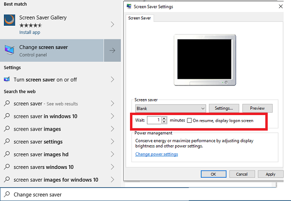

2. 应用程序会话超时终止

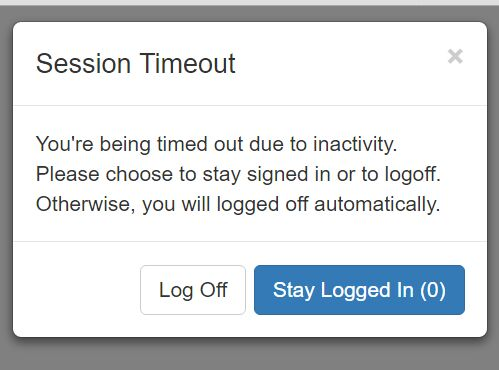

## D5-4：管理身份和访问配置生命周期

身份和访问配置生命周期指的是账户的创建、管理和删除。

### 一、配置和入职

新员工入职后，创建新账户并配置适当权限，也就是登记或注册（enrollment or registration），该过程重点在于确认用户的身份信息准确可靠。

### 二、取消配置和离职

员工离职后，需要取消配置并执行离职流程，改过程最重要的是收回权限，通常不会直接删除用户账号，而是选择禁用。一方面是因为账户所拥有的数据，另一方面是可能离职面谈扭转了员工思想。

### 三、定义新角色

在组织的发展过程中，员工职责可能发生变化，因此会需要创建新角色，并分配相关特权，方便管理员配置员工特权。

### 四、账户维护

账户维护主要涉及员工的职责变化，导致管理员对其权限的调整，应实施标准化维护流程，降低特权蠕变等情况的发生。

### 五、账户访问审查

定期审核账户权限和非活动账户，涉及问题有特权蠕变和过度权限（特权蠕变导致过度权限）。

PS：结合人员安全管理过程理解。

## D5-5：比较访问控制模型

### 一、比较权限、权力和特权

1. 权限（permission）

技术层面用户能够访问资源的权限，如可读取、可读可写、可执行等。

2. 权利（right）

现实层面的权利，你有权利查看数据库的数据，前提是有读取的权限。

3. 特权（privilege）

权限+权利就是特权。

4. 权利（Entitlement）

权利是指授予用户特权的数量，通常在首次分配账户时指定。

### 二、理解授权机制

1. 隐式拒绝

基本原则，白名单机制，如不特定声明允许访问的全部按拒绝。

2. 能力表

关注主体，主体能够访问哪些客体以及执行什么操作。

3. 访问控制列表

关注客体，客体能够被哪些用户访问以及执行什么操作。

4. 访问控制矩阵

能力表和访问控制列表组成访问控制矩阵，如防火墙的访问控制。

5. 约束接口

限制用户能够执行或查看的内容，如Windows菜单。

6. 依赖内容的控制

根据客体内容限制用户，如数据库视图。

7. 依赖上下文的控制

根据主体动作或时间进行权限控制，如上班时间才能访问文件服务器。

8. 知其所需

主体只能访问工作所需的内容。

9. 最小特权

主体仅被授予执行工作所需的权限，与知其所需的区别在于执行动作的权利。

10. 职责分离

敏感任务流程拆分由多人执行。

11. 纵深防御

多层机制保护资产，大维度上采用物理、技术、管理控制保护，小维度上边界防火墙、数据中心防火墙保护。

### 三、使用安全策略定义需求

组织的安全策略宏观上指导访问控制的实现。

### 四、自主访问控制（DAC）

允许客体的所有者、创建者或数据托管员控制和定义对该客体的访问，即关注客体，典型代表ACL。DAC属于分散式访问控制，灵活但不易管理。

### 五、非自主访问控制（Non-DAC）

Non-DAC属于集中式访问控制，不够灵活但易于管理。

1. 基于角色的访问控制（RBAC）

通过使用组来实现控制，如安全设备的三权分立。RBAC有助于解决特权蠕变，强制执行最新特权原则，适合人员更迭频繁的环境。

2. 基于任务的访问控制（TBAC）

与RBAC的区别在于不基于用户身份，而是基于工作任务来控制。

3. 基于规则的访问控制（Rule-BAC）

也就是访问控制矩阵，即防火墙，包含隐式拒绝。

4. 基于属性的访问控制（ABAC）

Rule-BAC的高级实现，可以细粒度的控制条件（不限于五元组），如用户的身份、部门、设备、时间等。

5. 强制访问控制（MAC）

MAC依赖分类标签的使用，也通常被称为基于格子的模型，每一个安全级别都可以使用标签继续细分权限，称为隔间或隔离专区。想要访问隔离专区的数据，必须先拥有级别标签，还需要拥有隔间标签才能进行访问。

由此MAC有三种环境类型：分层、分区和混合。

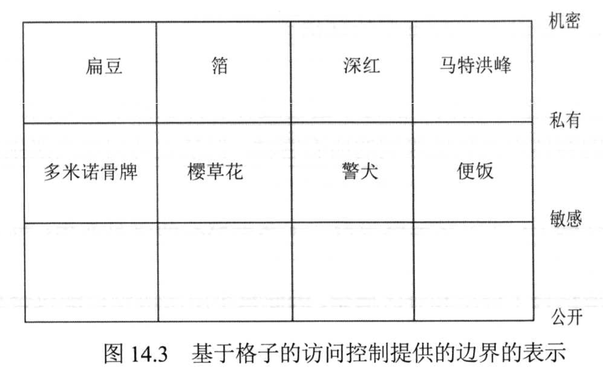

6. 基于风险的访问控制（Risk-BAC）

该模型通过考虑几个不同的因素来评估风险：

- 环境（environment）：可以是物理位置、IP地址等因素。
- 情况（situation）：可以是正在发生什么。
- 安全策略（Security policies）：可以是风险计算方式。

听起来很抽象，其实简单理解就是某个场景下对风险进行评估，再授予该场景下用户符合安全策略的访问权限。

## D5-6：实施身份验证系统

### 一、在互联网实施SSO

1. 可扩展标记语言（XML）

XML可以包含标记，用于将数据描述为所需的任何内容。可用来传输和存储数据，组织使用基于XML的语言来共享身份验证和授权信息。

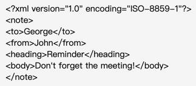

2. 安全断言标记语言（SAML）

SAML基于XML，通常用于在联合组织间交换身份验证和授权（AA）信息。SAML 2.0规范使用三个实体：

- 委托人或用户代理（Principal or User Agent）
- 服务提供者（Service Provider，SP）
- 身份提供者（Identity Provider，IdP）

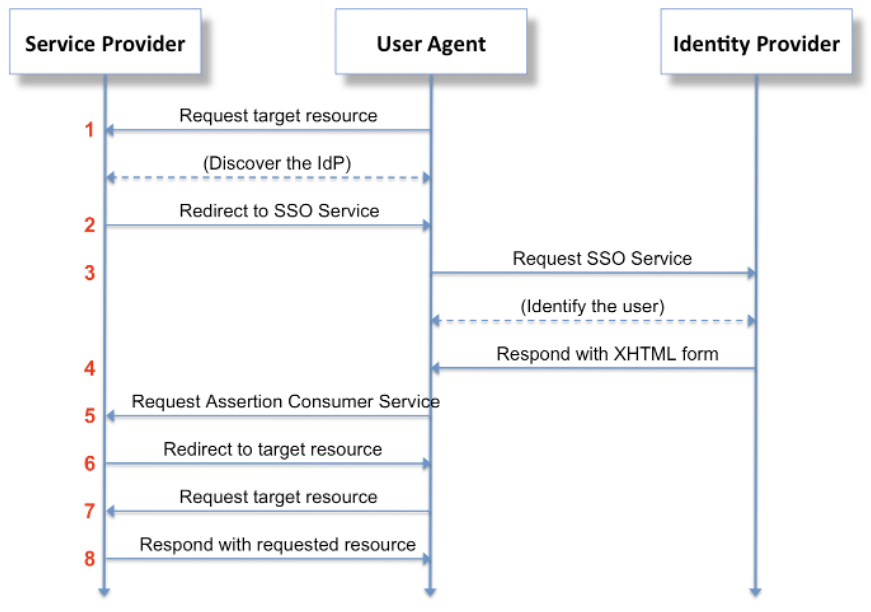

IdP可以发送三种类型的断言：

- 身份验证断言（Authentication Assertion）：提供证明用户代理提交了正确的凭据，并标识了身份识别方法和用户登录时间。
- 授权断言（Authorization Assertion）：提供是否授权用户代理访问请求的服务。
- 属性断言（Attribute Assertion）：提供有关用户代理的任何信息。

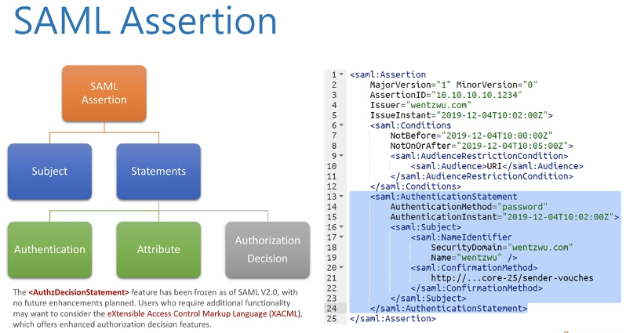

3. OAuth

OAuth 2.0是一个授权框架，不是身份验证协议，通过交换API消息发放令牌进行授权。

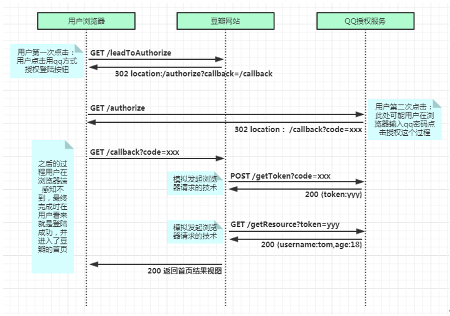

4. OpenID

OpenID是一个开放的身份验证标准，通过使用OpenID标识登录不同的网站，OpenID提供者（OP）进行身份验证，这些网站被称为依赖者（RP）。

5. OIDC

OpenID Connect（OIDC）是使用OAuth 2.0授权框架的身份验证层，即同时提供身份验证和授权。OIDC使用JSON格式Web令牌（JWT），也叫ID令牌。

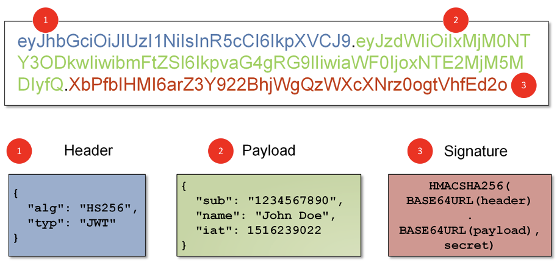

6. 比较SAML、OAuth、OpenID和OIDC

SAML使用断言来传递身份验证和授权信息，OIDC（OpenID+OAuth）使用JWT来传递身份验证和授权信息。SAML的兄弟概念：

- 服务配置标记语言（SPML）：基于XML，专门为交换用户信息而设计，即用于同步创建、修改、删除账号。
- 可扩展访问控制标记语言（XACML）：用于在XML格式中定义访问控制策略，通常用于实现RBAC。

### 二、在内部网络实施SSO

1. AAA协议

用于提供身份验证、授权和记账的协议被称为AAA协议，为远程访问系统提供集中访问控制。

2. Kerberos

Kerberos是一种票据身份验证机制，V5版本使用对称加密算法AES来保障机密性。

Kerberos核心组件

- 密钥分发中心（KDC）：管理所有成员的对称秘钥，用于身份验证的可信第三方。
- 身份验证服务器（AS）：托管KDC功能的服务器，主要是票据授予服务（TGS）和身份验证服务（AS），其中可以将TGS剥离另置一台服务器独立运行。
- 授予票据（TGT）：主体经过KDC的身份验证后获得的身份证明，但不包含授权信息。
- 服务票据（ST）：主体获得ST后才能够去访问客体。

Kerberos通信过程

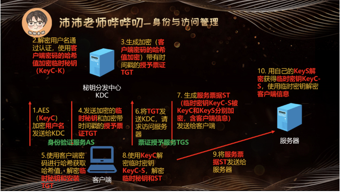

Kerberos风险点

- KDC单点故障，如果KDC挂掉或被攻破，那么可用性和机密性都讲遭到破坏。
- 因为过程中涉及时间戳，因此要求严格的时间配置，需要NTP支持。

3. RADIUS

RADIUS使用UDP 1812和1813传输信息，传输的信息仅密码被加密。可通过使用TLS加强传输安全性，使用TCP端口2083，称为RADIUS/TLS。

4. TACACS+

Cisco专有协议，可将AAA分别托管到不同服务器，通过TCP 49端口传输，可加密所有身份验证信息。

## D5-7：理解访问控制攻击

### 一、常见访问控制攻击

1. 特权提升

攻击者使用权限特殊技术获取非预期权限，如普通用户权限提升为管理员权限。权限提升分两类：

- 水平权限提升（horizontal privilege escalation）：攻击者获得内网服务器普通用户权限后，通过横向渗透获取其他服务器的普通用户权限。
- 垂直权限提升（vertical privilege escalation）：攻击者获得内网服务器普通用户权限后，通过该服务器其他漏洞获得管理员权限。

减少特权命令执行

- Linux中普通用户可使用su或sudo以管理员权限执行命令。
- Windows中的PowerShell常被利用执行无文件攻击。

2. 密码攻击

- 字典攻击（Dictionary Attack）：使用弱密码库进行密码尝试攻击。
- 爆力破解（Brute-Force Attack）：尝试各类字符的可能组合进行密码尝试攻击。
- 喷射攻击（Spraying Attack）：爆破攻击的一种，可尝试绕过账户锁定策略，即账户A爆破失败锁定后，对账户B爆破锁定后，再对账户C爆破，直到账户A的锁定时间到后再对A进行爆破。
- 凭证填充攻击（Credential Stuffing Attack）：即撞库攻击，由于用户在不同网站或系统的密码基本是一样的，所以当其中一个网站或系统的密码被拿到后，可尝试用该账号密码登录其他网站或系统。
- 生日攻击（Birthday Attack）：利用散列算法的碰撞缺陷绕过身份验证。
- 彩虹表攻击（Rainbow Table Attack）：密码通常以哈希值进行存储，利用彩虹表可减少计算哈希的时间来提高密码爆破的效率。
- Mimikatz：一款针对Windows的透测试工具，拥有以下功能：
  - 从内存中读取密码
  - 提取Kerberos票据
  - 提取证书和私钥
  - 从内存中读取LM和NTLM密码哈希值
  - 从LSASS中读取明文密码
  - 列出正在允许的进程
- 哈希传递攻击（Pass-the-Hash Attack，PtH）：攻击者将捕获的密码哈希值发送到身份验证服务，以尝试绕过身份验证机制。
- Kerberos漏洞利用攻击：攻击Kerberos的工具有Mimikatz、Rubeus（针对Windows）、Impacket（针对Linux）。
  - 跨越哈希（Overpass the Hash）：也被称为传递密钥（pass the key），在禁用NTLM使用PtH（pass the hash，传递哈希）攻击的替代方法，可以绕过身份验证获取TGT。
  - 传递票据（Pass the Ticket）：攻击者试图获取lsass.exe进程中持有的票据，然后模拟用户尝试访问网络资源。
  - 白银票据（Silver Ticket）：攻击者获取服务账户的NTLM哈希值，就可以伪造TGS票据，可获取服务账户的所有特权。
  - 黄金票据（Golden Ticket）：攻击者获取Kerberos服务账户（KRBTGT）的哈希值，就可以伪造任何票据，想访问什么服务都可以。
  - 爆破攻击（Brute-Force）：针对用户名和密码的爆破攻击。
  - AS-REP Roast：AS-REP Roast是针对用户账号进行离线爆破的攻击方法，仅在未开启Kerberos预身份验证有效。Kerberos预身份验证是Kerberos中的一项安全功能，可帮助预防密码猜测攻击。
  - Kerberoasting：该攻击收集加密的TGS票据（服务账户使用），尝试进行爆破，并试图查找未开启预身份验证的用户。

PS：TGS tickets就是service ticket（即服务票据）。

- 嗅探攻击（Sniffer Attack）：通过捕获网络通信中的数据包进行分析。

3. 欺骗攻击

- 电子邮件欺骗（Email Spoofing）：伪造电子邮件的发件人，诱使用户相信，常见于垃圾邮件或钓鱼邮件。
- 电话号码欺骗（Phone Number Spoofing）：伪造来电号码欺骗接听者，常见于电信诈骗或电话钓鱼。

### 二、核心保护方法

1. 控制访问

控制物理和逻辑访问，物理方面如使用门禁等，逻辑访问如使用防火墙。

2. 密码策略

- 强密码：长度超过8位，采用大小写、符号和数字组合。
- 账户锁定：多次登录失败锁定账户，延长爆破攻击时间。
- 上次登录通知：登录提示上次登录的信息，可以发现可疑登录行为。
- 多因素身份验证：采用多因素身份验证提高强度。

3. 密码保护

- 散列：加密密码。
- 盐和胡椒：增加加密密码的随机性，盐本地存储，胡椒第三方存储。
- 密码屏蔽：屏幕不能以明文显示密码，且不能复制密码框内的字符。

4. 安全培训

适当的培训有助于员工更好的理解安全的必要性以及为员工提供安全指导。
