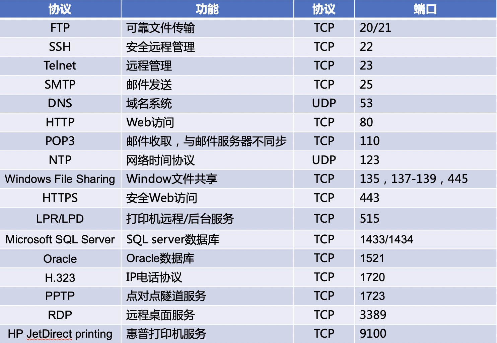
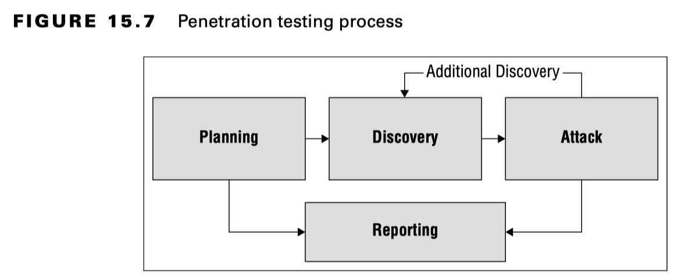
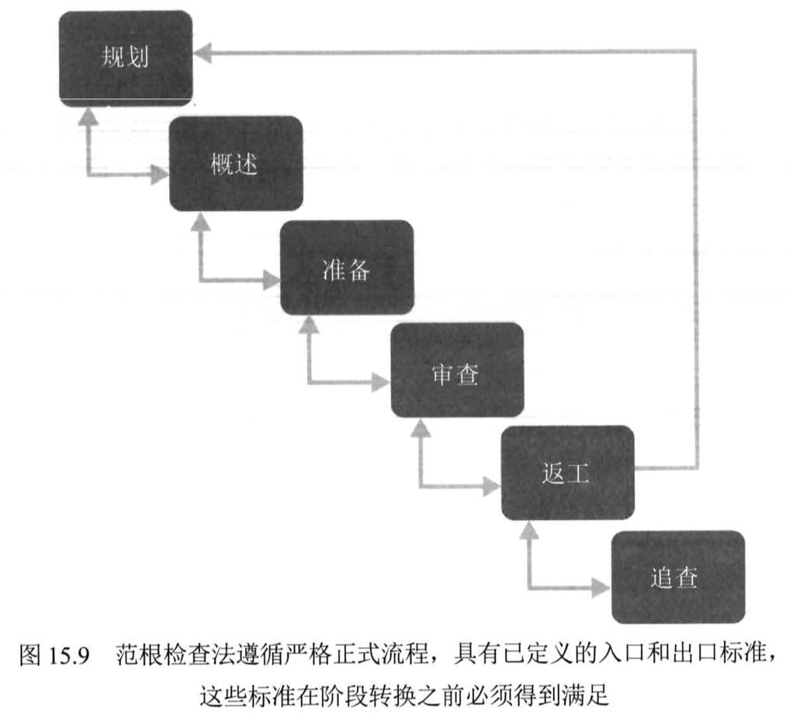

# 域6：安全评估与测试

- [域6：安全评估与测试](#域6安全评估与测试)
  - [D6-1：构建安全评估和测试方案](#d6-1构建安全评估和测试方案)
    - [一、安全测试（Security Testing）](#一安全测试security-testing)
    - [二、安全评估（Security Assessments）](#二安全评估security-assessments)
    - [三、安全审计（Security Audits）](#三安全审计security-audits)
  - [D6-2：开展漏洞评估](#d6-2开展漏洞评估)
    - [一、漏洞描述](#一漏洞描述)
    - [二、漏洞扫描](#二漏洞扫描)
    - [三、渗透测试](#三渗透测试)
    - [四、合规检查](#四合规检查)
  - [D6-3：测试软件](#d6-3测试软件)
    - [一、代码审查和测试](#一代码审查和测试)
    - [二、接口测试](#二接口测试)
    - [三、误用案例测试](#三误用案例测试)
    - [四、测试覆盖率](#四测试覆盖率)
    - [五、网站监测](#五网站监测)
  - [D6-4：安全管理流程](#d6-4安全管理流程)
    - [一、日志审查](#一日志审查)
    - [二、账户管理](#二账户管理)
    - [三、灾难恢复和业务连续性](#三灾难恢复和业务连续性)
    - [四、培训和意识](#四培训和意识)
    - [五、关键绩效和风险指标（KPI/KRI）](#五关键绩效和风险指标kpikri)

## D6-1：构建安全评估和测试方案

### 一、安全测试（Security Testing）

1. 验证控制措施是否正常运行，应定期开展测试。
2. 通常情况下，自动化测试频率高，手工测试频率低。
3. 典型场景如测试备份功能是否正常、病毒库更新是否正常。

### 二、安全评估（Security Assessments）

更全面的安全性审查（涵盖安全测试的内容），会执行风险评估、识别安全漏洞、提出修复意见等，安全评估的成果通常提交管理层审阅。

安全评估可以由内部团队执行，也可以委托专业的第三方团队执行。

NIST 800-53A评估内容

1. 规范：查管理制度；
2. 机制：查技术措施；
3. 活动：查人员行为；
4. 人员：查人员。

### 三、安全审计（Security Audits）

安全审计是为了向第三方证明控制措施有效性而进行的评估，因此审计必须具有独立性。

1. 审计类型
  - 内部审计：由组织内部审计人员执行，直接向CEO或董事会进行汇报。
  - 外部审计：由外部审计公司执行，具有很高的公信力，如四大。
  - 第三方审计：实际上也是外部审计。
2. 审计标准
  - 美国-认证业务标准18号文（SSAE 18）
  - 国际-国际认证业务3402（ISAE 3402）
  - 这两个审计标准通常被称为服务组织控制（SOC）审计。
  - 信息和相关技术控制目标（COBIT）-ISACA
  - SO 27001信息安全管理、ISO 27002 信息安全控制-ISO
3. SOC报告类型
  - SOC 1：评估可能影响财务报告准确性的组织控制措施。
  - SOC 2：评估影响系统中存储的信息安全性和隐私的组织控制。报告是机密的，需要签署保密协议才可与外部组织进行共享。
  - SOC 3：SOC 2报告的摘要信息，可公开展示。
  - Type 1：报告覆盖一个特定时间点，审计管理制度描述的控制措施内容。
  - Type 2：报告覆盖一段较长时间（最少6个月），审计管理制度描述的控制措施实际运行情况。

## D6-2：开展漏洞评估

### 一、漏洞描述

安全内容自动化协议（SCAP）为漏洞描述和评估提供通用语言。

1. 通用漏洞及披露（CVE）：描述安全漏洞的命名系统，即漏洞编号。（http://cve.mitre.org）
2. 通用漏洞评分系统（CVSS）：描述安全漏洞严重性的标准化评分系统，即漏洞级别。（https://www.first.org/cvss/）
3. 通用配置枚举（CCE）：描述系统配置问题的命名系统，即基线配置编号。（https://cce.mitre.org）
4. 通用平台枚举（CPE）：描述操作系统、应用程序及设备的命名系统，即漏洞影响的厂商、组件、版本等。（https://cpe.mitre.org）
5. 可扩展配置检查表描述格式（XCCDF）：描述安全检查表的语言，包括其他元素的大集合。（https://csrc.nist.gov/Projects/Security-Content-Automation-Protocol/Specifications/xccdf）
6. 开放漏洞评估语言（OVAL）：描述安全测试过程的语言，即描述漏洞如何检测的过程。（https://oval.mitre.org）

### 二、漏洞扫描

漏洞扫描工具具备自动化功能，应定期测试内部风险变化，且可被黑客利用作为攻击工具使用。

1. 网络发现扫描

用于扫描IP地址，探测系统开放的端口，不涉及漏洞探测。

常见扫描技术

- TCP SYN扫描：发送含SYN标志位的包，如果返回SYN-ACK则端口开放，也被称为半开放（half-open）扫描。
- TCP Connect扫描：如果用户没有半开放扫描权限，则需要进行全连接扫描。
- TCP ACK扫描：发送含ACK标志位的包，主要用于确定是否有防火墙拦截。
- Xmas扫描：发送含FIN、PSH、URG标志位的包，如果返回RST则端口开放， 也被称为圣诞树（ Christmas tree）攻击。

网络发现扫描代表工具nmap

开源免费使用，能够扫描IP、端口、版本号等等，集成插件还可以进行漏洞扫描，但在考试范畴里就是扫IP、端口的。

nmap能够提供端口的状态

- 开放：端口在系统上是开放的，即服务正常运行；
- 关闭：端口在系统上是关闭的，即服务没有运行；
- 过滤：检测到防火墙干扰，无法判断是否打开还是关闭。

TIPs

- 网络发现扫描如果未经授权开展，则会认定是违法行为。
- 网络发现扫描的最主要应用场景是对目标进行信息收集，方便后续的渗透测试活动。
- 可以使用netstat命令查看系统当前开放的端口号和连接建立情况。

2. 网络漏洞扫描

网络漏洞扫描不仅可以扫描IP和端口，还可以基于漏洞库检测目标系统存在的已知漏洞，即无法检测0 day漏洞。

- 误报（false positive report）：漏扫工具报出漏洞，但目标系统实际不存在该漏洞的情况。
- 漏报（false negative report）：是目标系统实际存在漏洞，但漏扫工具未检测到的情况。
- 基于软件版本号检测，检测到低版本号后匹配该版本的漏洞信息进行漏洞报告，误报率高、检测效率高。
- 基于攻击载荷检测，实际发送漏洞利用的载荷到目标系统，检测目标系统的返回包来确定漏洞是否存在，误报率低、检测效率低。
- 未经身份验证的扫描（unauthenticated scans）：偏向于攻击者视角，但由于没有经过身份验证，某些页面或功能无法获取，因此发现的漏洞相对较少。
- 经过身份验证的扫描（authenticated scans）：经过身份验证后可以提高扫描的范围和准确度，发现的漏洞相对较多。

常见服务的端口号

常见漏扫工具

- Nessus 商业/免费 传统网络
- OpenVAS 免费 传统网络
- AirCrack 免费 无线网络

3. Web应用漏洞扫描

与网络漏洞扫描的最大区别在于其对Web应用进行更为深入的漏洞探测，就像IPS和WAF的关系。

常见Web漏洞扫描工具

- Acunetix 商业
- Nikto 开源
- Wapiti 开源
- Burp Suite 代理工具

4. 数据库漏洞扫描

数据库漏洞扫描工具通常可以同时对数据库和Web应用进行扫描，试图找到数据库漏洞。

典型数据库漏扫工具有sqlmap。

5. 漏洞管理工作流程

- 检测：发现漏洞；
- 验证：手工确认漏洞是否真是存在，避免误报；
- 修复：对漏洞进行修复，方法包括但不限于升级、打补丁、部署防护设备等。

### 三、渗透测试

与漏洞扫描最大的区别在于是否发动了真是的攻击行为，且渗透测试往往是人工参与的。

1. 渗透测试阶段

- 规划（planning）：确定测试范围和规则，确保测试团队与管理人员对测试性质达成共识，明确测试是经过授权的。
- 信息收集和发现（information gathering and discovery）：结合人工和自动化工具收集目标信息，包括网络发现扫描和各类漏洞扫描。
- 尝试攻击（attack seeks）：利用手工和自动化利用工具来企图破坏系统安全。
- 报告（reporting）：总结渗透测试结果，并提出修复建议。
典型渗透测试工具有Metasploit。

2. 渗透测试种类

- 白盒渗透测试（White-Box Penetration Test）：向攻击者提供目标系统的详细信息，可以缩短攻击事件、提高发现漏洞的可能性，也叫已知环境（known environment）测试。
- 灰盒渗透测试（Gray-Box Penetration Test）：向攻击者提供目标系统的部分信息，平衡黑白盒的优缺点，也叫部分已知环境（particularly known environment）测试。
- 黑盒渗透测试（Black-Box Penetration Test）：不向攻击者提供任何信息，模拟黑客攻击场景，也叫未知环境（unknown environment）测试。

入侵与攻击仿真（Breach and Attack Simulations）是Gartner在2021年提出的一个风险管理趋势，BAS工具用于自动化执行无危害的攻击行为，旨在测试组织内的安全控制措施有效性。

### 四、合规检查

组织必须遵循各种法律法规的约束，因此定期执行合规检查可以避免不可预见的监管问题。

## D6-3：测试软件

软件是系统的核心组成部分，会影响很多不同组件的安全，如操作系统、中间件、数据等，因此不不仅需要关注软件的正常功能测试，而且需要关注软件处理处理意外活动的能力，即异常处理（exception handing）。

### 一、代码审查和测试

1. 代码审查（code review）

代码审查也称为同行评审（peer review），编写代码的开发人员之外的其他开发人员会对代码进行检查以发现漏洞，决定代码是否可以上线。

Fagan inspections步骤

规划（planning）、概述（overview）、准备（preparation）、审查（inspection）、返工（rework）、跟进（follow-up）

Fagan审查是最为严格的代码审查方法，适用于代码缺陷可能引发灾难性危害的场景，如涉及人身安全的应用程序开发。

稍微宽松的代码审查方法

- 开发团队会议上成员走查（walk through）代码
- 高级研发人员手工审查
- 自动化代码审查工具

2. 静态测试

静态应用程序安全测试（Static application security testing，SAST）：不运行软件的情况下进行测试，往往使用自动化检测工具。

3. 动态测试

动态应用程序安全测试（Dynamic application security testing，DAST）：运行软件的情况下进行测试，一般使用web漏扫工具进行。

TIPs：

- 模拟事物（synthetic transactions）：动态测试中用于验证系统的性能。
- 交互式应用程序安全测试（Interactive application security testing，IAST）：针对运行时的行为、应用程序性能、HTTP\HTTPS流量、框架、组件和后端连接进行实时分析，动态测试的一种。
- 运行时应用程序自我保护（Runtime Application Self-Protection，RASP）：运行在服务器上的工具，可以拦截应用程序调用和验证数据请求，是一种防护技术。
- 道德披露（ethical disclosure）：安全人员检测到厂商的漏洞后，有责任向厂商报告漏洞详情，为他们提供开发补丁或其他补救措施的机会。应为厂商提供合理的时间来纠正问题，但如果未按时纠正可公开漏洞，以便为其他用户使用此产品提供参考。（可参考乌云的运作模式）

4. 模糊测试

模糊测试（Fuzz testing）是一种动态测试技术，向软件提供不同类型的输入测试其限制以发现漏洞。

模糊测试类型

- 突变模糊测试（Mutation or Dumb Fuzzing）：将输入值进行随机改变来测试软件反馈（不动脑）。
- 智能模糊测试（Generational or Intelligent Fuzzing）：开发数据模型创建新的值来测试软件反馈（动脑子）。

模糊测试虽然重要，但无法覆盖所有代码的测试，仅限于不涉及业务逻辑的简单漏洞测试。

### 二、接口测试

应用程序开发都是抽象的，因此交互都要依靠接口（interface）完成，对接口进行测试也是软件测试的重要部分。

接口类型

1. 应用编程接口（API）：应用程序之间交互的通道。
2. 用户界面（UI）：包括图像用户接口（GUI）和命令行接口（CLI），前段和后端交换的通道。
3. 物理接口（Physical Interfaces）：操控机械装置、逻辑控制器或其他物理设备的应用程序交换通道，物理接口测试需慎重，因为影响较大。

### 三、误用案例测试

测试人员梳理错误使用应用程序的场景，然后通过手工活自动化的方式对应用程序进行测试。

### 四、测试覆盖率

测试软件是无法做到测试所有部分的，就像风险无法被完全消灭，因此衡量对软件的测试程度使用测试覆盖率分析。

测试覆盖率=已测用例的数量/全部用例的数量

五个常见标准

1. 分支覆盖率（branch coverage）：是否每一个if语句都已被执行。
2. 条件覆盖率（condition coverage）：是否每一个逻辑都已被测试。
3. 函数覆盖率（function coverage）：是否每个函数都已被调用。
4. 循环覆盖率（loop coverage）：是否每个循环都已被执行。
5. 语句覆盖率（statement coverage）：是否每行代码都已被执行。

### 五、网站监测

组织应对网站进行持续监测，可以实现性能管理、故障排除、安全问题识别等。

1. 被动监测（passive monitoring）：对真实流量进行监测，用于发现网络活动；其中真实用户监测（RUM）是被动监测的变体，侧重于用户活动的监测。
2. 主动监测（active monitoring）：也叫综合监测（Synthetic monitoring），模拟事务交易来测试网站性能。

被动监测具有滞后性，出了问题才能发现，而主动监测可以提前检测到问题。

## D6-4：安全管理流程

### 一、日志审查

1. 安全信息和事件管理（SIEM），对日志进行自动化收集、分析、审查。
2. 大部分设备、操作系统和应用程序都支持syslog，但window需要额外安装第三方软件才能支持。
3. 确保日志时间戳的一致性，必须实施网络时间协议（NTP）。
4. 在调查安全事件时，网络流（netflow）日志非常有用。

### 二、账户管理

账户管理审查（account management review）确保用户仅保留被授予的权限，并未发生未授权的修改。

1. 全面审查（full review）：对所有账户的权限进行审查，由于时间成本，往往选择仅对特权账户进行审查。
2. 抽样审查（sampling review）：随机抽取部分账户进行审查。
3. 自动审查：身份和访问管理（IAM）可以支持自动化审查，并提供审计踪迹（audit trail）。

### 三、灾难恢复和业务连续性

备份程序对于灾难恢复计划至关重要，管理人员应定期检查备份结果，涉及审查日志、检查哈希值、要求真实还原一个系统或文件。

对灾难恢复和业务连续性控制进行定期测试，可以确保组织能够有效地防止业务运营中断。

### 四、培训和意识

安全培训和安全意识有助于各类安全计划的开展。

### 五、关键绩效和风险指标（KPI/KRI）

安全管理人员应持续监测关键绩效和风险指标，如：

1. 未修复漏洞数量
2. 已修复漏洞数量
3. 漏洞/缺陷重现次数
4. 被盗用账户数量
5. 软件上线前漏洞数量
6. 审计结果重新次数
7. 用户访问恶意站点的数量
