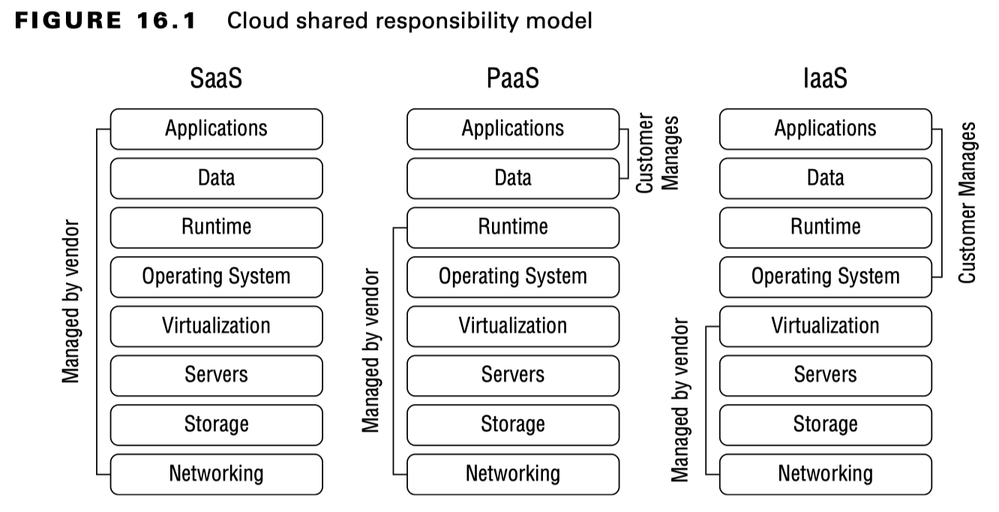
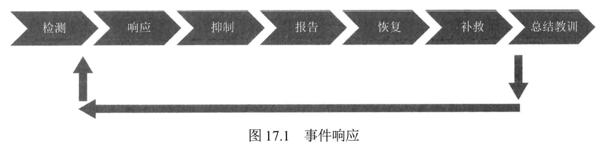
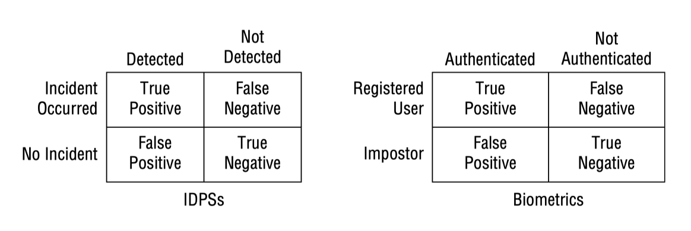
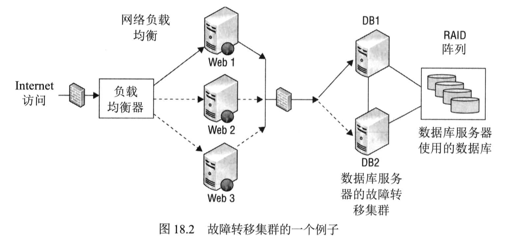

# 域7：安全运营

- [域7：安全运营](#域7安全运营)
  - [D7-1：应用安全运营概念](#d7-1应用安全运营概念)
  - [D7-2：解决人员安全](#d7-2解决人员安全)
  - [D7-3：安全地配置资源](#d7-3安全地配置资源)
    - [一、信息和资产所有权](#一信息和资产所有权)
    - [二、资产管理](#二资产管理)
  - [D7-4：应用资源保护](#d7-4应用资源保护)
    - [一、介质管理](#一介质管理)
    - [二、介质保护技术](#二介质保护技术)
  - [D7-5：云中托管服务](#d7-5云中托管服务)
    - [一、概念](#一概念)
    - [二、云服务模型中的共享责任](#二云服务模型中的共享责任)
    - [三、可扩展性和弹性](#三可扩展性和弹性)
  - [D7-6：执行配置管理](#d7-6执行配置管理)
    - [一、配置（provisioning）](#一配置provisioning)
    - [二、基线（baseline）](#二基线baseline)
    - [三、使用镜像创建基线](#三使用镜像创建基线)
    - [四、自动化](#四自动化)
  - [D7-7：管理变更](#d7-7管理变更)
    - [一、变更管理流程](#一变更管理流程)
    - [二、版本控制](#二版本控制)
    - [三、配置文档](#三配置文档)
  - [D7-8：管理补丁和减少漏洞](#d7-8管理补丁和减少漏洞)
    - [一、系统管理](#一系统管理)
    - [二、补丁管理](#二补丁管理)
    - [三、漏洞管理](#三漏洞管理)
    - [四、漏洞扫描](#四漏洞扫描)
    - [五、常见漏洞和暴露](#五常见漏洞和暴露)
  - [D7-9：执行事故管理](#d7-9执行事故管理)
    - [一、定义事故](#一定义事故)
    - [二、事故管理步骤](#二事故管理步骤)
  - [D7-10：实施检测和预防措施](#d7-10实施检测和预防措施)
    - [一、基本预防性措施](#一基本预防性措施)
    - [二、理解攻击](#二理解攻击)
    - [三、入侵检测和防御系统](#三入侵检测和防御系统)
    - [四、具体预防措施](#四具体预防措施)
  - [D7-11：日志记录和监控](#d7-11日志记录和监控)
    - [一、日志记录技术](#一日志记录技术)
    - [二、监控的作用](#二监控的作用)
    - [三、监控技术](#三监控技术)
    - [四、日志管理](#四日志管理)
    - [五、出口监控](#五出口监控)
  - [D7-12：自动化事故响应](#d7-12自动化事故响应)
    - [一、理解安全编排自动化与响应（SOAR）](#一理解安全编排自动化与响应soar)
    - [二、机器学习和人工智能工具（ML && AI Tools）](#二机器学习和人工智能工具ml--ai-tools)
    - [三、威胁情报（Threat Intelligence）](#三威胁情报threat-intelligence)
    - [四、技术整合](#四技术整合)
  - [D7-13：灾难恢复计划](#d7-13灾难恢复计划)
    - [一、灾难的本质](#一灾难的本质)
    - [二、理解系统恢复、高可用性和容错](#二理解系统恢复高可用性和容错)
    - [三、恢复策略](#三恢复策略)
    - [四、恢复计划的开发](#四恢复计划的开发)
    - [五、培训、意识和文档化](#五培训意识和文档化)
    - [六、测试与维护](#六测试与维护)
  - [D7-14：调查](#d7-14调查)
    - [一、调查类型](#一调查类型)
    - [二、电子发现（eDiscovery）](#二电子发现ediscovery)
    - [三、证据](#三证据)
    - [四、调查过程](#四调查过程)
  - [D7-15：计算机犯罪类型和道德](#d7-15计算机犯罪类型和道德)
    - [一、计算机犯罪的主要类型](#一计算机犯罪的主要类型)
    - [二、道德](#二道德)

## D7-1：应用安全运营概念

安全运营的实践的主要目的是保护资产，有助于识别威胁和漏洞，并实施控制来降低组织资产的整体风险。

1. 知其所需（need to know）

强制要求授予用户仅访问执行工作所需数据或资源的权限，通常与安全许可（security clearance）有关，约等于权利（right），即拥有访问数据的资格。

2. 最小特权（least privilege）

主体被授予完成工作所需的特权，而不再被授予更多特权。与知其所需的区别包括适用范围广，即不仅适用于访问数据，还适应于系统访问；最小特权包括权利和权限，而知其所需更多的偏向于权利。

3. 职责分离（SoD）

职责分离确保一个人无法完全控制关键职能或系统，即一个人无法破坏系统，有助于防止欺诈、串通等行为。

4. 双人控制（two-person control）

需要两个人对关键人物进行批准才可进行，可实现同行评审、减少欺诈和串通。

5. 拆分知识（split knowledge）

将职责分离和双人控制整合成一个解决方案。

6. 岗位轮换（job rotation）

员工定期更换工作职责，可实现同行评审、减少欺诈并实现交叉培训。

7. 强制休假（mandatory vacation）

强制员工休假一周或两周，有助于发现欺诈和串通行为。

8. 特权账户管理（PAM）

限制对特权账户的访问，或检测账户何时特权提升，以及监控特权账户的行为操作，可使用SIEM用以监测特权提升活动，还可以发现高级持续性威胁（APT）。

9. 服务水平协议（SLA）

服务水平协议是组织与供应商之间签订的协议，用以确保供应商提供的产品或服务满足性能要求，通常包含处罚条款。

除了SLA外，还会签订谅解备忘录（MOU）或互连安全协议（ISA），但不涉及处罚条款。

## D7-2：解决人员安全

人身安全是安全运营中最关心的元素。

1. 胁迫

当员工单独工作时，胁迫（duress）系统非常有帮助，即一个人无法应对危险时安全的方式通知其他人。如银行柜台下的静默报警装置就是胁迫系统的例子，还包括内部员工间使用的暗语，“今晚无风”即安全，“今晚有大风”即不安全。

2. 出差

首先要保障出差员工的人身安全，如客房服务敲门免费送食物，需要致电前台确认。其次是电子设备风险：

- 敏感数据：不应携带敏感数据出差，如必须携带需加密保护；
- 恶意软件和监控设备：注意电子设备的物理安全，避免被植入恶意程序。
- 免费Wi-Fi：勿连免费Wi-Fi，避免遭受中间人攻击。
- VPN：连接企业内网使用VPN，保障通信安全性。

3. 应急管理

应急管理计划和实践帮助组织在灾难发生后处理人身安全，人是最重要的资产。

4. 安全培训和意识

安全培训和意识是基础，可以很好多支持员工在日常工作中保持安全性。

## D7-3：安全地配置资源

### 一、信息和资产所有权

资产（包括数据、系统、设备等）的最终责任人是高级管理层，但也可以识别到具体的责任人，明确从上到下的安全职责。

### 二、资产管理

资产管理是对有形资产和无形资产的管理，根据资产清单对资产进行跟踪，并在资产生命周期内对其进行保护。

- 有形资产：硬件和软件资产。
- 无形资产：专利、版权、公司信誉等资产。

1. 硬件资产库存

硬件资产包括计算机、服务器、路由器、交换机及外围设备，使用数据库和库存应用程序进行管理，常用条形码（bar code）或射频识别（RFID）。

2. 软件资产库存

软件资产包括操作系统和应用程序，主要是管理许可密钥（license key），避免泄漏被盗用以及盗版法律风险，可使用微软的SCCM进行许可检查。

3. 无形库存

高级管理层对无形资产负责，由于无形资产也能够给组织带来价值，因此也需要进行跟踪管理。虽然无形资产的价值不好评估，但常用做法是使用通用会计准则（GAAP）进行计算。

## D7-4：应用资源保护

### 一、介质管理

介质管理是指保护介质及其存储的数据而采取的步骤。介质指的是任何存储数据的设备，包括磁带、光学介质（CD/DVD）、U盘、硬盘等，需要注意的是手机等带有存储卡的设备也属于介质。

### 二、介质保护技术

介质保护首先从物理上保护，如介质放置在安全的场所。其次就是技术控制，如禁用USB接口等。

1. 磁带介质

磁带往往与备份数据相关，保护磁带就是在保护备份数据，主要从存储环境、运输过程、数据加密等维度考虑。

2. 移动设备

主要包括智能手机和平板电脑，通过移动设备管理系统（MDM）进行管理。

3. 管理介质生命周期

介质达到平均故障时间（MTTF），就应该将其销毁，处理流程遵循存储数据的级别。

## D7-5：云中托管服务

### 一、概念

1. 云资产（cloud-based assets）包括组织使用云计算技术访问的所有资源，即托管服务（managed services）。
2. 使用云资源最大挑战是不受组织的直接控制，风险管理变的更加困难。特别是数据安全，应将云上存储的和传输中的数据进行加密，密钥使用本地密钥并进行保护。
3. 使用加密擦除方法（Cryptographic erase methods）进行数据和密钥的删除确保机密性。

### 二、云服务模型中的共享责任

根据云服务模式，资产责任级别有所不同。资产责任包括维护资产、确保资产保持正常运行、使系统和应用程序更新到最新补丁。

用户在不同模型下需要负责的内容：IaaS负责OS、APP、Data，PaaS负责APP、Data，SaaS负责Data（图中的Data不是用户数据）。

云部署模型（公有、私有、社区、混合）中的共同责任，根据自身职责和服务模型进行分配。

PS：一切即服务（XaaS）是指通过云解决方案向客户提供的任何类型的计算服务或功能，其中安全即服务（SECaaS）指的是通过云解决方案提供各种形式的安全服务，也被称为托管安全服务提供商（MSSP）。

### 三、可扩展性和弹性

可扩展性（scalability）是指想加资源就能加，比如某些笔记本16G内存，不支持扩展内存，这就是可扩展性差。

弹性（elasticity）是指能够动态增加资源，比如12306平时用100台服务就够了，但春节前后业务访问暴增，支持不关机动态增加内存来应对。

## D7-6：执行配置管理

配置管理（CM）有助于确保系统以安全、一致的状态部署，并在其整个生命周期中保持安全、一致的状态。基线和镜像通常用于部署系统。

### 一、配置（provisioning）

当配置一个新系统时，如果使用默认配置则可能会有很多漏洞，因此需要进行配置加固。

1. 禁用所有非必需的服务；
2. 关闭所有非必需端口（与服务是强相关的）；
3. 删除所有非必需应用程序；
4. 更改默认密码。

### 二、基线（baseline）

在配置管理中，基线指的是系统的初始配置，不同类型的系统具有不同的基线要求（即范围界定和按需定制）。

### 三、使用镜像创建基线

常见镜像工具有赛门铁克Norton Ghost和微软window部署服务（WDS）。

创建和部署基线镜像的步骤：

1. 安装OS以及APP等，按照基线对配置进行加固，并测试功能运行正常；
2. 使用镜像工具生成镜像并存储；
3. 根据需要使用镜像即可。

基线镜像能够保障配置是正确的，缩短了部署系统的时间和成本，需要关注基线镜像的完整性，避免被植入恶意程序。

### 四、自动化

镜像通常与其他基线自动化方法组合使用，因为要根据系统的不同类型进行定制化基线配置，一台一台配置累死，所以使用自动化方式进行统一配置，典型工具就是微软的组策略（group policy）。

## D7-7：管理变更

由于组织环境是不断变化的，因此安全也是持续活动，变更管理（change management）确保变更不会导致意外中断。

### 一、变更管理流程

1. 请求变更（request）：组织环境中有变更需求就必须请求变更，禁止非授权进行变更。
2. 审核变更（review）：由变更咨询委员会（CAB）/变更审核委员会（CRB）对变更内容进行审核并出具审核报告，委员会成员应来自不同领域，确保委员会具有全面的知识。
3. 批准/拒绝变更（approve/reject）：根据审核结果批准或拒绝变更。CRB在某些情况下需要创建回滚或退出计划（rollback or backout plan），确保变更过程中发生异常，可保障系统能够恢复如初。
4. 测试变更（test）：变更被批准后，为了保障实际变更不出意外，先在测试环境测试一下变更方案是明智之举。
5. 安排并实施变更（schedule and implement）：确定变更时间（非工作时间最合适），按变更方案步骤执行变更，最小化变更影响。
6. 记录变更（document）：文档化至关重要，可以帮助相关方了解系统的变更内容，也可以指导系统恢复到变更前的状态。

在需要实施紧急变更的情况下，如病毒感染需要隔离主机，则可先执行变更再补变更记录，即变更记录一定要有，用于审计、知识传递或系统恢复等用途。

### 二、版本控制

版本控制（versioning）通常指的是软件配置管理所使用的版本控制，如Apache 2.4.39。版本控制可以很好的标识不同版本之间的差异，有助于跟踪软件随时间的变更情况。

### 三、配置文档

配置文档（Configuration Documentation）用于记录系统当前配置，明确责任人、系统目的以及变更内容。

## D7-8：管理补丁和减少漏洞

### 一、系统管理

补丁和漏洞管理应将所有有操作系统的设备纳入管理，如服务区、工作站、网络设备、安全设备、打印机、物联网设备、移动设备等等。

### 二、补丁管理

补丁（patch）是纠正程序缺陷及漏洞或提高现有软件性能的所有代码类型的总称，也叫更新（updates）、快速修复（quick fix）和热补丁（hot fix）。补丁管理很容易被组织忽视，有补丁你不打，中招只能说活该，如永恒之蓝漏洞补丁2017年3月12日就发布了，WannaCry2017年5月12日爆发。

补丁管理常见步骤如下：

1. 评估补丁（evaluate）：评估补丁是否适合自身系统，如Apache出了个新补丁，而你用的是Nginx，那就不用管了。
2. 测试补丁（test）：在测试环境对补丁进行测试，确定补丁是否影响系统。
3. 批准补丁（approve）：补丁在生产环境升级前需要获得批准，走变更管理流程。
4. 部署补丁（deploy）：生产环境升级补丁，但为了保障系统不会因打补丁而崩溃（往往测试环境不会出问题，生产环境容易出），最好做个备份。
5. 验证被部署的补丁（verify）：对打的补丁进行测试，确保其新功能正常运行。

### 三、漏洞管理

漏洞管理是指定期识别漏洞、评估漏洞并采取措施减轻漏洞相关的风险，与补丁管理相辅相成，需应用职责分离原则。

### 四、漏洞扫描

使用漏洞扫描工具（如Nessus）定期对系统和网络进行扫描，并生成相关漏洞报告，按照报告的修复建议进行漏洞修复。

### 五、常见漏洞和暴露

漏洞使用CVE来进行统一管理，MITRE维护CVE数库。

## D7-9：执行事故管理

### 一、定义事故

1. 事故（incident）是指对组织资产的CIA产生负面影响的任何事件（event）。
2. 安全事故（security incident）是危害计算机或网络安全的某个方面的任何有害事件（event），出自RFC 2350。
3. 安全事故（security incident）是违背或即将违背计算机安全策略、可接受使用策略或标准安全实践规范的情况，出自 NIST SP 800-61。

TIPs：安全事件（event）和安全事故（incident）如果做区分的话，事件指的是还未确定真实发生的事件（存在误报可能），事故指的是确定已真实发生的事件（经过确认和定性）。

### 二、事故管理步骤

事故管理是一个持续性活动，不包含针对攻击者的反击活动（违法行为）。

1. 检测（detection）

通过检测工具（如IPS）或人工上报的方式通知IT专家，事件经过误报过滤后确定事故，并指定事故的严重级别。

2. 响应（response）

计算机事故响应小组（CIRT）或计算机安全事故响应小组（CSIRT）用于应对重大安全事故，小型安全事故第一检测人可直接自行处理。

事故响应速度越快，其产生的影响越小。

事故通常会进行追责，因此从响应过程开始就需要对证据进行保护。

3. 抑制（mitigation）

有效的事故管理目标之一是限制事故的影响或范围，如将中病毒的主机进行隔离。

4. 报告（reporting）

将安全事故上报高级管理层或外部监管机构。报告对象取决于安全事故的性质，如果仅涉及组织自身则可能为了声誉不会上报给监管机构，但涉及到用户个人信息，则需要遵循隐私保护政策及时上报监管机构（72小时内）。还有一种情况，是由于员工自身能力问题，导致没有将事件定性为事故，进而导致事故发展蔓延、影响范围扩大，需进行员工培训解决。

5. 恢复（recovery）

恢复系统或使其恢复到全功能状态。基于事故严重程度，执行的恢复操作也不同，为防止恶意代码的存留，最佳选项是重建系统。重建系统时组织的配置管理和变更管理显得尤为重要，可以确保系统重建后配置是正确的。需要双重复查的内容有：访问控制、服务和协议、补丁、用户账户、合规性。

6. 补救（remediation）

安全人员执行根本原因分析（root cause analysis），采取措施防止事故再次出现。

7. 经验教训（lessons learned）

安全人员回顾整个事故的过程，总结经验教训，编写报告提供改进意见提交高级管理层。

TIPs：通过检查表、培训等方式指导员工参与事故响应，可以提高响应速度、降低事故影响，即不再将事故响应全权交由安全人员负责。

每个组织对事故响应步骤的划分可以不一样，但核心动作都是存在，如NIST SP 800-61中事故响应生命周期的步骤为4个：1.准备；2.检测和分析；3.遏制、根除和恢复；4.事故后活动。

## D7-10：实施检测和预防措施

理想状况下，组织通过实施预防措施来避免事故发生，但不论多有效的预防机制，事故也可能仍然发生，因此需要其他控制来检测和响应事故。

1. 预防性控制：试图阻止或停止非预想或未授权的活动发生，事前措施。
2. 检测性控制：试图发现或检测非预想或未授权的活动，事后措施。

### 一、基本预防性措施

1. 保持系统和应用程序及时更新
2. 移除或禁用非必需的服务和协议
3. 使用入侵检测和防御系统（IDP）
4. 使用最新版本的反恶意软件程序
5. 使用防火墙
6. 实施配置和系统管理流程

### 二、理解攻击

安全人员需要充分理解常见攻击方法，域3涉及密码学攻击、域4涉及网络攻击、域5涉及访问控制攻击、域8涉及恶意代码。

1. 僵尸网（botnets）

具备访问互联网的设备（终端、服务器、IoT设备、智能手机等）受到攻击，被植入恶意代码后，可以被黑客远程控制，这样的终端或服务器被称为僵尸主机（bots or zombies hosts）；海量僵尸主机形成的网络被称为僵尸网（botnets）。

- 僵尸网主要目的用于发动DDoS攻击，也用于窃取用户数据等。
- 防御手段包括但不限于用户安全意识培训（用户）、反恶意软件程序（主机）、防火墙（边界）、威胁情报等（知识）。

2. 拒绝服务攻击（DoS）

DoS攻击的目标是使目标拒绝服务或缓慢提供服务，攻击源一般是一个，由于单机性能的提升，基于流量型的不太好使了。

- 分布式拒绝服务（DDoS）攻击是DoS的升级版，配合僵尸网实现多打一，利用资源优势碾压目标。
- 分布式反射型拒绝服务（DRDoS）攻击时DDoS的一种，特点在于利用公共资源（如DNS服务器）放大攻击流量。
- 最有效应对流量型DDoS攻击的措施是与运营商合作，在管道侧将攻击流量清洗掉。

3. SYN Flood攻击

利用TCP三次握手机制的漏洞，伪造源IP地址向目标发送大量SYN包建立半连接而不回复ACK，导致目标为了维护半连接而导致内存塞满，进而无法响应正常服务请求。

- 拒绝服务攻击的一种形式。
- 防御手段包括但不限于SYN cookie（替代建立半连接）、源认证（代理回复ACK确认对方真实性）、缩短会话超时时间（释放内存空间）等。

4. Smurf和Fraggle攻击

- Smurf通过伪造源IP，发送ICMP广播让广播域内的主机都对目标主机进行响应，致使目标主机被流量淹没。
- Fraggle与Smurf相似，但利用的是UDP数据包。

对于现在的计算机性能和网络分段来说，这两个攻击不再那么有效。

5. ping flood

利用大量ICMP请求包淹没目标，配合僵尸网才有效，通过过滤ICMP echo请求包就能解决。

过时攻击

- Ping of Death：使用超大ping数据包（64KB以上），导致目标系统崩溃（可能引发缓冲区溢出错误）。
- Teardrop：利用TCP分段偏移重叠无法组合，导致目标系统崩溃。
- Land：利用TCP SYN包将源IP和目标IP都伪造成目标IP，导致目标系统不断自己与自己建立连接而崩溃。

6. 零日利用（Zero-day Exploit）

零日利用指的是利用其他人还不知道的漏洞（0 day漏洞）的攻击，随着时间的推移会叫1 day、N day等，补丁一旦发布就被称为已知漏洞了。

防护零日利用的方法包括基本预防措施，以及蜜罐（honeypots）和APT检测（沙箱）可用于发现0 day攻击行为。

7. 中间人攻击（MiTM）

也叫路径上攻击（on-path attack），两个终端通信之间被攻击者监听（嗅探攻击）或代理（可篡改数据）。

嗅探攻击极难被检测到，代理攻击可以被防代理机制或异常网络活动检测到。

8. 蓄意破坏（Sabotage）

指的是内部员工对自己所在组织实施破坏的犯罪活动，包括物理和技术破坏。蓄意破坏一般发生在员工对组织心怀不满时（如工资待遇、怀才不遇等），防范机制是做好人员安全管理。

### 三、入侵检测和防御系统

入侵检测系统（IDS）用于检测攻击行为，入侵防御系统（IPS）用于预防或防御攻击行为，IPS包含检测能力，也称之为入侵检测和防御系统（IDPS）。

1. 基于知识和基于行为的检测

基于知识的检测：也叫基于签名或模式匹配检测，检测速度快、误报率低，无法检测未知攻击。

基于行为的检测：也叫统计型入侵检测、异常检测和基于启发检测，检测速度慢、误报率高，可以检测未知攻击。

两个场景中关于误报的四个概念

- 真阳性（True positive）：事故发生被检测到。
- 假阴性（False negative）：事故发生没有被检测到。
- 假阳性（False positive）：事故没发生被检测到。
- 真阴性（True negative）：事故没发生没有被检测到。

- 真阳性（True positive）：注册用户尝试身份验证并成功验证。
- 假阴性（False negative）：注册用户尝试身份验证但验证失败。
- 假阳性（False positive）：虚假用户尝试身份验证并成功验证。
- 真阴性（True negative）：虚假用户尝试身份验证但验证失败。

结果合理则为真，结果不合理则为假；机制执行成功则为阳，机制执行失败则为阴。

一般我们只会提及假阴性（漏报和错误拒绝率高）和假阳性（误报和错误接受率高），因为他们不符合预期结果。

2. IDS响应

IDS在发现安全事故后，会以被动或主动方式做出响应。

- 被动响应：该方式不会影响组织环境，仅通过邮件、短信、弹窗消息等方式通知管理员。
- 主动响应：该方式通过改变组织环境来拦截攻击，如给防火墙下发访问控制策略。

被动响应的优势在于不会惊动黑客的攻击行为，这也是IDS较IPS的优势所在，而主动响应则会打断黑客当前的攻击进程，迫使黑客放弃或尝试绕过。

3. 基于主机或基于网络的IDS

- 基于主机的IDS：检测主机的行为来发现异常，如进程活动、日志信息等，检测能力强、管理和经济成本高、占用系统资源、易被黑客发现。
- 基于网络的IDS：检测网络流量特征来发现异常，检测能力较弱、管理和经济成本低、不影响系统、隐蔽性高。

越来越多的通信采用TLS加密，虽然提高机密性，但也给安全设备带了挑战——无法检测加密流量中的攻击行为。通过使用TLS解密器（一般叫SSL网关或SSL卸载等），可以解密加密流量让安全设备进行检测，通常是硬件形态（性能原因），部署在组织互联网边界。

4. 入侵防御系统

IDS以旁路方式部署，IPS以在线串接方式部署，因此可以实现攻击流量拦截。

### 四、具体预防措施

1. 蜜罐（Honeypots）和蜜网（Honeynets）

蜜罐是单个的计算机，被创建当作陷阱或诱饵来应对入侵者或内部威，多个蜜罐组成的陷阱网络就是蜜网。

- 蜜罐与生产环境中的系统基本一样（不含真实数据），但被人为设置了大量漏洞（即伪漏洞，pseudo-flaws），其目的是吸引攻击者远离生产环境、对攻击行为进行监测和记录用于抵抗0 day。
- 蜜罐和蜜网通常在虚拟系统上构建，方便重建系统，但攻击者容易识别出所在环境是否是虚拟环境。
- 诱惑（enticement）和诱捕（entrapmeng）的区别在于蜜罐所有者是否主动邀请访问者，主动就是诱捕、不合法、类似钓鱼执法，被动就是诱惑、合法行为。

2. 警告横幅（Warning Banners）

警告横幅的目的是为了威慑，对象包括授权用户和未授权用户，警告其行为都在监控之下，注意什么能做什么不能做。

3. 反恶意软件（Antimalware）

也就是杀毒软件，基于签名和启发式检测能力，需要定期更新规则库来保障反恶意软件能力。除了常见主机反恶意软件，边界的下一代防火墙也具备反恶意软件能力，还有安装在电子邮件服务器上的专用反恶意软件等等，起到纵深防御的能力。

- 通常不建议安装多个反恶意软件，耗费主机性能。
- 限制用户的权限也可以降低恶意软件的影响。
- 教育用户了解恶意软件的危害，能有效对抗社会工程攻击。

4. 白名单和黑名单（Whitelisting and Blacklisting）

黑白名单的应用领域非常广泛，包括应用程序限制、网络过滤、访问控制等，黑明单限制已知内容、允许未知内容，白名单允许已知内容、限制未知内容，从安全的角度考虑，白名单优先级高于黑名单。

5. 防火墙（Firewall）

防火墙也是主要的预防措施，域4已经详细讨论过。

- 一代墙主要依靠五元组（源MAC、目的MAC、源IP、目的IP和协议）进行过滤。
- 二代墙加强了应用程序的过滤。
- 三代墙基于会话状态进行过滤。
- 下一代防火墙集成多种过滤功能，包括FW、IPS、AV、URL、TI等，之前被称为统一微信管理（UTM）系统。

6. 沙箱（Sandboxing）

沙箱提供了一个隔离的环境用意运行可疑软件来检测其行为，以此来判断可疑软件的性质，可用于检测0 day攻击。

7. 第三方安全服务（Third-Party Security Service）

专业的事情交给专业的人去做，雇佣专业外包人员负责诸如渗透测试、代码审计等工作，也是预防措施的一种。

## D7-11：日志记录和监控

日志记录（Logging）和监控（Monitoring）程序可以帮助组织预防事故，在事故发生时提供有效的响应，并能够形成一个全面的问责体系。

### 一、日志记录技术

日志记录是将事件相关信息记录到日志文件或数据库的过程。

1. 常见日志类型

- 安全日志：记录对文件、文件夹、打印机等资源的访问信息。
- 系统日志：记录系统事件，如系统开机和关机时间、服务的启动和停止时间等。
- 应用日志：记录应用程序的活动信息，如数据库的访问信息。
- 防火墙日志：记录通过防火墙的流量信息，如哪些流量被拦截。
- 代理日志：记录通过代理的网络访问信息。
- 变更日志：记录系统的变更请求、批准和实际变更。

2. 保护日志数据

- 将日志拷贝到一个中央系统进行存储，如安全信息和事件管理（SIEM）系统。
- 限制日志文件的访问权限。
- 备份日志文件满足合格要求即可，过多存储备份日志文件会造成资源浪费。

### 二、监控的作用

1. 审计跟踪（Audit Trails）

当有关事件和发生情况的信息被存储到一个或多个数据库或日志文件时创建的记录，将日志关联起来反映用户活动，用于证明或反驳罪责。

2. 监控和问责（Monitoring and Accountability）

监控可确保主体对自己的动作和活动负责，促使用户约束自己的行为和遵守组织的安全策略。

3. 监控和调查（Monitoring and Investigations）

审计跟踪可用于调查安全事故的前因后果，但需要确保组织内有NTP服务器确保时钟同步。

4. 监控和问题识别（Monitoring and Problem Identification）

审计跟踪可用于识别系统故障、操作系统错误以及软件错误，如系统崩溃的原因会被记录。

### 三、监控技术

监控时检查日志信息以找出特定内容的过程，支持人工和自动化方式，是一个持续化的过程。

1. 安全信息和事件管理（SIEM）

SIEM用于采集组织内的日志信息，利用关联分析引擎将日志串联起来形成攻击链，报警的准确度高。

2. Syslog

用于发送事件通知消息的系统日志协议，默认使用UDP 514端口，Window系统需要额外组件支持。

3. 抽样（Sampling）

抽样也被称为数据提取（data extraction），简单理解就是有1000个事件，不认为太多不想全部审查，那么久抽其中10个看一看，10个结果代表这1000个事件的结果。

4. 裁剪级别（Clipping Levels）

名字比较怪异，其实也就是日常说的阈值，如当用户输入错误密码的事件在1分钟内出现了5次以上，才会被系统判定为异常进行报警。

5. 其他监控工具

- 视频监控系统（CCTV）：用于事后审计，或实时检测（废眼睛）。
- 击键监控（Keystroke Monitoring）：与用于攻击的键盘记录器功能一样，组织使用的话就是用于监测异常活动，会涉及隐私问题需提前告知。
- 通信流量分析和趋势分析（Traffic Analysis and Trend Analysis）：用于对流量趋势进行分析以检测异常活动，如用户使用终端工作，其流量大小不会超过1Mbps，突然某个用户的流量飙升到100Mbps，就值得怀疑。

### 四、日志管理

指用于收集、处理和保护日志条目的所有方法。主要提了几个日志处理的方法：

1. 滚动日志（rollover logging）：通过设置条件来清理掉老旧日志以保存新日志，如日志存储空间到达95%，系统自动删除25%的老旧日志。
2. 归档日志（archive logs）：日志达到最大大小后，系统将日志另存并启动新日志，易造成系统磁盘空间爆掉。
3. 日志转存：归档的基础上，利用脚本或其他机制将归档文件直接发送到另一台服务器，一般是日志管理系统。

### 五、出口监控

出口监控指的是监控离开内网到互联网的流量，主要是检测未授权将数据发送到互联网，即数据泄露。

1. 隐写术（Steganography）：攻击者将信息嵌入其他文件（如图片、音视频等），可在边界处使用哈希算法校验文件完整性来判断是否嵌入消息。
2. 电子水印（Digital Watermark）：用于在数字文件中秘密地嵌入标记，常用于版权管理。
3. 数据防泄漏（DLP）：可以检测电子水印来执行过滤动作，与其他安全设备一样，无法检测加密文件和加密流量。

## D7-12：自动化事故响应

### 一、理解安全编排自动化与响应（SOAR）

SOAR是一组技术，允许组织自动化的响应某些事故，简单原理是管理员提前定义什么事件以什么动作处理，如一台电脑中病毒，则自动配置交换机端口将其隔离。

1. 场景手册（Playbook）

描述了各类攻击场景下验证和响应事故的过程。

2. 运行手册（Runbook）

将场景手册的过程自动化实现。

3. 例子和区别

- 场景过程：U盘恶意病毒感染主机，执行主机杀毒并隔离，病毒清除主机解除隔离。
- 自动化实现：采集系统插入U盘和杀毒软件检测到病毒的日志，下发策略到主机防火墙隔离主机，杀毒软件执行病毒查杀，病毒清除后主机防火墙策略恢复。

场景手册的主要目的是记录运行手册应该做什么动作，运行手册来自动化的实现场景手册的内容。

### 二、机器学习和人工智能工具（ML && AI Tools）

1. 机器学习（Machine Learning）

机器学习是人工智能的一部分，指的是能够通过经验来自动提高能力的系统。

2. 人工智能（Artificial Intelligence）

人工智能是一个广泛的、不断发展的领域，使机器能够执行拥有人类智能才能完成的任务。

3. 区别和应用

人工智能包括机器学习，最大的区别在于是否是零知识开始（人工智能会为自己建立规则，机器学习依靠人设置的规则），典型应用的例子是AlphaGo（围棋）。基于行为的检测系统是机器学习和人工智能在信息安全方面的应用。

### 三、威胁情报（Threat Intelligence）

威胁情报是指收集潜在威胁的数据，形成威胁情报库共享自己或他人用于提前预防威胁。

1. 理解杀伤链

杀伤链（kill chain）是军方一直使用用于战争对抗的，只要使过程中任意一步中断，就能挫败攻击者，基于此Lockheed Martin创建了网络杀伤链框架（Cyber Kill Chain framework）。

- 侦察（Reconnaissance）：攻击者获取目标的信息。
- 武器化（Weaponization）：攻击者识别目标的漏洞并研究利用的方法。
- 投递（Delivery）：攻击者向目标发送武器。
- 利用（Exploitation）：攻击者用武器利用漏洞。
- 安装（Installation）：攻击者利用漏洞安装远控。
- 命令与控制（Command and Control）：攻击者实现C2能力。
- 目标行动（Actions on objectives）：开展任何想做的事情。

2. 理解MITRE ATT&CK

MITRE ATT&CK矩阵（由MITRE创建，全称为Adversarial Tactics, Techniques, and Common Knowledge）是攻击者在各种攻击中使用的已识别战术、技术和程序（tactics, techniques and procedures, TTPs）的知识库。https://attack.mitre.org/

3. 威胁源

威胁源（threat feeds）指的是与潜在威胁相关的原始数据，通常无法直接使用。威胁情报源（threat intellgence feed）试图从威胁源中提出有意义的数据，用于检测和响应潜在威胁，通常提取可疑IP、域名、邮箱、哈希等内容。

4. 威胁狩猎

威胁狩猎（threat hunting）是在网络中主动搜索网络威胁的过程。安全人员可以利用威胁情报在组织网络中主动出击，使用杀伤链模型来追踪各个阶段的可疑行为。

### 四、技术整合

ML && AI可以帮助SOAR建立场景，借助威TI提高精准度，可不断完善SOAR检测和响应的能力。

## D7-13：灾难恢复计划

### 一、灾难的本质

1. 自然灾难：地震、洪水、暴风雨、火灾、流行病、其他自然事件。
2. 人为灾难：火灾、恐怖行为、爆炸/煤气泄漏、电力中断、网络&公共设施&基础设施故障、硬件/软件故障、罢工/示威抗议、盗窃/故意破坏。

### 二、理解系统恢复、高可用性和容错

系统恢复、高可用性和容错的主要目标是消除单点故障（Single Point Of Failure，SPOF），通过可用时间的百分比衡量能力水平，如99.999%。

1. 保护硬盘驱动器

- RAID-0：条带（striping），使用两个及以上硬盘，提高性能，没有容错能力。
- RAID-1：镜像（mirroring），使用两个硬盘，每个盘存储相同数据，降低整体空间大小（N/2），具有容错能力。
- RAID-5：奇偶校验条带（sstriping with parity），使用三个及以上硬盘，其中一块盘存储奇偶校验信息（N-1），具有容错能力。
- RAID-6：RAID-5的冗余版本，使用四个及以上硬盘，其中两块盘存储奇偶校验信息（N-2），具有容错能力。
- RAID-10：条带镜像（stripe of mirrors），使用四个及以上硬盘，降低整体空间大小（N/2），具有容错能力。

基于硬件的RAID相对昂贵，但高效、可靠、支持热插拔，基于软件的RAID相对便宜，但性能较低、支持冷插拔。

2. 保护服务器

通过故障转移集群（failover cluster）来保障关键服务器的容错能力。

3. 保护电源

- 不间断电源（UPS）：通常提供段时间供电（5～30分钟），帮助服务器正常关机，或提高稳定电压。
- 发电机（generator）：可提供长时间供电，但需要考虑燃料供给和储备问题。

4. 可信恢复

可信恢复（trusted recovery）保障系统在发生故障或崩溃前后，其安全性是一样的。

1. 故障后的系统状态

- 故障安全（fail-secure）：系统故障后阻止所有访问，安全性高。
- 故障开放（fail-open）：系统故障后允许所有访问，安全性低。

这两个系统状态还可以应用于防火墙、门禁等。

2. 可信恢复类型

- 手动恢复（Manual Recovery）：系统故障后必须人工执行可信恢复。
- 自动恢复（Automated Recovery）：系统故障后，可以针对至少一种故障进行自动恢复。
- 无不当损失的自动恢复（Automated Recovery without Undue Loss）：统故障后，可以针对至少一种故障进行自动恢复，且可保障特定对象不丢失。
- 功能恢复（Function Recovery）：系统故障后，可以自动恢复特定功能。

5. 服务质量

服务质量（QoS）可保护网络数据的可用性。

- 带宽（Bandwidth）：传输通信的网络容量。
- 延迟（Latency）：数据包从源传输到目的地所需的时间，通常提及延迟大、网速慢。
- 抖动（Jitter）：不同数据包之间的延迟变化，通常体现就是网速时快时慢。
- 数据包丢失（Packet Loss）：传输过程中数据包丢失，需要重传才能获取完整数据。
- 干扰（Interference）：电子噪音等因素造成数据包完整性破坏。

早些时候用交换机或路由器进行控制，现在通常使用应用识别技术控制应用流量。

### 三、恢复策略

灾难恢复策略不仅应包含有效的自动化响应能力，还应购买保险来降低经济损失（保险应包含ACV条款来确保赔偿金额）。

1. 业务单元和功能优先级

灾难恢复也分轻重缓急，因此需要提前确定业务恢复优先级，可参考BCP计划中的业务影响分析（BIA）作为基础数据，再对业务流程的步骤再进行优先级划分，越精细化，灾难恢复时越有条理、恢复速度越快。此过程还需要确定平均修复时间（MTTR）、最大可容忍中断时间（MTD）、恢复时间目标（RTO）、恢复点目标（RPO）。

2. 危机管理

通过危机管理（Crisis Management）培训，保障人员在碰到突发灾难时镇定自若，领导团队开展灾难恢复计划。

3. 应急通信

当灾难发生后，一方面，对公众发布受灾情况和恢复情况说明至关重要，能增强公众对组织的信任；另一方面，内部消息的互通也非常重要，高级管理层如何通知员工下一步应该做什么，这都需要应急通信来保障。

4. 工作组恢复

在灾难恢复时很容易关注对业务系统的恢复，但更需要关注工作组的恢复，毕竟业务正常运作还是要靠人来完成。

5. 可替代处理站点（Alternate Processing Sites）

解决主站点短期内无法正常运行的情况。

- 冷站点（Code Sites）：该站点仅有电话线，用于提供紧急通信。优点是非常便宜，但恢复时间非常长（数周）。
- 热站点（Hot Sites）：该站点具有完备的基础设施（服务器、工作站、通信线路等），定期或实时从主设施获取数据。非常昂贵，但恢复速度快，恢复速度取决于数据的复制方式。
- 温站点（Warm Sites）：该站点与热站点的区别在于没有数据，需要将数据备份在备用服务器上还原才能恢复。恢复时间通常需要12小时以上，但费用较热站少。
- 移动站点（Mobile Sites）：该站点如电影中车厢塞满服务器的面包车，可以快速恢复一个小型工作组。
- 云计算（Cloud Computing）：云计算已成为首选灾难恢复的选项，虽然经济方便且高效，但仍需要注意使用云计算的安全风险。
- 相互援助协议（MAA）：Mutual assistance agreements，也叫互惠协议（reciprocal agreements），两个组织承诺在灾难发生时通过共享计算设施或其他技术资源彼此援助，但非常难以实现，原因在于信任。

6. 数据库恢复

灾难恢复计划中数据库恢复技术的选择非常重要，其决定了灾难发生后的恢复速度。

- 电子链接（Electronic Vaulting）：通过批量传输将数据库备份转移到远程站点。该方式在恢复时速度很慢，且存在丢失数据的可能性，建议进行突击测试来确定有效性。
- 远程日志处理（Remote Journaling）：相较于电子链接，该方式传输频率更高（至少每小时一次）。
- 远程镜像（Remote Mirroring）：实时传输数据到远程服务器上，最先进的数据库备份方案，但非常昂贵。

基于云的数据库包含冗余能力，可以考虑纳入DRP。

### 四、恢复计划的开发

完成业务优先级识别和替代站点的选择，就可以开发灾难恢复计划，通常包含以下内容：

- 执行概要
- 特定部门的计划
- 针对负责实施和维护关键备份系统的IT人员的技术指南
- 灾难恢复团队的人员清单
- 提供给关键灾难恢复团队成员的完整副本

1. 应急响应（Emergency Response）

DRP应包含简单而全面的说明（即应急响应计划），以便重要人员在意识到灾难正在发生或即将发生时立即遵循。根据灾难类型的不同，应急响应计划中的执行动作会有很大差异，但最重要的任务要排在第一位。应急响应计划中还定义了启动灾难恢复计划的标准和宣布灾难的角色。

2. 人员和通信（Personnel and Communications）

DRP应包含人员清单，以便在发生灾难时进行沟通。人员清单包括姓名、职责、联系方式、备用联系人及联系方式。

3. 评估（Assessment）

对灾难的评估是渐进明细的，第一响应人的评估是简单的，随着响应的进行会开展更详细的评估，以便随时调整资源分配。

4. 备份和异地存储

备份指的是存储在磁带、磁盘、云或其他介质的数据，是灾难恢复的核心，因此DRP必须完整地说明组织的备份策略。

1. 备份方式

- 完整备份（Full Backups）：复制所有数据。
- 增量备份（Incremental Backups）：只复制最近一次完整或增量备份之后有变化的数据。
- 差异备份（Differential Backups）：只复制最近一次完整备份之后有变化的数据。

使用完整+增量和完整+差异的不同在于，前者备份时间短、空间占用少、恢复时间长，具体备份方案取决于组织要求的RPO。备份不仅需要本地备份（方便恢复），还需考虑异地备份（以防大灾难发生）。

2. 磁盘到磁盘（D2D）备份

传统备份技术都是围绕磁带设计的，通过虚拟磁带库（VTL）可以把磁盘虚拟称磁带进行备份操作。

3. 最佳备份实践

- 业务空闲时间执行备份
- 规划备份存储空间
- 采用RAID、集群或镜像等补偿措施
- 删除冗余备份数据
- 测试恢复流程

4. 磁带轮换

磁带轮换策略有祖父-父亲-儿子（GFS）、汉诺塔（Tower of Hanoi）、六磁带每周备份（Six Cartridge Weekly Backup）等。

5. 软件托管协议

software escrow arrangement，在供应商未能为产品提供足够的支持或供应商破产的情况下，组织可以获取源代码来获得支持。

6. 公共设施

灾难恢复计划还需要考虑公共设施，如电力、水、天然气、下水道等服务。

7. 后勤保障

灾难发生后可能会涉及调拨人员、设备和物资到备用站点，因此后勤保障也是DRP需要考虑的内容。

8. 恢复和还原

灾难发生后，备用站点能够正常运行则完成恢复（Recovery），然后考虑主站点的恢复，一旦主站点恢复运行则完成还原（Restoration）。

### 五、培训、意识和文档化

与BCP一样，也需要对员工进行DRP培训。全员培训以确保DRP的权威性，灾难恢复团队成员进行详细的技能培训，以保障能够有效开展灾难恢复活动，并定期进行复习。DRP通常是敏感文档，不同职责的员工仅能看到与其相关的内容（知其所需），培训内容亦如此。由于灾难往往会造成电子设备不可用，因此将DRP打印多个副本分别保存是十分有必要的。

### 六、测试与维护

DRP必须定期进行测试，以确保其内容符合组织需求。

1. 通读测试（Read-Through Test）

也叫检查单测试（checklist tests），向灾难恢复团队成员分发DRP副本进行内容审查。

2. 结构化演练（Structured Walk-Through）

也叫桌面练习（tabletop exercise），灾难恢复团队成员开会扮演灾难时自己负责的角色职责，讨论可能需要优化的部分，此类型测试可能涉及人员实际活动，如逃离办公楼。

3. 模拟测试（Simulation Test）

与结构化演练类似，但某些响应措施会进行测试，可能会中断非关键业务活动或占用运营人员。

4. 并行测试（Parallel Test）

涉及将人员重新安置到备用恢复站点并实施站点激活程序，但主站点仍负责处理日常业务。

5. 完整中断测试（Full-Interruption Test）

涉及直接关闭主站点的运营，并在备用站点启动激活程序，风险非常大，通常不会进行此类型测试。

6. 经验教训（Lessons Learned）

任何灾难恢复操作或其他安全事故结束后，组织应该立即组织经验教训会议。团队成员应该反思在活动中的行为和结果，总结经验改进事故响应流程和技术，以便更好地应对未来的安全危机。

最佳实践可参考：NIST SP 800-61。

7. 维护

组织需求变化、灾难恢复演练、安全事故响应等情况的发生，都将促使DRP计划的优化。因此需要对DRP进行变更，然后再进行培训、测试、总结，是一个动态的循环活动。

## D7-14：调查

### 一、调查类型

1. 行政调查（Administrative Investigations）

属于内部调查，旨在检查运营问题或违反组织策略，但也可能随着调查的发现升级成其他类型的调查。

针对运营问题的调查，主要是调查业务问题的根本原因，不在乎证据的收集；而针对员工违反组织策略的调查，则需要收集强有力的证据才合适，因为可能会涉及内部误判。

2. 犯罪调查（Criminal Investigations）

通常由执法机构执行，针对违法行为进行调查。

针对犯罪调查必须满足超越合理怀疑（beyond a reasonable doubt）的证据标准，即遵循非常严格的证据收集和保存过程。

3. 民事调查（Civil Investigations）

通常涉及民事纠纷。

民事调查的证据收集标准不是那么严格。

4. 监管调查（Regulatory Investigations）

由政府工作人员执行，针对个人或企业可能违法（如网络安全法）或违规（如行业标准）时进行监管调查，即合规性调查。

### 二、电子发现（eDiscovery）

1. 信息治理（Information Governance）：确保信息能够有效地为未来的电子发现提供支持。
2. 识别（Identification）：当可能发生诉讼时，识别所需信息的位置。
3. 保存（Preservation）：确保潜在发现的信息的完整性。
4. 收集（Collection）：集中收集相关信息。
5. 处理（Processing）：将收集的相关信息进行过滤，删减无关信息（粗剪）。
6. 审查（Review）：检查剩余的信息以确定相关信息（细剪），并移除受律师-客户特权（attorney-client privilege）保护的任何信息。
7. 分析（Analysis）：对剩余信息进行更深层次的调查。
8. 生产（Production）：将信息置入可与他人共享的格式并发送给需要方。
9. 呈现（Presentation）：向证人、法庭和其他当事人展示信息。

### 三、证据

法庭上使用的证据也被称为工件（artifacts），如计算机、移动设备、网络设备、设备日志等。

1. 可采纳的证据

- 必须与事实相关的（relevant）
- 对事实来说是必要的（material）
- 必须合法获得（competent）

2. 证据类型

- 实物证据（Real Evidence）：也被称为客观证据（object evidence），如凶器、笔记本电脑、硬盘、指纹、DNA等。
- 文档证据（Documentary Evidence）：任何证明事实的书面内容。它有两个规则：最佳证据规则（best evidence rule）指的是文档类证据必须是原始文档，不能是副本；口头证据规则（parol evidence rule）指的是口头协议无效。
- 言辞证据（Testimonial Evidence）：证人的证词形成的证据。证人证词必须基于事实观察到直接证据，但领域专家的证言不适应此要求。传闻规则（Hearsay Rule），通常避免传闻行为，即证人听说的事情不能当证据。但也有例外，如业务记录可以被证言当作言辞证据。
- 证明性证据（Demonstrative Evidence）：用来支持言辞证据的证据，如DDoS攻击原理分析图示，可采纳性由陪审团决定。

证据链（Chain of Evidence），也叫监管链（chain of custody），为了证据的完整性、合法性而进行的记录活动。

3. 工件、证据收集和取证程序

计算机证据国际组织（IOCE）指导数字取证的6个原则：

- 合规：处理数字证据时，必须应用所有通用的司法和程序原则。
- 完整性：收集数字证据后，不能修改证据。
- 培训：某人有必要使用原始数字证据时，应当接受有针对性的培训。
- 监管链：与收集、访问、存储或转移数字证据有关的所有活动都应当被完整记录和保留，并且可供审查。
- 责任：在数字证据被某人掌握之后，他应当对与数字证据有关的所有活动负责。
- 遵守：所有负责收集、访问、存储或转移数字证据的机构都负责遵守上述原则。

取证分析类型

- 介质分析（Media Analysis）：识别和提取存储介质中的信息，如磁盘、硬盘、光盘等。
- 内存分析（In-Memory Analysis）：尝试从内存中提取信息，技术难度非常大，如转储文件的提取。
- 网络分析（Network Analysis）：从网络流量进行分析，除非攻击行为仍在发生，不然需提前部署抓取流量的机制才能实现。
- 软件分析（Software Analysis）：对软件及其活动进行分析，如软件代码、软件日志、软件的哈希值等。
- 硬件/嵌入式设备分析（Hardware/Embedded Device Analysis）：对硬件和嵌入式设备中的内容进行分析，如智能手机、平板电脑、车机系统等。

取证分析获取到的信息进行镜像拷贝并计算哈希值，分析工作应该在信息副本上进行，尽可能保证证据的完整性，并在整个取证分析活动中保持监管链。

### 四、调查过程

1. 收集证据

收集证据必须以适当的方式进行，有几种可能的方式：

- 自愿上交（voluntarily surrender）：仅攻击者不是证据所有者的情况，通常是内部调查。
- 法庭传票（court subpoena）：法庭传票迫使个人或组织上交证据，但证据容易被篡改。
- 显见声明（plain view doctrine）：执法人员可以扣押直观看到的证据，且该证据与犯罪活动有关。
- 搜查令（search warrant）：不需要向证据所有者或其他人透漏信息的情况下获取证据，需说服法官才可采取该行动。
- 紧急情况（exigent circumstances）：在紧急情况下，即如果不立即收集证据，则证据可能会被销毁的情况下，执法人员可以无需搜查令就可收集证据。

为避免收集证据会影响个人隐私问题的出现，可以在雇佣员工时签署一份同意调查的协议。

2. 请求执法

在调查中首先要做出的判断就是是否请求执法机构介入，这是一个艰难的抉择，因为请求执法可能会对组织信誉造成影响，并会造成无法私下调解的结果。

3. 进行调查

调查时应遵循如下原则：

- 不对原始证据进行调查，应使用备份或副本；
- 不要进行反击活动；
- 请求专家协助，避免法律问题。

4. 约谈个人

如果约谈的是掌握相关信息的人，称为约谈（interview）；如果怀疑某人涉嫌犯罪且想获取证据的约谈，称为审问（interrogation）。

5. 数据完整性和保留

由于证据的完整性遭到破坏，则在法庭上会被认为是无效的，因此调查过程中保护证据完整性非常重要。

6. 报告和记录调查

在信息安全的每个环节，文档化都十分重要，将调查过程全部记录下来形成报告，为法庭博弈提供支持。

## D7-15：计算机犯罪类型和道德

### 一、计算机犯罪的主要类型

1. 军事和情报攻击

主要用于从执法机构或军事和技术研究机构获取秘密和受限信息，通常危害国家安全，攻击者均是专业人员，如高级持续性威胁（APT）。

2. 商业攻击

主要用于非法危害企业运营的完整性、机密性和可用性，如商业间谍、勒索软件等。

3. 财务攻击

主要目的是非法获取钱财或服务，如盗取银行资金、免费打电话、DDoS勒索等。

4. 恐怖攻击

主要目的是扰乱人民的正常生活和灌输恐惧感，如电力系统瘫痪、大坝泄洪等。

5. 恶意攻击

主要目的是对组织或个人造成破坏，常见于内部员工恶意报复，如克扣工资、删库跑路。

6. 兴奋攻击

仅是为了乐趣而发起的攻击，攻击者常被称为脚本小子（script kiddies）。

7. 黑客行动主义攻击

通常将政治活动与黑客兴奋结合起来，有一定的组织信仰，如Anonymous组织。

### 二、道德

道德规范是职业行为的最低标准。

1. 组织的道德规范

每个组织都有自己的道德规范，通过安全制度或安全策略发布给员工进行遵守，通常是指南性策略。

2. (ISC)²的道德规范

遵守(ISC)²的道德规范是获取证书的必要条件。

- 保护社会、公益、必要的公众信任和信心以及基础设施；
- 行为得体、诚实、公正、负责和合法；
- 为雇主提供勤勉和称职的服务；
- 推动和保护职业。

道德规范投诉

- 任何人都可以提出准则1和准则2的投诉；
- 仅雇主才能提出准则3的投诉；
- 其他专业人员可以提出准则4的投诉。

3. 道德和互联网

- RFC 1087
- 计算机道德规范10条戒律
- 公平信息实践准则
