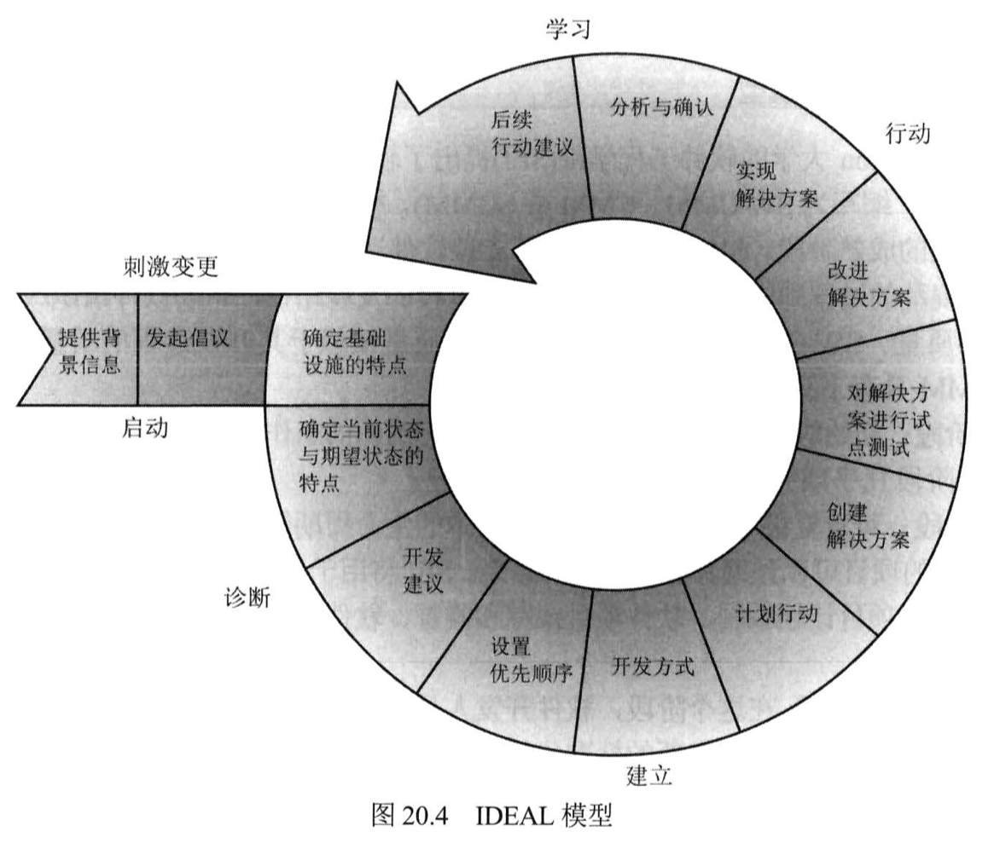
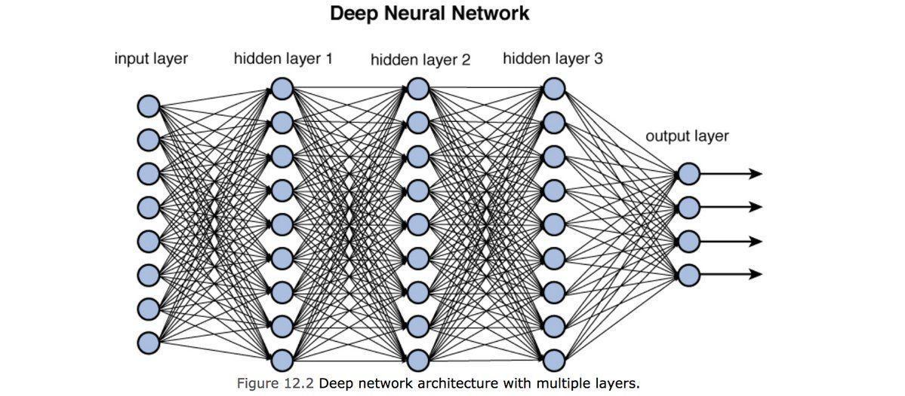

# 域8：软件开发安全

- [域8：软件开发安全](#域8软件开发安全)
  - [D8-1：系统开发概述](#d8-1系统开发概述)
    - [一、软件开发](#一软件开发)
    - [二、系统开发生命周期](#二系统开发生命周期)
    - [三、生命周期模型](#三生命周期模型)
    - [四、甘特图和PERT](#四甘特图和pert)
    - [五、变更和配置管理](#五变更和配置管理)
    - [六、DevOps方法](#六devops方法)
    - [七、应用程序编程接口](#七应用程序编程接口)
    - [八、软件测试](#八软件测试)
    - [九、代码仓库](#九代码仓库)
    - [十、服务水平协议](#十服务水平协议)
    - [十一、第三方软件购置](#十一第三方软件购置)
  - [D8-2：建立数据库和数据仓库](#d8-2建立数据库和数据仓库)
    - [一、数据库管理系统架构](#一数据库管理系统架构)
    - [二、数据库事务](#二数据库事务)
    - [三、多级数据库安全](#三多级数据库安全)
    - [四、开放数据库连接](#四开放数据库连接)
    - [五、NoSQL](#五nosql)
    - [六、存储器威胁](#六存储器威胁)
  - [D8-3：理解基于知识的系统](#d8-3理解基于知识的系统)
    - [一、专家系统](#一专家系统)
    - [二、机器学习](#二机器学习)
    - [三、神经网络](#三神经网络)
  - [D8-4：恶意软件](#d8-4恶意软件)
    - [一、恶意代码来源](#一恶意代码来源)
    - [二、病毒](#二病毒)
    - [三、逻辑炸弹](#三逻辑炸弹)
    - [四、特洛伊木马](#四特洛伊木马)
    - [五、蠕虫](#五蠕虫)
    - [六、间谍软件和广告软件](#六间谍软件和广告软件)
    - [七、勒索软件](#七勒索软件)
    - [八、恶意脚本](#八恶意脚本)
    - [九、零日攻击](#九零日攻击)
  - [D8-5：恶意软件预防](#d8-5恶意软件预防)
    - [一、易受恶意软件攻击的平台](#一易受恶意软件攻击的平台)
    - [二、反恶意软件](#二反恶意软件)
    - [三、完整性监控](#三完整性监控)
    - [四、高级威胁保护](#四高级威胁保护)
  - [D8-6：应用程序风险和措施](#d8-6应用程序风险和措施)
    - [一、应用程序攻击](#一应用程序攻击)
    - [二、注入漏洞](#二注入漏洞)
    - [三、利用授权漏洞](#三利用授权漏洞)
    - [四、利用Web应用程序漏洞](#四利用web应用程序漏洞)
    - [五、应用程序安全控制](#五应用程序安全控制)
    - [六、安全编码实践](#六安全编码实践)

## D8-1：系统开发概述

### 一、软件开发

1. 编程语言

- 机器语言（machine language）：1和0组成，人类无法直接理解。
- 汇编语言（Assembly language）：较机器语言高级点，但仍很麻烦。
- 编译型语言（compiled languages）：如C、Java等，通常无法直接查看到源码，但可通过逆向工程尝试获取源码。
- 解释型语言（interpreted languages）:如Python、Java Script等，用户能够直接查看编程人员的原始指令。

某些情况下，语言依赖运行时环境（runtime environments）来允许跨不同操作系统执行代码，如JVM。

2. 库文件

开发人员依赖包含重用代码的共享软件库文件（software libraries），能给提高开发人员的效率。使用共享库文件会导致安全问题，如心脏滴血漏洞（Heartbleed），因此在使用共享库文件前应评估其安全性。

3. 开发工具集

开发人员也使用集成开发环境（IDE）来提升工作效率，IDE可以编写、测试、调试、和编译代码，如PyCharm。

4. 面向对象编程（OOP）

OOP关注交互所涉及的对象，对象协调工作提供系统功能。OOP提倡高内聚、低耦合，每个开发人员只需要负责开发自己的对象方法，不需要关心其他人的代码是如何实现的，提高了编程的效率、故障排查效率。

5. 保证

管理员使用保证程序（assurance procedures）来确保新应用程序中内置的安全控制机制在整个生命周期内正确地实施安全策略，可参考通用准则（CC）。

6. 避免和缓解系统故障

- 输入验证：对输入的值进行检查，对数字范围进行检查被称为限制检查（limit check），如日转账限制；对特殊字符进行检查并替换被称为转义输入（escaping input），如替换等号或尖括号等；输入验证建议在服务器端实现，客户端浏览器代码易被绕过。
- 身份验证和会话管理：应用程序应要求用户完成身份验证才可进行后续行动，并对用户的会话进行全程跟踪。
- 错误处理：详细的错误消息，对定位bug非常便利，但也可能泄漏信息造成安全风险，应禁止非授权访问错误消息。
- 日志记录：详细的日志记录能够协助定位安全事故。
- 故障防护和应急开放：故障防护（fail-secure）适用于安全性要求高的环境中，故障后什么也做不了；应急开放（fail-open）适用于安全性要求不高的环境中，故障后所有安全控制失效，优先保证用户行动。

### 二、系统开发生命周期

1. 概念定义

定义要开发一个什么系统，如OA。该阶段也涉及开发高级别安全需求，在控制规范开发阶段完善，如数据分类和安全要求。

2. 功能需求确定

确定系统所拥有的功能，如OA中的流程审批功能。功能需求涉及输入、行为和输出。

3. 控制规范开发

完成系统控制规范的开发，如身份验证和授权、日志记录、容错性等，安全性设计的融入应该贯穿整个生命周期。

4. 设计审查

设计人员完成系统各功能如何协同工作、工作任务清单、以及阶段里程碑对应的时间表，并上会进行审查。

5. 编码

开发人员依据设计文档开始写代码，并遵循控制规范。

6. 代码审查走查

项目经理在里程碑处组织代码评审会议，修复代码编写的漏洞。

7. 系统测试审查

代码完成编写和审查后，模拟用户常规和非常规行为进行系统测试，多次回归测试（regression testing）系统稳定后进入用户验收测试（UAT），UAT完成后代码就可以部署到生产环境中。

8. 维护和变更管理

随着系统的使用，可能会有新漏洞、新需求、环境变化等因素需要进行维护，任何改变都需要走变更管理流程。

### 三、生命周期模型

1. 瀑布模型

一个阶段完成后经过验证后才能进入下一个阶段，如果发生错误只能回退一个阶段，适合严谨、安全要求高的软件开发项目。

2. 螺旋模型

由于瀑布的死板，开发了可以多次反复、灵活性高的螺旋模型。

3. 敏捷软件开发

敏捷开发宣言核心就一个字“快”：

- 个体与交互优于过程与工具
- 有效的软件优于完整的文档
- 客户合作优于合同谈判
- 响应变更优于遵循计划

敏捷开发具体的方法有：

- 迭代式增量软件开发过程（Scrum）
- 看板管理（Kanban）
- 快速应用开发(RAD)
- 敏捷统一过程(AUP)
- 动态系统开发模型(DSDM)
- 极限编程(XP)

其中，Scrum最受欢迎。Scrum的特色是每天要开会，由Scrum Master主持，负责推动项目进度，即项目经理的角色。Scrum将任务组织成冲刺（sprints）活动，即开发活动，每完成一次冲刺，系统就能够上线运行，可能功能不全，但后续的每次冲刺都完善其功能，可参考微信的开发模式。

4. 能力成熟度模型

软件成熟度模型（SCMM、SW-CMM、CMM，同义词）描述了从事软件开发组织经历的不同成熟阶段。

- L1-初始（Initial）：通常很少或没有定义软件开发过程。
- L2-重复（Repeatable）：基本生命周期管理流程出现。
- L3-定义（Defined）：开发人员依照一系列正式、文档化的软件开发过程进行操作。
- L4-管理（Managed）：量化软件开发过程。
- L5-优化（Optimizing）：持续改进软件开发过程。

CMM已经被CMMI（能力成熟度模型集成）替代，CMMI第四阶段称为定量管理（Quantitatively Managed），且侧重于不同阶段间集成。

5. 软件保证成熟度模型

软件保证成熟度模型（SAMM）是OWASP维护的开源项目，将安全活动集成到软件开发和维护过程中，为组织提供评估其成熟度的能力。SAMM将软件开发过程划分为五个业务功能：

- 治理（Governance）：组织为管理软件开发过程而进行的活动。
- 设计（Design）：组织用于定义软件需求和创建软件的过程。
- 实施（Implementation）：建立和部署软件组件并管理这些组件缺陷的过程。
- 验证（Verification）：组织为确认代码满足业务和安全要求而开展的活动。
- 运营（Operations）：组织在生命周期中维护安全性而采取的行动。

6. IDEAL模型

代表过程改进活动的生命周期，共有五个阶段：

- 启动（Initiating）：确定改进的目标并活动相关支持。
- 诊断（Diagnosing）：确定目标与现状的差异。
- 建立（Establishing）：制定实现目的的计划。
- 行动（Acting）：根据计划开始干。
- 学习（Learning）：总结经验教训。

### 四、甘特图和PERT

甘特图是一种显示不同时间项目和进度之间相互关系的条形图。

项目评估审查技术（PERT）是一种项目调度工具，用于判断软件产品大小和计算风险评估标准差。

### 五、变更和配置管理

软件投入使用后也会面临各种变更（如新功能、改bug等），因此需要进行变更管理。

- 请求控制：该过程用户请求软件变更，管理人员执行成本/效益分析，开发人员优化任务。
- 变更控制：该过程开发人员解决用户需求，开发新功能或修复漏洞。
- 发布控制：完成新代码的开发后，经过用户验收测试发布到生产环境。

除了变更管理外，软件配置管理也非常重要，用于控制软件版本、跟踪和控制软件配置的变更。

- 配置标识：管理员文档化组织内容软件产品的配置。
- 配置控制：确保软件版本的变更符合变更控制和配置管理策略。
- 配置状态统计：跟踪所有授权变更。
- 配置审计：定期开展配置审计，确保没有发生未授权配置变更。

### 六、DevOps方法

DevOps用于解决IT部门间互不合作、提皮球等问题，将软件开发、质量保证和技术运营整合到一起。DevOps模型与敏捷开发方法紧密配合，减少开发、测试、部署软件所需的时间。DevOps基于自动化可实现持续集成/持续交付（CI/CD）的目标。快速开发和投产不能忽略安全性，也需要集成安全控制，因此提出了DevSecOps方法。

### 七、应用程序编程接口

现如今的系统都不在是独立系统，往往需要系统间交互，因此提供了应用程序编程接口（API）。

- API必须考虑身份验证，通常通过API密钥来完成。
- API也必须经过安全测试，以避免出现安全漏洞。
- curl可用于测试API，也可被黑客用于攻击API。

### 八、软件测试

代码在投产前应进行彻底地测试，需要考虑以下内容：

1. 合理性检查（reasonableness check）：确保返回的值符合常理，如身高超过10米、存款余额-1000元等。
2. 用例和误用案例（use cases/misuse cases）：测试应结合正常用户和非正常用户活动进行测试。
3. 职责分离：软件测试应该由非开发人员进行，保持软件测试的独立性。
4. 软件测试理念：根据查看代码的多少，有黑盒测试、灰盒测试、白盒测试，与渗透测试理念一致。

### 九、代码仓库

代码仓库（Code repositories）用于集中存储代码，还提供版本控制、bug跟踪、Web托管等功能，如GitHub。

代码仓库的风险之一就是访问控制，涉及机密信息的代码需管控访问权限，避免敏感信息泄密。

### 十、服务水平协议

服务水平协议（SLA）确保供应商提供的服务或产品满足合同要求，不满足则会涉及对供应商的处罚措施。

### 十一、第三方软件购置

组织的大多数软件不是内部开发的，通常有几个途径：

1. 商用现货（COTS）：具有标准协议或接口的软件或硬件产品，也就是成熟的商业产品，如用友的财务软件。
2. 软件即服务（SaaS）：云服务，如邮件系统。
3. 开源软件（OSS）：开源项目提供的免费软件。

无论采用哪种方法获取软件，都需要进行安全测试以确保安全性。

## D8-2：建立数据库和数据仓库

### 一、数据库管理系统架构

1. 层次式和分布式数据库

层次式数据库以分层方式存储数据，分布式数据库将数据存储在多个数据库中，但在逻辑上是一个数据库。

2. 关系型数据库

关系型数据库的主要组件是表，即关系，是非常流行的数据库类型，如MySQL。

- 表中的列对应属性（attributes）或字段（fields），列的数量被视为度数（degree），通常不变；
- 表中的行对应记录（record）或元组（tuple），行的数量被视为基数（cardinality），通常会发生变化。

键的类型

- 候选键（candidate key）：用于唯一标识表中记录的属性子集。
- 主键（primary key）：从候选键中选出用于唯一标识表中记录的键。
- 备用键（alternate key）：未被选为主键的候选键。
- 外键（foreign key）：用于建立两个表之间关系，也叫参照完整性。

关系型数据库使用的标准语言是结构化查询语言（SQL），为使用者与数据库交互提供了接口。SQL有两个组件：数据定义语言（DDL）允许操作数据库结构，数据操作语言（DML）允许操作数据库数据。

### 二、数据库事务

1. 定义

数据库事务（database transactions）是指包含一个或多个数据库操作的命令集合，要么全部执行成功，要么全部执行失败。

- 以end结尾的每个SQL操作都具有独立性，执行成功与失败不影响其他操作；
- 以commit结尾的每个SQL操作都属于一个事务，其中一个执行失败，其他操作都会回滚。

2. ACID模型

- 原子性（Atomicity）：要么全部成功、要么全部失败。
- 一致性（Consistency）：事务执行前后环境是一致的。
- 隔离性（Isolation）：事务之间互不影响。
- 持久性（Durability）：事务一旦提交数据不会丢失。

### 三、多级数据库安全

多级安全数据库指的是包含不同分类级别的信息，应用安全标签、知其所需等对用户的访问进行限制。

数据库视图（database views）通过限制可执行的SQL语句来进行权限控制也可实现多级安全性。

1. 并发性

并发性（Concurrency）或编辑控制（edit control）是一种预防性安全机制，用以解决不同进程同时操作数据库时保障信息的正确性。

- 丢失更新：当两个进行同时更新数据库某条数据时，而互相不清楚对方活动，则会出现丢失更新。
- 脏读：当进程从没有成功提交的事务中读取记录时，则会出现脏读。
- 脏写：一个进程的事务回滚导致另一个进程已提交的信息也回滚，则会出现脏写。
- 不可重复度：一个进程读取一个数据两次，但读取的结果不一致，则会出现不可重复读。

并发性使用锁特性，在同一时间仅允许一个用户对某数据进行变更，拒绝其他用户对该数据的访问。

2. 聚合

聚合（aggregation）攻击指的是使用SQL函数来获取一个或多个表的记录，以生成高价值的数据的过程。

3. 推理

推理（inference）攻击是在聚合攻击的基础上，利用人类思维的演绎能力来获取高价值数据。

4. 其他安全机制

- 时间标记：按时间顺序执行事务来维护数据的完整性和可用性。
- 细粒度控制：基于内容的访问控制、基于上下文的访问控制以及单元抑制（cell suppression）都是细粒度控制的体现。
- 数据库分区：根据数据的安全级别或内容类型对数据库进行分区。
- 多实例（Polyinstantiation）：额外增加记录或表，不同安全级别能访问的数据的值是不同的。
- 噪声和干扰（noise and perturbation）：在数据库中插入错误或欺骗性数据来保护真实数据。

### 四、开放数据库连接

开放数据库连接（ODBC）用以解决应用程序与不同类型数据库的通信，即翻译官的作用。

### 五、NoSQL

因数据库性能或存储类型的限制，许多组织开始使用非关系型数据库，即NoSQL。

1. 键值存储（key/value stores）

以键/值对存储信息，与编程中的字典一样，适合高速存取和大数据场景。

2. 图形数据库（graph databases）

适合对象之间关系极其复杂的场景，如社交关系。

3. 文档存储（document stores）

类似于键值存储，但以文档形式存储，存储信息可以非常复杂，如JSON。

### 六、存储器威胁

数据库是运行在操作系统、物理硬件之上的，因此也需要在其他方面加强风险控制。

1. 非法访问

包括逻辑和物理上的，逻辑上通过权限控制、数据机密等方式应对，物理上通过门锁、保安等方式应对。

2. 隐蔽通道

通过非正常传输通道造成数据泄密。

## D8-3：理解基于知识的系统

### 一、专家系统

专家系统（expert systems）尝试将人类在某个领域的知识具体化，用以在未来进行决策。

1. 知识库

指的是包含专家经验总结的已知规则，用if/then语句形式存在。如下所示：

- 如果用户在夜晚1点～5点尝试登录系统，则可能是黑客攻击。
- 如果用户多次尝试登录系统失败，则可能是黑客攻击。
- 如果用户登录系统成功后提升权限，则可能是黑客攻击。

2. 推理引擎
根据知识库的规则与实际发生的信息进行分析，从而做出正确决策的引擎。如下所示：

- 黑客攻击的条件命中3及以上，做出黑客攻击的报警。

专家系统的优劣取决于以上两个组件的能力，适合于风险控制场景，不受制于人类情绪影响。

### 二、机器学习

机器学习（machine learning）技术使用分析能力从数据中发现知识，而不直接使用人类知识（如知识库）。有两种技术类型：

1. 监督学习（supervised learning）

使用标记数据进行训练，即明确了哪是正确的结果，基于标杆进行模型开发。

2. 无监督学习（unsupervised learning）

使用未标记数据进行训练，即未明确哪些是正确的结果，主要是对数据进行分类。

### 三、神经网络

计算单元链用来尝试模仿人脑的生物推理过程，是机器学习技术的延伸，也被称为深度学习或认知系统。

## D8-4：恶意软件

### 一、恶意代码来源

最早由开发人员研制，后来经过传播和演变已经形成来产业链，有开发的、投放的、收尾的等等。

### 二、病毒

计算机病毒主要有两个功能：传播和破坏。

1. 病毒传播技术

- 主引导记录（MBR）病毒：利用可引导介质传播，如硬盘、U盘。
- 文件感染病毒（File Infector Virus）：利用可执行程序进行传播，如exe、com、msc。
- 同伴病毒（Companion Virus）：文件感染病毒的变种，利用系统文件相似的名称来伪装自己。
- 宏病毒（Macro Viruses）：利用VBA实现病毒功能，常见于Microsoft Office全家桶。
- 服务注入病毒（Service Injection Viruses）：将自己注入可信系统进程中，如svchost.exe。

2. 病毒技术

- 复合病毒（Multipartite Viruses）：使用多种传播技术，如Marzia病毒。
- 隐形病毒（Stealth Viruses）：篡改操作系统欺骗反病毒软件进而达到隐形目的。
- 多态病毒（Polymorphic Viruses）：每次感染都修改自身代码特征从而让反病毒软件无法检测。
- 加密病毒（Encrypted Viruses）：使用密钥对自身进行加解密，形式上与多态病毒基本一样。

3. 骗局

谎称有一个贼牛逼的病毒要爆发，让很多组织浪费时间和资源进行研究和防御，这就是病毒骗局（hoaxes）。

### 三、逻辑炸弹

感染系统后在满足一个或多个条件时才触发的恶意代码，常见于员工离职前为服务器植入逻辑炸弹，离职后数月才触发破坏服务器。

### 四、特洛伊木马

不同的特洛伊木马在功能上有很大区别，常见有如下类型：

- 破坏型：尽可能短时间内产生大规模破坏，如删除数据。
- 黑产型：每次运行木马都会访问指定网站刷访问量。
- 流氓杀软：伪装成杀毒软件诱导安装，实际窃取用户数据或欺骗付费。
- 远程访问木马（RATs）：在系统中打开后门，使攻击者能够远程控制系统。
- 资源窃取：窃取系统的计算资源用于挖掘数字货币。

### 五、蠕虫

具备自主传播能力，破坏力很强大。

- CodeRed蠕虫：随机扫描IP地址，利用IIS版本漏洞进行传播，再统一对白宫主页发动DDoS攻击。
- 震网病毒（Stuxnet）：利用0 day漏洞发动攻击，首个针对基础设施造成严重破坏的、国与国间网络战争的恶意代码。

### 六、间谍软件和广告软件

- 间谍软件（spyware）：监控用户行为并向外发送，如窃取你的键盘输入。
- 广告软件（adware）：会疯狂给你弹广告窗口，或监视的购物行为并访问购物网站。

这些软件类型被称为潜在不需要的程序（PUPs）。

### 七、勒索软件

勒索软件（ransomware）感染系统后加密整个或部分数据进行勒索，已成为当今非常流行的攻击方式。

存在一个道德问题：被勒索后是否支付赎金？不支付恢复不了业务，支付了助长攻击者的嚣张气焰。

### 八、恶意脚本

安全运维人员使用脚本来提升工作效率，如脚本检查系统配置是否符合基线要求。

攻击者使用恶意脚本来提升攻击效率，如自动提权、建立账号等等。

恶意脚本除了落地成为文件外，还有种无文件恶意软件（fileless malware），直接从恶意链接下载后再内存中运行，因此常规杀软无法检测。

### 九、零日攻击

未有补丁能够修复的漏洞被称为零日漏洞。系统受影响的主要原因：

- 脆弱性窗口（window of vulnerability），补丁发布和病毒库更新与漏洞发现之间的延迟。
- 管理员未及时更新补丁，最不该、最容易出现的原因。

## D8-5：恶意软件预防

### 一、易受恶意软件攻击的平台

跟平台的流行程度基本一致，早些时候都集中在Windows平台，现在Mac、androids等系统的恶意软件越来越多。

### 二、反恶意软件

反恶意软件即杀毒软件是最基础的安全措施。主要有两种检测机制：

1. 特征型

基于庞大病毒库来进行检测，误报率低、检测效率高、仅能检测已知恶意软件，检测能力与病毒库强绑定关系，因此需及时更新病毒库。

2. 启发式

基于恶意软件行为进行检测，误报率高、检测效率低、可以检测未知恶意软件。

### 三、完整性监控

完整性监控工具（如Tripwire）也提供了辅助反恶意软件的能力，通过计算文件哈希值并定期检查来发现恶意软件感染迹象。

### 四、高级威胁保护

1. 终端检测和响应（EDR）

除了包含反恶意软件功能外，还加入了检测和消除威胁的能力。

- 分析终端内存、文件系统和网络活动是否存在恶意活动迹象；
- 自动隔离可能的恶意活动控制潜在危害；
- 集成威胁情报源，实施洞察其他地区的恶意行为；
- 与其他事故响应机制集成以自动化方式工作。

许多安全厂商提供托管服务，被称为托管检测和响应（MDR）服务。

2. 用户和实体行为分析（UEBA）

关注用户活动并构建正常活动模型，基于模型偏差检测恶意行为。

3. 下一代终端保护工具

反恶意软件保护、文件完整性监控、终端检测与响应和用户实体行为分析集成使用。

## D8-6：应用程序风险和措施

### 一、应用程序攻击

1. 缓冲区溢出

未对用户的输入进行验证，输入太大溢出到其他内存空间，可造成系统崩溃、执行任意代码等等。

2. TOCTOU

- 检查时间（TOC）指的是主体检查对象状态的时间。
- 使用时间（TOU）指的是主体访问对象的时间。
- TOCTOU攻击被称为竞争条件（race conditions）。

举个例子：一个URL允许上传文件，但会对上传的文件格式进行检查，不符合的要求的文件会被删除。如果上传了一个webshell.php文件，然后疯狂访问这个webshell文件，就可能会在文件被删除前访问到，那么这个就是竞争条件攻击。

3. 后门

开发人员在测试阶段留的、用于调试目的的后门叫维护钩子，而攻击者留的远程控制的后门就是后门。

4. 特权提升和Rootkis

攻击者拿到普通管理员权限后，会使用rootkit（利用系统漏洞攻击）工具获得管理员权限。

### 二、注入漏洞

1. SQL注入攻击

SQL注入利用SQL命令拼接的方式来执行额外的命令获取权限之外的信息。许多情况下SQL注入攻击无法直接查看返回结果，这种情况下则使用盲注攻击（blind SQL injection）。通常有两种类型：

- 基于内容盲注：根据不同的输入得到不同的返回结果判断是否存在注入点。
- 基于时间盲注：输入加入延迟命令看返回时间是否延迟而判断是否存在注入点。

2. 代码注入攻击

试图将攻击者编写的代码插入web应用程序合法代码的攻击都是代码注入攻击，如SQL注入。

- LDAP注入攻击

- XML注入

- 跨站脚本XSS

3. 命令注入攻击

某些情况下，应用程序代码可能会返回到操作系统以执行命令，那就可能出现命令注入攻击。

### 三、利用授权漏洞

1. 不安全的直接对象引用（Insecure Direct Object References）

根据用户输入的参数直接查询相关数据，而不对用户的权限再次判断就会出现不安全的直接对象引用。

2. 目录遍历（Directory Traversal）

当允许用户浏览web服务器目录结构并访问相应文件时，使攻击者可以通过目录遍历攻击获取密码文件或备份文件。

3. 文件包含（File Inclusion）

文件包含攻击可执行文件中包含的代码，从而使web服务器执行目标代码。通常有两种类型：

- 本地文件包含：执行本地服务器上的代码。
- 远程文件包含：执行远程服务器上的代码。

### 四、利用Web应用程序漏洞

1. 跨站脚本攻击（XSS）

攻击者将恶意代码插入网页中用以攻击客户端。

- 反射型XSS：通常发生在应用程序允许反射输入时，最典型是弹窗告警。
- 存储型/持久型XSS：将跨站脚本代码存储在web服务器上，就是存储型XSS，又因为能够持久存在，也称为持久型XSS。

通过输入验证和输出编码进行防范。

2. 请求伪造（Request Forgery）

利用信任关系并试图让用户无意中对远程服务器执行命令。有两种形式：

- 跨站请求伪造（CSRF/XSRF）：利用远程站点对用户系统的信任来冒充用户执行命令。
- 服务端请求伪造（SSRF）：通过篡改提及的URL可以对内网其他系统进行攻击。

3. 会话劫持（Session Hijacking）

攻击者拦截授权用户和资源直接的通信，使用劫持技术接管会话。常用劫持技术有：

- 抓取客户端和服务器间的身份验证信息进行客户端伪装
- 诱使客户端认为攻击者就是目标服务器
- 使用用户cookies数据访问服务器

通过反重放认证技术和cookies过期时间进行防范。

### 五、应用程序安全控制

1. 输入验证

对用户的输入进行验证，以降低包含攻击代码的可能性。

- 输入白名单（input whitelisting）：仅允许清单里的值进行输入。
- 输入黑名单（input blacklisting）：不允许清单里的值进行输入。
- 元字符（Metacharacters）：被赋予特殊编程含义的字符，通常使用转义（Escaping）将其转换成普通符号。
- 参数污染（Parameter Pollution）：攻击者向web应用程序同一个输入变量发送多个值，用以实现绕过输入验证机制。

执行输入验证必须在服务器端实现，客户端输入验证极容易被绕过。

2. Web应用防火墙

Web应用防火墙（WAF）工作在应用层，根据规则库对网络流量中的恶意行为进行过滤，是对应用程序安全控制的补充措施。

3. 数据库安全

- 参数化查询（Parameterized queries）：开发人员准备SQL语句，仅允许用户输入变量的值，不允许插入额外代码。
- 存储过程（Stored procedures）：与参数化查询原理类似，但实现代码在数据库服务器上。
- 数据最小化（Data minimization）：最好的防御，数据越少、风险越小。
- 令牌化（Tokenization）：使用唯一标识符替代敏感信息。
- 哈希（Hashing）：将敏感数据通过哈希计算形成替代标识符，通常会加入盐或胡椒用以抵抗彩虹表攻击。

4. 代码安全

- 代码签名（Code Signing）：使用私钥对代码进行数字签名，可提供完整性和不可否认性。
- 代码重用（Code Reuse）：通过使用第三方软件库和软件开发工具包（SDK）来重用代码。
- 软件多样性（Software Diversity）：避免依赖于单个源代码、二进制可执行文件或编译器。
- 代码存储库（Code Repositories）：用于存储和管理应用程序源代码的位置。
- 完整性测量（Integrity Measurement）：利用哈希算法确保部署的代码与代码库中的代码是一致的。
- 应用弹性（Application Resilience）：设计应用程序时需要考虑其能够适应不断变化的需求，有两个方面：可伸缩性（Scalability）和弹性（Elasticity），参考云计算特性。

### 六、安全编码实践

1. 源代码注释（Source Code Comments）

源代码注释可以帮助开发人员理解代码实现的功能和原理，但也向攻击者提供了便利，代码发布前应删除相关注释。

2. 错误处理（Error Handling）

攻击者会利用代码中的错误进行攻击，因此开发人员应在代码中加入对错误的处理机制。另一方面，错误处理输出的信息也不能太过详细，也容易被黑客利用。

3. 硬编码凭证（Hard-Coded Credentials）

在某些情况下，开发人员可能会在源代码中包含用户名和密码，有两种情况：保留维护账号用于开发维护，即后门漏洞；代码中的用户名和密码可能会被外人得知，即信息泄漏风险。

4. 内存管理（Memory Management）

- 资源耗竭（Resource Exhaustion）

系统的资源是有限的，一旦全部用完就会造成系统拒绝服务，如内存泄漏（Memory leaks）。

- 指针解引用（Pointer Dereferencing）

指针是在内存中存储另一个位置地址的内存的一个区域。如果应用程序访问某一个资源，则会执行一个指针解引用的操作，即访问指针指示的内存地址。如果指针是空的，那么可能会导致系统崩溃或绕过安全控制，进而产生风险。
